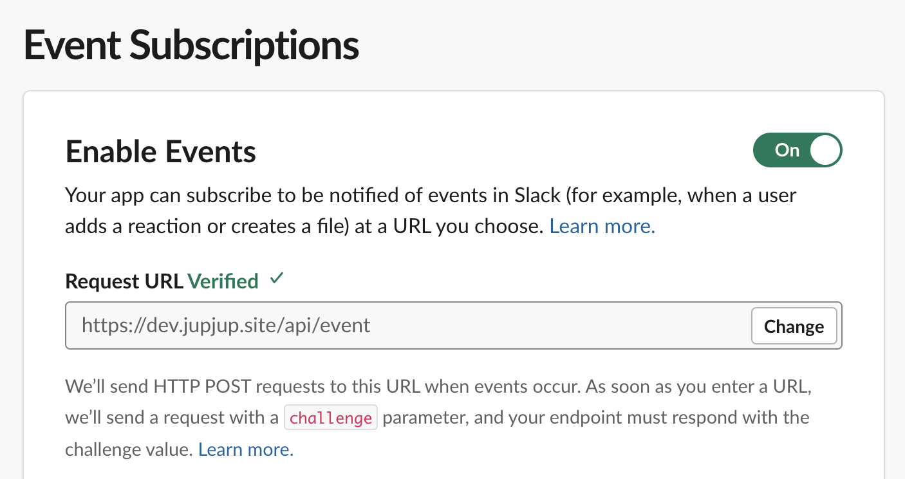

해당 포스팅은 [줍줍](https://github.com/woowacourse-teams/2022-pickpick) 개발 과정 중 맞딱뜨린 문제점과 답을 찾아가는 과정을 다른 방식으로 재구성한 글이다.  
생각보다 글이 길어진 고로, 문제상황과 해결방안만 보고싶다면  
- [문제상황](https://hyewoncc.github.io/#슬랙-rtm리얼타임-메시지와의-사투)  
- [빈 컬렉션 주입을 이용한 해결 예시코드](https://github.com/hyewoncc/spring-sandbox/tree/spring/collection-beans)  
이 둘을 보기를 권한다.  
  
## 간단한 게시판 서비스를 상상하기  

### 회원 가입과 탈퇴  

당신은 지나가던 고양이의 의뢰로 서버를 개발하게 되었다. 
고양이는 🐱 닉네임을 입력하면 가입이 가능하고, 탈퇴할 수 있는 서비스를 만들어 주세요 💬 라고 요구했다. 
그래서 나는 (그리고 이 글을 볼 대부분의 사람들은) 이건 쉽지~ 하고 간단한 컨트롤러를 만들었다.  

```java
@RestController
@RequestMapping("/members")
public class MemberController {

    @PostMapping
    public ResponseEntity<Void> join(final String name) {
        Member member = memberService.save(new Member(name));
        return ResponseEntity.created(URI.create("/members/" + member.getId())).build();
    }

    @DeleteMapping("/{id}")
    public ResponseEntity<Void> leave(@PathVariable final Long id) {
        memberService.delete(id);
        return ResponseEntity.noContent().build();
    }
}
```

### 그런데 이제 엔드포인트를 하나로 하고  

이 코드를 본 고양이가 말했다.  
🐱 엔드포인트를 하나로 통일할래요. 그리고 이게 **회원 가입인지 탈퇴인지**는 **body**안에 쓸게요. 이렇게요. 💬  

```json
{ // 회원 가입 시 
    "event": "join",
    "name": "cat"
} 
{ // 회원 탈퇴 시
    "event": "leave",
    "id": "1"
}
```

<br>

코드가 이상해지기 시작한다. 그래도 아직 납득 가능한 수준이다.  

```java
@RestController
@RequestMapping("/members")
public class MemberController {

    @PostMapping
    public ResponseEntity<Void> event(final MemberRequest request) {
        if (request.getEvent().equals("join")) {
            Member member = memberService.save(new Member(request.getName()));
            return ResponseEntity.created(URI.create("/members/" + member.getId())).build();
        }
        if (request.getEvent().equals("leave")) {
            memberService.delete(request.getId());
            return ResponseEntity.noContent().build();
        }
        return ResponseEntity.internalServerError().build();
    }
}
```

### 여기에 포스팅 기능도 몽땅 넣어줘    

이 코드를 본 고양이가 또 요구했다. 
🐱 각자 게시글을 쓰고, 수정하고, 삭제하는 것도 가능하게 만들어주세요. 엔드포인트는 여전히 하나만 쓰고요. **body**는 이렇게 바꿀래요. 💬 

```json
{ // 회원 가입 시 
    "event": "member",
    "content": {
        "type": "join",
        "name": "cat"
    }
}
{ // 회원 탈퇴 시 
    "event": "member",
    "content": {
        "type": "leave",
        "id": "1"
    }
}
{ // 게시글 작성 시 
    "event": "posting",
    "content": {
        "type": "write",
        "posting": {
            "memberId": "1",
            "text": "안녕하세요"
        }
    }
}
{ // 게시글 수정 시 
    "event": "posting",
    "content": {
        "type": "edit",
        "posting": {
            "id": "1",
            "text": "안녕하세요, 반갑습니다"
        }
    }
}
{ // 게시글 삭제 시 
    "event": "posting",
    "content": {
        "type": "delete",
        "id": "1"
    }
}
```

<br>

이제 어떻게 해결할 지 정말 막막해졌다. 
이유를 추려보자.  

1. 여러개의 도메인 x 여러개의 요구사항의 수많은 가짓수를 한 엔드포인트로 처리해야 한다  
2. 요청값의 형태가 각자 다르므로 `DTO` 클래스로 받을 수 없다  
3. 처리해야 할 도메인이 추가될 때 마다 주입될 서비스 클래스도 추가된다  
4. 처리해야 할 도메인이나 요구사항이 추가될 때 마다 `if`문이 추가된다  

여기까지의 요구사항을 억지로나마 맞추면 코드를 이렇게 짤 수는 있겠다.  

```java
@PostMapping
public ResponseEntity<Void> event(final Map<String, Object> request) {
    String event = (String) request.get("event");
    Map<String, Object> content = (Map<String, Object>) request.get("content");

    if (event.equals("member")) {
        if (content.get("type").equals("join")) {
            ...
        }
        if (content.get("type").equals("leave")) {
            ...
        }
    }
    if (event.equals("posting")) {
        if (content.get("type").equals("write")){
            ...
        }
        if (content.get("type").equals("edit")){
            ...
        }
        if (content.get("type").equals("delete")){
            ...
        }
    }
    return ResponseEntity.internalServerError().build();
}
```

몇가지 리팩토링을 통한 개선 여지는 보이지만 마음이 아픈 코드다. 
여기까지 읽었으면 `이런 억지 요구사항이 어딨나?`고 생각할 수도 있다. 
그런데 이게 **슬랙이 우리에게 요구했던 사항**이다.  

<br>

## 슬랙 RTM(리얼타임 메시지)와의 사투  

### url을 하나 제출하세요  

줍줍을 개발하면서 애증하게 된 슬랙의 애정하는 면 중 하나는 사용자에게 정말 폭넓은 편의를 제공한다는 것이다. 
처음 개발에 착수했을 때, 슬랙에서 발생하는 메시지 생성, 삭제, 채널명 수정 등의 사건을 어떻게 포착할지 막막했다. 
그런데 슬랙은 이미 봇을 통해 이를 리얼타임으로 제공한다. 와!  

하지만... 리얼타임 메세지를 한번 받아보니 바로 애정이 애증이 되었다. 
원래 물에서 건져주면 보따리 내놓으라고 한다고, 이 모든 걸 한 엔드포인트에 꽂아주는 게 문제였다.    

  

여기를 통해서 다음과 같은 모든 이벤트를 처리해야 했다.  

- 메시지 관련
    - 새로운 메시지 전송
    - 메시지 내용 수정
    - 메시지 삭제
    - 메시지 댓글을 채널로 다시 전송
- 공개 채널 관련
    - 채널 정보(ex.이름) 수정
    - 채널 삭제 
- 사용자 관련
    - 사용자 정보(ex.이름, 프로필 사진) 수정
    - 워크스페이스에 새로운 사용자 입장  

보면 알겠지만 전혀 다른 도메인과 그에 따른 요구사항이 섞여있다.  

### DTO? 만들 수 있으면 만들어 봐

여기다가 형식이 통일됐다면 나았을텐데, 이벤트 특성이 달라서 그런가 들어오는 값이 달라도 너무 달랐다. 
`DTO` 클래스가 아닌 `Map<String, Object>`로 요청값을 받는 게 강제된 이유가 이것이다. 
(민감 정보 부분은 대치했다)  

```json
// 채널명 변경 시 들어오는 값  
{
    "token": "token string",
    "team_id": "team id string",
    "api_app_id": "app id string",
    "event": {
        "type": "message",
        "subtype": "channel_name",
        "ts": "1656920324.323089",
        "user": "user id string",
        "text": "채널 이름을 \"4기-공지사항\"에서 \"4기-공지사항-변경했지요\"(으)로 변경했습니다.", 
        "old_name": "4기-공지사항", 
        "name": "4기-공지사항-변경했지요", 
        "channel": "channel id string", 
        "event_tannel_type": "channel"
    },
    "type": "event_callback", 
    "event_id": "Ev03MS66TUQP", 
    "event_time": "1656920324", 
    "authorizations": [
        {
            "enterprise_id": "null", 
            "team_id": "team id string", 
            "user_id": "user id string", 
            "is_bot": "true", 
            "is_enterprise_install": "false"
        }
    ], 
    "is_ext_shared_channel": "false", 
    "event_context": "4-eyJldCI6Im1lc3NhZ2UiLCJ0aWQiOiJUMDNNUzhTOUUzViIsImFpZCI6IkEwM01WRE01UjdDIiwiY2lkIjoiQzAzTjdTU1RVTVAifQ"
}

// 메시지 삭제 시 들어오는 값  
{
    "token": "token string", 
    "team_id": "team id string", 
    "api_app_id": "app id string",  
    "event": {
        "type": "message", 
		"subtype": "message_deleted", 
        "previous_message": {
            "client_msg_id": "f226562b-81e0-42ae-ba24-2e68898a7d35", 
			"type": "message", 
			"text": "안녕하세요?", 
			"user": "user id string", 
			"ts": "1658055738.383439", 
			"team": "T03MS8S9E3V", 
			"blocks": [{
                    "type": "rich_text", 
					"block_id": "9Ldl", 
					"elements": [{
                            "type": "rich_text_section", 
							"elements": [{
                                    "type": "t", 
									"text": "안녕하세요?"
								}]
						}]
                }]
		},
    },
    "channel": "channel id string", 
	"hidden": "true", 
	"deleted_ts": "1658055738.383439", 
	"event_ts": "1658055753.002600", 
	"ts": "1658055753.002600", 
	"channel_type": "channel", 
	"type": "event_callback", 
	"evend": "Ev03PTECHXLK", 
	"event_time": "1658055753", 
	"authorizations": [{
        "enterprise_id": "null", 
		"team_id": "team id string", 
		"user_id": "user id string", 
		"is_bot": "true", 
		"is_enterprise_install": "false"
	}], 
	"is_ext_shared_channel": "false", 
	"event_context": "4-eyJldCI6Im1lc3NhZ2UiLCJ0aWQiOiJUMDNNUzhTOUUzViIsImFpZCI6IkEwM01WRE01UjdDIiwiY2lkIjoiQzAzTjdTU1RVTVAifQ"
}
```

<br>

## 줄줄이 if문을 막아라    

이 문제 해결을 위한 방안을 팀원 각자 고민해오기로 했다. 
얘기해보니 크게 두 갈래의 의견이 나왔다.  

### 1. 핸들러 이전에 엔드포인트를 분리  

첫번째로 제시된 방안은 아예 엔드포인트를 분리하기였다. 
`HandlerAdapter`를 구현하면 가능할 것 같다는 의견이 나왔었다. 
나도 이 방법으로 시도해보았으나, 잘 짜지지 않았다. 
핸들러 매핑 과정에 대한 이해가 부족했던 것 같다.  

다른 팀원은 `필터`로 헤더값을 추가하는 식으로 구현을 해왔다. 
이 방식을 이용하면 컨트롤러 코드는 대략 이렇게 바뀌었다.  

```java
@PostMapping(headers = "{type=member-join}")
public ResponseEntity<Void> saveMember(final MemberRequest request) {
    memberService.save(request);
    return ResponseEntity.noContent().build();
}

@PostMapping(headers = "{type=member-leave}")
public ResponseEntity<Void> deleteMember(final MemberLeaveRequest request) {
    memberService.delete(request);
    return ResponseEntity.noContent().build();
}

@PostMapping(headers = "{type=posting-write}")
public ResponseEntity<Void> savePosting(final PostWriteRequest request) {
    postService.save(request);
    return ResponseEntity.noContent().build();
}
...
```  

아마 추가적인 작업으로 컨트롤러도 `MemberController, PostController...`하는 식으로 분리 가능했다. 
메서드를 명확하게 분리 가능하다는 점, `DTO`를 만들 수 있다는 점이 좋았다.  

<br>

### 2. 어쨌든 동일 엔드포인트 내에서 분기 처리  

두번째로 제시된 방안은 '어쨌든 한 엔드포인트로 받은 후, 로직을 *깔끔하게* 분리 실행하자'였다. 
나는 이 방안을 선호했다. 
1안을 `HandlerAdapter`를 통해 구현 시도하면서 `inputStream`을 통해 읽은 `body`값을 다시 읽을 수 없다는 사실을 알게 되었기 때문이다. 
이를 위해선 [wrapper를 통해 다시 읽도록 처리](https://meetup.toast.com/posts/44)하는 추가 작업이 필요했다. 
간단한 방법(비록 if문이 늘어나지만)을 두고 돌아간다는 생각이 들었다. 
거기에 슬랙이 의도를 갖고 보낸 http 요청을 분기 처리를 위해 중간에 조작하는 것이 옳을까? 하는 측면도 있었다.  

얘기 끝에 2번을 시도해보고, 잘 안된다면 1번을 해보자고 결론이 났다.  

<br>  

## 그래서 어떻게 했느냐면...

### 1. enum으로 이벤트 분리  

if문의 처리를 위해 `Events`라는 `enum`을 만들었다. 
`Map<String, Object>` 형태의 요청값을 넣어주면, 어떤 요청인지 식별할 수 있게 되었다.  

```java
public enum Events {

    MEMBER_JOIN("member", "join"),
    MEMBER_LEAVE("member", "leave"),

    POSTING_WRITE("posting", "write"),
    POSTING_EDIT("posting", "edit"),
    POSTING_DELETE("posting", "delete"),
    ;

    private final String event;
    private final String subtype;

    Events(final String event, final String subtype) {
        this.event = event;
        this.subtype = subtype;
    }

    public static Events of(final Map<String, Object> requestBody) {
        String event = String.valueOf(requestBody.get("event"));
        String type = (String) ((Map<String, Object>) requestBody.get("content")).get("type");

        return Arrays.stream(values())
                .filter(events -> isSameEvent(events, event, type))
                .findAny()
                .orElseThrow(NoSuchElementException::new);
    }

    private static boolean isSameEvent(final Events events, final String event, final String type) {
        return events.event.equals(event) && events.subtype.equals(type);
    }
    ...
}
```

### 2. 각 event를 처리할 객체들의 인터페이스 분리  

이 단계에서 조금 막혔는데, 팀원이 개발바닥 오픈톡방에 질문을 올렸다가 호돌맨님, 형덕님, 승일님이 큰 도움을 주셔서 잘 풀어나갈 수 있었다. 
각 이벤트를 처리할 객체들의 공통 인터페이스를 분리했다.  

```java
public interface EventService {

    void execute(Map<String, Object> requestBody);

    boolean isSameEvent(Events event);
}
```

### 3. event 별로 구현체 작성  

이제 각 이벤트를 처리할 서비스 구현체를 하나씩 만든다. 
예시로 회원 가입을 처리할 구현체를 보자.   

```java
public class MemberJoinService implements EventService {

    private final MemberRepository members;

    public MemberJoinService(final MemberRepository members) {
        this.members = members;
    }

    @Override
    public void execute(final Map<String, Object> requestBody) {
        String name = (String) ((Map<String, Object>) requestBody.get("content")).get("name");
        members.save(new Member(name));
    }

    @Override
    public boolean isSameEvent(final Events event) {
        return Events.MEMBER_JOIN == event;
    }
}
```  

`isSameEvent`로 이 서비스 객체가 **회원 가입**을 처리할 객체임을 식별한다. 
`execute`로 요청값에서 필요값을 추출해 필요한 작업을 한다.  

### 4. 모든 EventService 빈을 컬렉션으로 주입받는 Finder 만들기  

이제 만들어진 모든 `EventService` 구현체를 `EventServiceFinder`라는 클래스에 모은다. 

```java
@Component
public class EventServiceFinder {
    public final List<EventService> eventServices;

    public EventServiceFinder(final List<EventService> eventServices) {
        this.eventServices = eventServices;
    }

    public EventService findByEvent(final Events events) {
        return eventServices.stream()
                .filter(service -> service.isSameEvent(events))
                .findAny()
                .orElseThrow(NoSuchElementException::new);
    }
}
```

빈을 컬렉션으로 주입받는 걸 언제 쓰나 했더니 이럴 때 쓰는 것이었다. 
[죽은 지식이 살아나는](https://hyewoncc.github.io/wild-seed/) 또 다른 순간이었다. 
이제 `findByEvent()`를 호출하며 해당 이벤트 `enum`을 넣으면, `isSameEvent()`로 이벤트에 대응되는 서비스가 반환 될 것이다.  

### 5. 마침내, 컨트롤러에서 사용하기  

컨트롤러는 `EventFinder`만 주입받는다.   

```java
@RestController
@RequestMapping("/event")
public class EventController {
    private final EventServiceFinder serviceFinder;

    public EventController(final EventServiceFinder serviceFinder) {
        this.serviceFinder = serviceFinder;
    }

    @PostMapping
    public ResponseEntity<Void> execute(final Map<String, Object> request) {
        serviceFinder.findByEvent(Events.of(request))
                .execute(request);
        return ResponseEntity.noContent().build();
    }
}
```  

각 요청값을 처리하는 건 각 서비스 객체의 `execute()`안에 구현되어 있으므로, `serviceFinder`로 찾은 객체에서 `execute()`만 호출하면 된다. 
북잡한 if문의 향연은 `enum`안으로 사라졌다. 
그리고 컨트롤러에서는 **대응되는 서비스를 찾아 처리를 맡긴다**는 깔끔한 맥락만 남았다.  

[전체 예제 코드](https://github.com/hyewoncc/spring-sandbox/tree/spring/collection-beans)를 깃헙에서 볼 수 있다. [통합 테스트 코드](https://github.com/hyewoncc/spring-sandbox/blob/spring/collection-beans/src/test/java/sandbox/EventsTest.java) 실행 시 잘 동작한다.    

<br>

## 결론  

순수한 자체 서비스를 개발했다면 이런 경험을 할 일이 없었을 것이다. 그냥 엔드포인트 분리하고 끝내면 되니까. 
그런데 외부 데이터에 의존하는 기능을 만들다보니 이런 골치아프고 재밌는 일도 겪어본다.  

여담으로, 빈을 컬렉션으로 주입받을 수 있다는 사실이 김영한님 스프링 강의에 있었다고 한다. 
분명 나도 들은 강의인데 연관시켜 해결 할 생각은 전혀 하지 못했다. 
이런 지식 적용의 어려움은 어떻게 풀어나갈 수 있을까 고민이 든다.  

```toc
```
