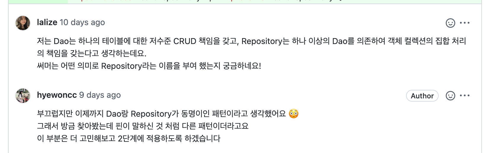
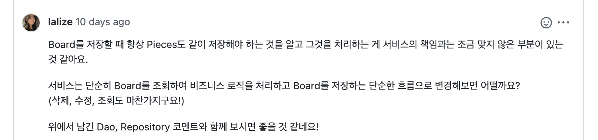

[웹 체스 미션](https://github.com/woowacourse/jwp-chess/pull/474)을 진행하면서 `JdbcTemplate`을 이용해 DB에 접근하는 모든 클래스의 이름을 `Repository`라 지었다가 아래와 같은 코멘트를 받았다.  

  
  

코멘트를 받기 전까지 `DAO`와 `Repository`가 이름만 다른 같은 개념이라 생각했다. 그래서 이 둘의 차이에 대해 알아보았다.  

## @Repository 문서  

스프링 `@Repository` 어노테이션 자바 문서에는 다음과 같이 적혀 있다.  <!--more-->

> 적용 된 클래스가 *Repository* 임을 나타냅니다. 이는 [도메인 주도 설계(에릭 에반스)](http://book.naver.com/bookdb/book_detail.naver?bid=6680572)에서 정의한 *저장소를 캡슐화하고, 저장하고, 검색하여 객체의 컬렉션처럼 다루는 메커니즘*을 뜻합니다.  
> *Data Access Object*와 같은 전통적인 자바 EE 패턴을 사용하는 팀도 이 스테레오타입을 *DAO* 클래스에 적용할 수 있습니다. 다만 그 전에 *Data Access Object*와 *DDD-style repositories*의 차이를 이해하는 것이 좋습니다. 이 어노테이션은 다목적 스테레오타입이고 개별 팀은 자신들만의 축소된 의미에 맞춰 적절하게 사용하면 됩니다.  
> 어노테이트된 클래스는 `PersistenceExceptionTranslationPostProcessor`와 결합 되었을 때, 스프링 `DataAccessException` 변환을 사용할 수 있게 됩니다. 또한 이 주석은 해당 클래스가 전체 어플리케이션 구조에서 tooling, aspects(마땅한 번역을 못 찾아 원어로 대체합니다) 등의 기능을 한다고 표기하는 것이기도 합니다.  
> 스프링 2.5에서 이 어노테이션은 `@Component`의 특정형으로써도 기능하는데, 해당 클래스가 클래스 경로 스캐닝에서 자동 탐지(autodetected)되도록 합니다.  

이 문서에서 <u>DAO와 Repository는 다른 개념이며, 두 개념을 확실히 구분지어 인지</u>하는 것이 중요함을 알 수 있었다.  

## DAO / Repository  

둘의 차이에 대해 알아보기에 앞서 간단한 도메인을 떠올려보자. 아래 각 클래스는 어떤 웹게임 서비스의 `플레이어, 게임`을 나타낸다. 도메인 규칙은 다음과 같다.  

- 플레이어는 한번에 한 게임에 참가 가능하다  
- 게임은 플레이어의 일급 컬렉션을 갖는다  
- Dice는 DB에 저장할 값이 없다    

```java
public class Player() {
  private String name;
  private int win;
  private int lose;
  ...
}

public class EasyGame() {
  private Dice dice;
  private Players players;
  private int stage;
  ...
} 
```

DB에 생성할 테이블과 저장해야 하는 정보는 다음과 같다  

- Player  
  - 이름  
  - 승패 횟수  
  - 게임 키
- Game
  - 키  
  - 진행 스테이지  

### DAO (Data Access Object)  

`DAO`는 추상 API를 통해 어플리케이션/비즈니스 계층과 퍼시스턴스 계층을 분리하기 위해 만들어진 패턴이다. 한 테이블에 대한 <u>저수준 CRUD</u> 책임을 갖기에, 한 테이블 당 하나씩 만들어진다.  

```java
public interface PlayerDao {
  Player find(Long id);
  List<Player> findAll();
  List<Player> findByGameId(Long id);
  void save(Player player);
  void update(Player player);
  void delete(Long id);
}

public interface GameDao {
  Game find(Long id);
  List<Game> findAll();
  void save(Game game);
  void update(Game game);
  void delete(Long id);
}
```

### Repository  

이제 DB에서 값을 읽어 `EasyGame`을 복원하려면 어떻게 해야 할까?  
1. 게임의 키값인 `id`로 game 테이블을 조회하고  
2. player 테이블에서 `game_id`가 일치하는 플레이어를 조회하고  
3. 두 결과 객체를 통해 `EasyGame 도메인 객체`를 만들어야 한다  

`EasyGameRepository`에서 두 Dao를 갖게 하고, 두 Dao를 이용해 만들 수 있다. 

```java
public class EasyGameRepository() {
  private PlayerDao playerDao;
  private GameDao gameDao;

  public EasyGame find(Long gameId) {
    Game game = gameDao.find(gameId);
    Players players = new Players(playerDao.findByGameId(gameId));
    return new EasyGame(game, players);
  }
}
```

이러면 `Service`에서 `EasyGame` 도메인 객체를 만들기 위해 어느 테이블를 다룰지 몰라도 되고, `EasyGame` 도메인을 책임지는 `EasyGameRepository`를 통해 호출할 수 있다.  

```java
public class EasyGameService() {
  private EasyGameRepository easyGameRepository;

  public EasyGame lodeGame(Long gameId) {
    return easyGameRepository.find(gameId);
  }
}
```

[도메인 주도 설계(DDD)](http://book.naver.com/bookdb/book_detail.naver?bid=6680572)에는 레포지토리를 이렇게 설명한다.  

> 전역적인 접근이 필요한 각 객체 타입에 대해 메모리상에 해당 타입의 객체로 구성된 컬렉션이 있다는 착각을 불러 일으키는 객체를 만든다. 잘 알려진 전역 인터페이스를 토대로 한 접근 방법을 마련하라. 객체를 추가하고 제거하는 메서드를 제공하고, 이 메서드가 실제로 데이터 저장소에 데이터를 삽입하고 데이터 저장소에서 제거하는 연산을 캡슐화하게 하라. 특정한 기준으로 객체를 선택하고 속성값이 특정 기준을 만족하는 완전히 인스턴스화된 객체나 객체 컬렉션을 반환하는 메서드를 제공함으로써 실제 저장소와 질의 기술을 캡슐화하라.  

DDD를 아직 모르는 입장이라 나는 **캡슐화**에 주목했다. `service`에서 `DAO`를 바로 이용했다면, 아래와 같은 코드가 되어 `service`가 `EasyGame`을 만들기 위해 **어떤 DB에 접근해야 하는지가 그대로 드러나게 된다.**  

```java
public class EasyGameService() {
  private PlayerDao playerDao;
  private GameDao gameDao;

  public EasyGame lodeGame(Long gameId) {
    List<Player> players = findByGameId(Long gameId);
    Game game = gameDao.find(gameId);
    return new EasyGame(game, players);
  }
}
```

따라서 **하나의 유기체처럼 동작하는 객체마다 일반적으로 Repository 한 개**가 만들어지며, 하나의 `Repository`에서 여러 `DAO`를 가질 수 있다. DDD에서 이 하나의 유기체처럼 동작하는 객체를 `Aggregate/애그리거트`라고 지칭한다.  

별개로 궁금했던 부분인데, 앞선 예시에서 `Player`도 하나의 애그리거트로 볼 수 있다. 그렇다면 플레이어 한 명의 정보를 불러오고 싶을 때, `PlayerRepository`와 `PlayerDao`는 다음과 같이 될 것이다.  

```java
public class PlayerRepository() {
  private PlayerDao playerDao;

  public Player find(Long id) {
    return playerDao.find(id);
  }
}

public class PlayerDao() {
  public Player find(Long id) {
    ... 
  }
}
```

이럴 경우 단순히 클래스만 하나 더 거쳐오는 것(리뷰어 핀은 `by-pass`라고 칭했다)처럼 보여도, `Player`가 하나의 애그리거트에 해당되기에 `PlayerRepository`를 사용하는 것이 맞다. 물론 이는 레포지토리와 DAO와 둘다 존재할 때의 얘기며, 내부 구현은 달라질 수 있다. 중요한 것은 `PlayerRepository`가 마치 `Player 컬렉션`을 다루는 것 처럼 **캡슐화**하고 있다는 것이다.  

### DAO와 Repository의 차이  

둘의 차이에 대해선 [깃헙 @msbaek - DAO와 REPOSITORY 논쟁](https://github.com/msbaek/memo/blob/master/dao-vs-repository.md)에 잘 정리되어 있다. 정리하던 도중 더 좋은 글을 찾아서 링크로 대체한다.  

## 참고 자료  

- [기계인간 John Grib - 저장소 패턴(Repository Pattern)](https://johngrib.github.io/wiki/pattern/repository/)  
- [깃헙 @msbaek - DAO와 REPOSITORY 논쟁](https://github.com/msbaek/memo/blob/master/dao-vs-repository.md)   
- [리뷰어 핀(@lalize)의 코멘트](https://github.com/woowacourse/jwp-chess/pull/474)  

```toc
```
