## 🧳 줍줍 MySQL 인덱스 탐험  

❗️ 해당 포스팅에서 지칭하는 **책**은 모두 [Real MySQL 8.0 1권](https://search.shopping.naver.com/book/catalog/32443973624?cat_id=50010586&frm=PBOKPRO&query=realmysql&NaPm=ct%3Dl8u5bsc0%7Cci%3D283e817c3ef615da4bb3c94f9385d94070cbbc93%7Ctr%3Dboknx%7Csn%3D95694%7Chk%3D702ada6411525c62218b0df3e900c84c33c4cdd2)을 뜻합니다.  
 
우테코 팀 프로젝트 5차 스프린트에서 성능 테스트로 톰캣 설정 최적화 / 모든 쿼리 수집 후 DB 인덱스 설정 이라는 두 개의 백엔드 과제가 있었다. 
나는 이 중 **DB 인덱스 설정**을 맡게 되었다. 
줍줍의 전체 테이블 구조는 정석 ERD보다 간략하게 표현하자면 이렇다.  

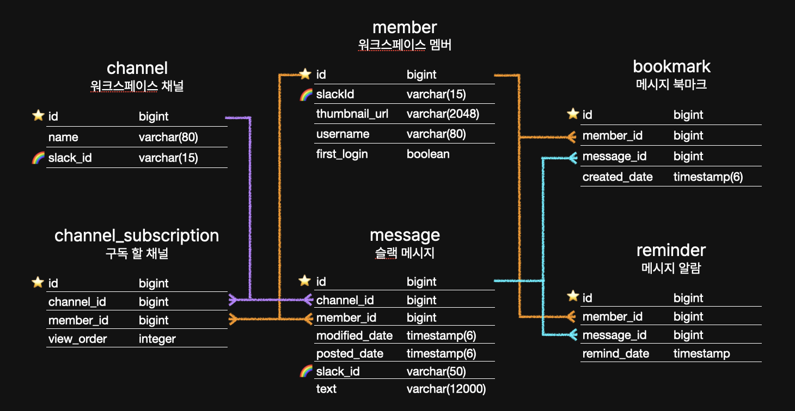  

쿼리 수집은 쉬웠다. 
줍줍의 모든 `Repository` 클래스들은 `Repository<Domain, ID>`를 상속했다. 
`JpaRepository`는 선언하지 않은 메서드도 사용 가능한 반면, `Repository`를 상속하면 선언한 메서드만 사용 가능하다.  

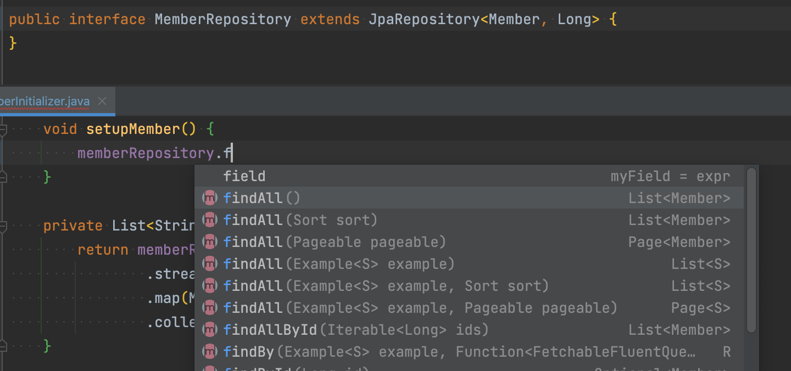  
<div style="text-align:center; font-style:italic; color:grey;">
  JpaRepository를 상속했을 때
</div>

<br>

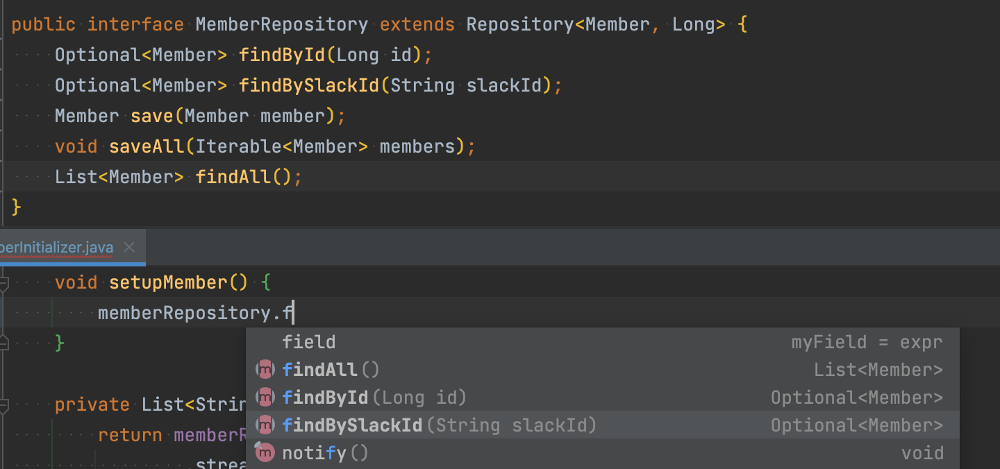  
<div style="text-align:center; font-style:italic; color:grey;">
  Repository를 상속했을 때
</div>

<br>

뒤집어 말하면 `QueryDsl`사용을 제외하면, `Repository` 코드의 모든 메서드가 곧 프로젝트에 사용 중인 모든 쿼리였다.  

<br>

## 쿼리 최적화 by.봄🌱  

인덱스 최적화를 시작하기 전에 고맙게도 같은 팀 크루인 봄이 [불필요햔 left outer join을 제거하는 쿼리 최적화](https://github.com/woowacourse-teams/2022-pickpick/pull/531)를 해주었다! 
`Repository`에서 `B`의 PK를 FK로 가진 `A`가 해당 FK를 조건으로 조회할 때, `findByBId`로 하면 불필요한 `left outer join`이 발생하고 있었다. 
이를 이미 `B`를 조회한 곳에서는 `findByB`를 사용하도록 바꾸고, `B`를 조회하지 않는 곳에서는 `@Query`로 직접 쿼리문을 작성해 개선해주었다. 
고마워요 최고 봄!  

```java
// 멤버의 채널 구독을 화면 순서대로 가져오는 메서드
// Before
Optional<ChannelSubscription> findFirstByMemberIdOrderByViewOrderDesc(Long memberId);
// After
Optional<ChannelSubscription> findFirstByMemberOrderByViewOrderDesc(Member member);

// 멤버와 메시지로 일치하는 북마크를 찾는 메서드
// Before
Optional<Bookmark> findByMessageIdAndMemberId(Long messageId, Long memberId);
// After
@Query("select b from Bookmark b WHERE b.message.id = :messageId and b.member.id = :memberId")
Optional<Bookmark> findByMessageIdAndMemberId(Long messageId, Long memberId);
```

<br>

## 🧪 실험 환경    

모든 테스트는 로컬 `docker`에 `mysql`을 띄워, 프로젝트와 동일하게 DB를 설정해 진행했다.   
그리고 `프로시저`로 10만건의 `Member` 더미데이터를 넣으려고 했는데... 
느려도 **너무** 느렸다. 
찾아보니 유니크한 `slackId`를 부여하기 위해 `UUID` 값 생성 후 적당히 잘라서 쓰고 있었는데, 여기가 문제였다. 
그래서 `JdbcTemplate`의 `batchUpdate`로 데이터를 넣도록 간단한 코드를 짰다. 
10만건 삽입에 프로시저는 **4분** 전후, 자바 코드로는 16초가 걸렸다... 
`JdbcTemplate`으로 하는 게 훨씬 빠르다고 알려준 매트에게 고맙다.😭  

<br>  

## ⚙️ MySQL의 자동 생성 인덱스  

사실 내가 모르는 새에 우리 DB에는 필요한 대부분의 인덱스가 설정되어 있었다. 
컬럼이 1.유니크하면서 2.null을 허용하지 않을 때, MySQL에서 자동으로 해당 컬럼으로 인덱스를 만들기 때문이다. 
마침 프로젝트에서 슬랙 정보를 이용하는 `member, channel, message` 테이블에는 해당 조건을 충족하는 `slack_id` 컬럼이 있었다. 
아래 그림에서 하이라이트 된 컬럼은 모두 자동 인덱스가 이미 설정 된 컬럼이다.  

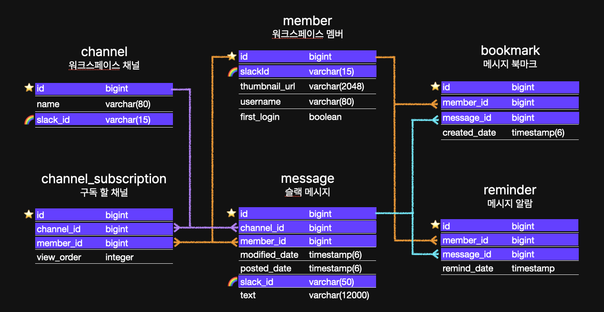  

그래도 궁금하니 한번 자동 생성된 인덱스를 삭제하고 `explain analyze` 쿼리를 통해 실행 시간을 재어 보았다. 
`member`에 10만개의 데이터를 넣고 99,998번째 row의 `slack_id`로 검색했다.  

```sql
explain analyze
select id, first_login, slack_id, thumbnail_url, username
from member
where slack_id = :slackId;
```

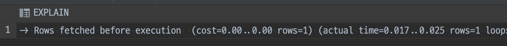
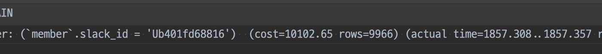  

자동 생성된 인덱스를 두고 조회했을 때 **0.017~0.025ms**가, 
해당 인덱스를 삭제하고 조회했을 때 **1857ms**가 소요되었다. 
1.8초도 느리긴 하지만, **10000배** 차이난다고 생각하니 정말 많~이 느려졌다.  

그럼 프로젝트의 쿼리가 최적의 인덱스를 타고 있는지 일단 **모두** 확인해보자.  

- Member  
  - ✅ findById(Long id)  
  - ✅ findBySlackId(String slackId)
- Channel
  - ✅ findById(Long id)  
  - ✅ findBySlackId(String slackId)
  - ⬜️ findAllByOrderByName()
- ChannelSubscription
  - ✅ findAllByMemberId(Long memberId)
  - ⬜️ findAllByMemberIdOrderByViewOrder(Long memberId)
  - ⬜️ findFirstByMemberOrderByViewOrderDesc(Member member)
  - ⬜️ findFirstByMemberIdOrderByViewOrderAsc(Long memberId)
  - ⬜️ existsByChannelAndMember(Channel channel, Member member)
- Message  
  - ✅ findById(long id)
  - ✅ findBySlackId(String slackMessageId)
  - ⬜️ Querydsl을 이용한 복잡한 조회쿼리  
- Bookmark
  - ✅ findById(Long id)
  - ⬜️ findByMessageIdAndMemberId(Long messageId, Long memberId)  
  - ⬜️ Querydsl을 이용한 복잡한 조회쿼리  
- Reminder  
  - ✅ findById(Long id)
  - ⬜️ findByMessageIdAndMemberId(Long messageId, Long memberId)
  - ⬜️ findAllByRemindDate(LocalDateTime remindDate)
  - ⬜️ Querydsl을 이용한 복잡한 조회쿼리  

이미 최적의 인덱스를 사용하고 있을 쿼리는 체크해줬다. 
위에서부터 하나씩 제거해보자.  

## 📺 Channel  

채널의 `findAllByOderByName()`은 워크스페이스의 모든 채널 목록을 반환한다. 
현재 1.한 워크스페이스만 지원하고있고 2.공개 채널만 저장되기 떄문에, 별다른 조건을 주지 않고 모두 조회중이다. 
그래서 넉넉하게 500개의 데이터를 넣고 조회했는데, `name` 컬럼에 인덱스를 설정 한 것과 안 한 것의 차이가 없었다.  

```sql
select *
from channel
order by name asc
limit 500;
```

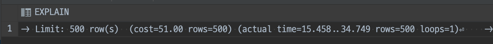
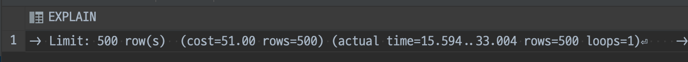  

|name 인덱스 X|name 인덱스 O|
|---|---|
|15~34ms|15~33ms|

`order by`는 원래 인덱스를 이용하지 않나 싶어서 책이랑 구글도 찾아봤는데 이유를 잘 모르겠다. 
데이터가 너무 적어서 그럴 수도 있겠다. 
어쨌든 추가로 인덱스를 설정하지 않았다.  


## 🔖 ChannelSubscription  

채널 구독은 2000명의 멤버가 500개의 채널을 각각 구독하는 상황을 가정해 **10만개**의 더미데이터를 삽입했다. 
우선 쿼리가 비슷한 아래 세 메서드를 보자.  

- findAllByMemberIdOrderByViewOrder(Long memberId)
- findFirstByMemberOrderByViewOrderDesc(Member member)
- findFirstByMemberIdOrderByViewOrderAsc(Long memberId)

```sql
select *
from channel_subscription
where member_id = :memberId
order by view_order; #desc;
limit 500; #limit 1; 
```

구독은 멤버에 종속적인 개념이기에, 항상 `memberId`를 기준으로 조회된다. 
그리고 `view_order` 순서대로 모두 조회하기 또는 첫번째 값을 가져오기기에, 
`memberId`와 `view_order`로 복합 인덱스를 설정해봤다. 

```sql
create index member_view_order on channel_subscription (member_id, view_order);
```

복합 인덱스를 설정했을 떄, 실제로 해당 인덱스를 이용해 쿼리가 실행된다. 

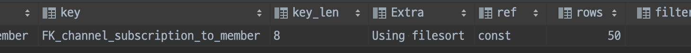
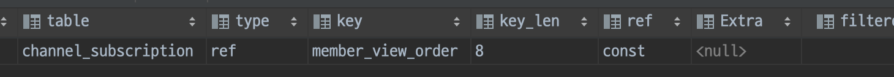
<div style="text-align:center; font-style:italic; color:grey;">
  복합 인덱스 설정하기 전과 후
</div>

<br> 

하지만 실행시간에서 유의미한 차이를 볼 수 없었다. 
의문인 점은 복합 인덱스 설정 전에는 `Extra` 필드에 `Using filesort`가 표기된다는 점이다. 
이건 `order by` 처리 시, 적합한 인덱스를 사용하지 못해 MySQL 서버가 조회된 레코드를 다시 정렬한다는 뜻이다. 
복합 인덱스 설정 시 해당 인덱스를 사용하기에 `Extra`는 `null`이 된다. 
그럼에도 실행시간이 뚜렷하게 개선되지 않았다.  

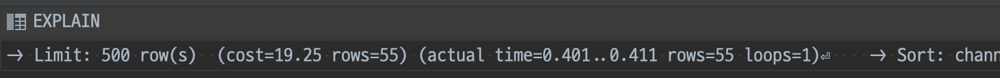
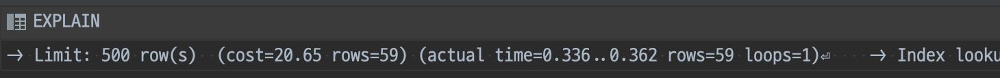  

캡쳐는 시간 차이가 조굼 나는 걸로 찍혔지만, 여러번 수행했을 때 평균치는 차이가 없었다. 
채널이 500개나 있는 과장된 상황에서도 차이가 없는 것이라 적용하지 않기로 정했다.  

<br>

나머지 한 메서드는 처음에는 추가 인덱스 설정이 필요하지 않을 것이라 생각했다.  

- existsByChannelAndMember(Channel channel, Member member)  

```sql
select channel_subscription.id
from channel_subscription
where channel_subscription.channel_id = :channelId
  and channel_subscription.member_id = :memberId
limit 1;
```

`FK`인 `channel_id`와 `member_id`에 이미 각각 인덱스가 걸려있었기 때문이다. 
그래서 실행 계획을 보면, `type`이 `index_merge`로 나온다.  

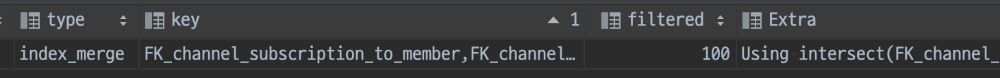  

그런데 `index_merge`를 책에서 찾아보니 개선이 필요했다. 
아래는 해당 책의 설명이다.   

`index_merge`는 2개 이상의 인덱스를 이용해 각각의 검색 결과를 만들어낸 후, 그 결과를 병합하는 처리 방식이며 다음과 같은 특징이 있다.  
- 여러 인덱스를 읽어야 하므로 일반적으로 `range` 접근 방식보다 효율성이 떨어진다  
- AND와 OR 연산이 복잡하게 연결된 쿼리에서는 제대로 최적화되지 못할 때가 많다 
- 전문 검색 인덱스를 사용하는 쿼리에서는 `index_merge`가 적용되지 않는다 
- `index_merge` 접근 방식으로 처리된 결과는 항상 2개 이상의 집합이 되기 떄문에 그 두 집합의 교집합이나 합집합 또는 중복 제거와 같은 부가적인 작업이 더 필요하다  

현재 `Extra`에 표시된 `Using intersect...`는 각 처리 결과에서 교집합을 추출해내는 작업을 수행했다는 의미다. 
더 효율적인 수행을 위해 `channel_id`와 `member_id`로 복합 인덱스를 생성했다.  

```sql
create index subscription_channel_and_member on channel_subscription (member_id, channel_id);
```

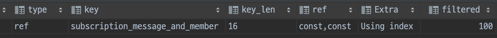  

실행 계획에서 해당 인덱스를 사용함을 볼 수 있다. 
사진 상 실수로 이름을 잘못 설정했는데, `subscription_channel_and_member`가 맞다.  

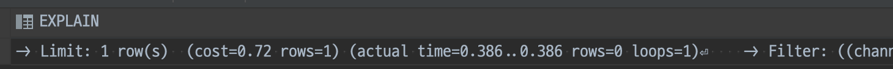
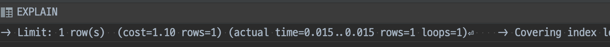  

|복합 인덱스 X|복합 인덱스 O|
|---|---|
|0.386ms|0.015ms|

실행 시간은 약 0.386ms에서 0.015ms로 **95%** 가량 감소했다.  

## ⭐️Bookmark & ⏰Reminder  

바로 위 사례와 비슷한 쿼리가 북마크와 리마인더에도 각각 존재한다.  

- Optional<Bookmark> findByMessageIdAndMemberId(Long messageId, Long memberId)  
- Optional<Reminder> findByMessageIdAndMemberId(Long messageId, Long memberId)  

북마크와 리마인더는 100만개의 메시지를 바탕으로 2000명의 멤버가 각각을 300개씩 등록한 것을 가정해, 각 60만개 더미데이터를 넣었다.  

```sql
select *
from bookmark
where message_id = :messageId and member_id = :memberId;
```

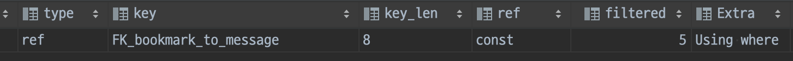  

아까와 달리 `Extra` 필드에 `Using where`가 표기된다. 
`Using where`은 스토리지 엔진으로부터 받은 레코드를 MySQL 엔진 레이어에서 별도의 가공을 통해 필터링 작업을 거쳤음을 나타낸다. 
또, `filtered` 필드에 `5`가 적혀있다. 
이는 스토리지 엔진으로부터 100건의 레코드를 받아 95건을 걸러내고 5건만 남았다는 의미다. 
결국 조회된 데이터 중 **95%** 를 버린 것이다.  
이번에는 `index_merge`를 쓰지 않았는데, 데이터 양의 차이로 추측된다. 
현재 더미데이터는 계산 시 각 메시지에 평균 1건 이하의 북마크가 등록되어 있다. 
보통 중요한 메시지에 북마크 생성이 치중될 것을 생각하면, 실제 상황과 조금 괴리가 있는 데이터 셋업이다. 
운영 데이터가 더 쌓이면 이를 분석해서 더 적절한 실험 상황으로 개선해야 할 것 같다.  

어쨌든 `message_id`와 `member_id`로 복합 인덱스 설정 시, 해당 인덱스를 이용하며 속도도 개선된다.  

```sql
create index bookmark_message_and_member on bookmark (message_id, member_id);
```

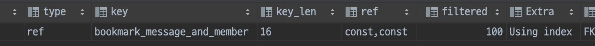  
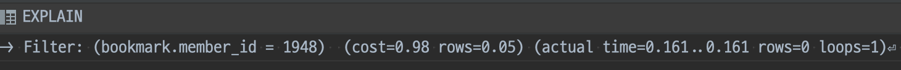
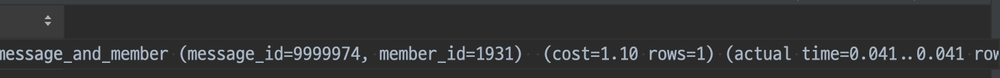  

|복합 인덱스 X|복합 인덱스 O|
|---|---|
|0.161ms|0.041ms|

더미데이터와 달리 한 메시지에 북마크가 몰리는 상황을 생각하면, 복합 인덱스 설정 시 조금 더 큰폭으로 효율이 개선될 것 같다.  

리마인더도 완전히 동일한 포맷의 sql문을 사용중이다.  

```sql
select *
from reminder
where message_id = :messageId and member_id = :memberId; 
```

복합 인덱스 설정 전/후에 북마크와 동일한 설정의 실행계획이 나오는 것을 확인했고, 실행시간을 비교해보았다.  

| |북마크|리마인더|
|---|---|---|
|복합 인덱스 설정 전|0.161ms|0.023ms|
|복합 인덱스 설정 후|0.041ms|0.017ms|

북마크 수행 시간이 더 극적으로 차이나는 것은... 
북마크를 테스트하고 맥북이 좀 느려졌길래 재부팅을 한번 해서 그런 것 같다 🙃    

`Querydsl`을 제외하고 남은 마지막 쿼리는 리마인더 발송을 위해 10분마다 실행되는 쿼리다.  

- findAllByRemindDate(LocalDateTime remindDate)

```sql
select *
from reminder
where remind_date = '2022-10-03 00:10:30'; #이해를 돕기 위해 아무 시각이나 넣었다 
```

예상 가능한 부분이지만 사용할 수 있는 인덱스가 없어서 **풀 테이블 스캔**이 일어나고 있다. 
시간도 앞선 쿼리들에 비하면 아주 길다.  

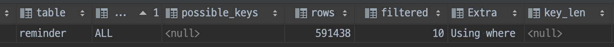
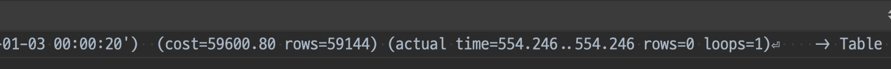  

`remind_date`에 인덱스를 설정했다. 
정상적으로 해당 인덱스를 이용하고, 실행시간도 1/1000 이하로 줄어들었다.  

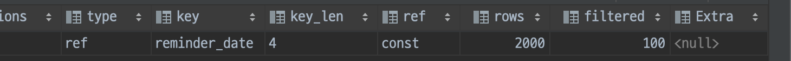
  

|remind_date 인덱스 X|remind_date 인덱스 O|
|---|---|
|554ms|0.139ms|

<br>

## ✉️ Querydsl을 이용한 복잡한 쿼리들  

이제 글 초반에 적었던 체크리스트에서 세 쿼리만 남았다!  

- Message의 Querydsl을 이용한 복잡한 조회쿼리  
- Bookmark의 Querydsl을 이용한 복잡한 조회쿼리  
- Reminder의 Querydsl을 이용한 복잡한 조회쿼리  

메시지부터 보자면 동적으로 조건이 변화하지만, 결국 아래 네 가지로 수렴한다.  

- 특정 한 채널에서 최신으로부터 n개를 작성시간 내림차순 조회  
- 특정 한 채널에서 특정 시각을 기준으로 작성시간이 과거/미래인 n개를 작성시간 내림차순 조회 (페이지네이션 대체)  
- 특정 한 채널에서 특정 시각을 기준으로 작성시간이 과거/미래인 메시지가 존재하는지 조회 (페이지네이션 대체)   
- 특정 여러 채널에서 특정 키워드를 포함한 메시지를 특정 시간 기준으로 n개를 작성시간 내림차순 조회  

여기서 1,2,3번 쿼리는 `특정 여러 채널` 조건으로 실행할 수도 있게 코드가 짜여있다. 
하지만 처음 구상과 달리 현재 서비스에서 사용하고 있지 않기에, `특정 한 채널`로만 진행했다. 
키워드 검색은 `like %keyword%` 방식이라 인덱스를 적용할 수 없어 제외했다. 
결국 나머지 셋의 공통점을 보자면 `채널, 쟉셩시간` 조건으로 조회하고 있다.  

```sql
select 
    message.id            as message_id,
    message.member_id     as member_id,
    member.username       as username,
    member.thumbnail_url  as thumbnail,
    message.text          as text,
    message.posted_date   as posted_date,
    message.modified_date as modified_date,
    bookmark.id           as bookmark_id,
    reminder.id           as reminder_id,
    reminder.remind_date  as remind_date
from
    message
    left outer join
        member on message.member_id = member.id
    left outer join
        bookmark
        on (bookmark.member_id = :memberId
              and bookmark.message_id = message.id
        )
    left outer join
        reminder
        on (reminder.member_id = :memberId
              and reminder.message_id = message.id
              and reminder.remind_date > :remindDate
        )
where
    message.channel_id in (:channelId)
    and (message.text is not null)
    and length(message.text) <> 0
order by
    message.posted_date desc
limit 20;
```

참고로 `channel_id`는 위에서 말했듯 복수의 값이 들어올 수도 있어서, 하나라도 `in()` 형태로 조회한다. 
여기서 결국 중요한 건 `where`안의 `channel_id`와 `order by`의 `posted_date`이다.  

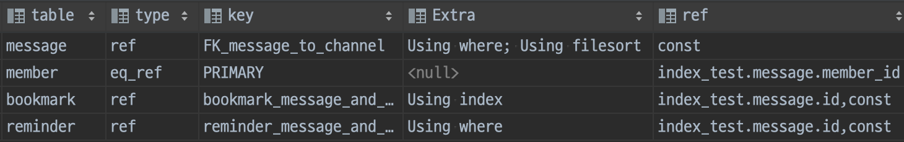  

실행계획을 보면, 제일 먼저 적용되는 `channel_id` 외래키 인덱스의 `Extra`에 `Using filesort`가 보인다. 
이는 `channel` 기준으로 조회한 레코드를 엔진에서 `posted_date`로 다시 정렬하고 있기 때문이다. 
따라서 `channel_id`와 `posted_date`로 복합 인덱스를 걸어준다.  

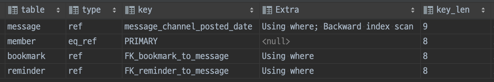  

해당 복합 인덱스를 사용함과 실행시간이 줄어듬을 확인할 수 있다.  

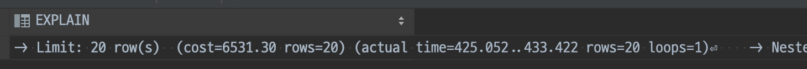
  

여기서 보면 거의 처음으로  `actual time`값이 `...`을 두고 유의미하게 서로 다른 값이 표시됐다. 
이는 `첫 레코드를 읽은 시간...마지막 레코드를 읽은 시간`이라는 뜻이다. 

|복합 인덱스 X|복합 인덱스 O|
|---|---|
|425...433ms|4.1...24.6ms|

마지막 레코드를 읽은 시간 기준으로 거의 **95%** 감소했다. 
키워드 검색의 경우도 `like` 부분을 제외하면 동일한 검색조건이라, 시간이 줄어듬을 확인할 수 있었다.  

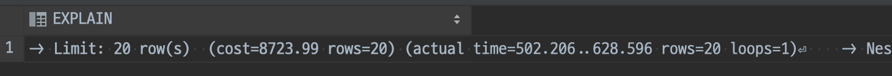
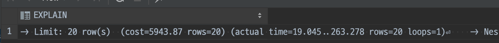  

|복합 인덱스 X|복합 인덱스 O|
|---|---|
|502...628ms|19...263ms|

<br>

북마크 조회는 메시지보다 간단하다. 
메시지는 특정 날짜로 이동해서 앞/뒤 어디든 볼 수 있게 해야했는데, 북마크는 무조건 `create_date`를 최신 또는 특정 시간부터 역순으로 조회한다.  

```sql
select
    bookmark.id as bookmark_id,
    bookmark.created_date as created_date,
    bookmark.member_id as member_id,
    bookmark.message_id as message_id,
    message.channel_id as channel_id,
    message.modified_date as modified_date,
    message.posted_date as posted_date,
    message.slack_message_id as message_slack_id,
    message.text as message_text,
    member.first_login as member_first_login,
    member.slack_id as member_slack_id,
    member.thumbnail_url as member_thumbnail_url,
    member.username as member_username
from
    bookmark
        left outer join
    message on bookmark.message_id=message.id
        left outer join
    member on bookmark.member_id=member.id
where
        bookmark.member_id=:memberId
        and bookmark.created_date < :createdDate
order by
    bookmark.created_date desc 
limit 20;
```

차이점이 있다면 메시지와 달리 북마크는 개인이 소유한 북마크만 보여주기에, `member_id` 일치 조건이 항상 걸려있다는 것이다. 
이쯤 되니 `member_id` FK 인덱스를 사용하고 있을 것이며, `Using filesort`가 표기될 것이 짐작간다.  

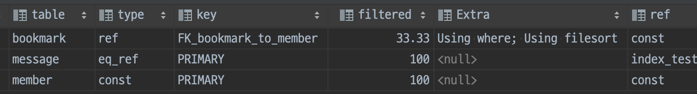  

예상이 맞았다. 
추가 정렬과 읽었지만 버려지는 레코드를 없앨 수 있도록 복합 인덱스를 걸어주자.  

```sql
create index bookmark_member_and_created_date on bookmark (member_id, created_date);
```

create index message_channel_and_posted_date on message (channel_id, posted_date);

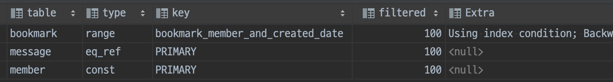

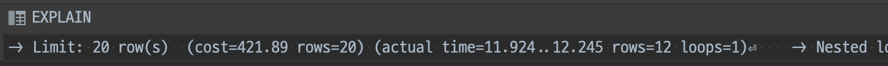
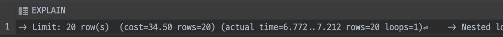

의도한 인덱스를 타고, 실행시간이 줄어들었다.  

|복합 인덱스 X|복합 인덱스 O|
|---|---|
|11.9...12.2ms|6.7...7.2ms|

더미데이터는 한 멤버당 300개의 북마크 데이터를 넣었다. 
북마크 데이터 수가 늘어난다면, 실행시간의 차이도 더 커질 것이다.  

<br>

마지막으로 리마인더는! 
북마크와 조건이 똑같다. 
멤버와 `remind_date`라는 알람 지정 시각을 기준으로 조회한다. 

```sql
where
    reminder.member_id=:memberId
    and reminder.remind_date < :remindDate
order by
    reminder.remind_date desc 
```

`member_id` FK 인덱스를 사용하고 `Using filesort` 표기까지 다~ 똑같았다. 
그래서 `member_id, remind_date`로 걸어줬고, 실행시간 차이만 적고 마치겠다.  

|복합 인덱스 X|복합 인덱스 O|
|---|---|
|15.8...19.2ms|3.4...8.0ms|

차이점이 있다면 리마인더는 알람을 발송하면 바로바로 데이터를 지우기 때문에, 실상황에서 효율은 더 낮지 않을까 싶은 점이다.  

<br>

## finally  

그래서 줍줍에는 추가로 이런 인덱스가 걸리게 되었다!  

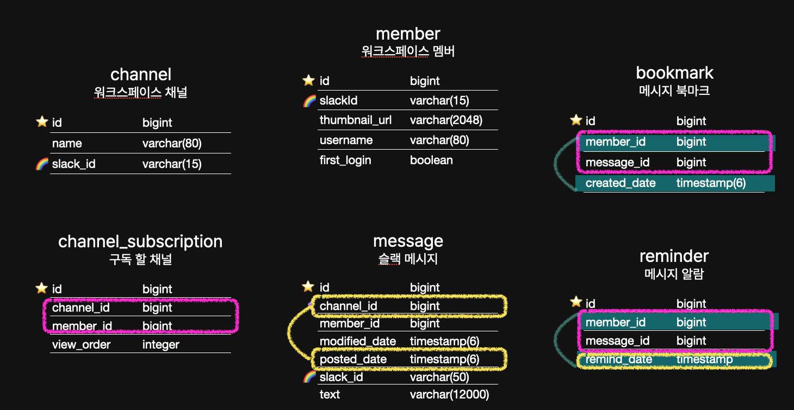

<br>

## 짧은 회고  

5차 스프린트 발표에 아쉬움이 많다. 
발표를 마치고부터 해당 포스팅을 적기 시작했는데... 하면 할 수록 발표 때 잘못 얘기한 부분만 보여서 유튜브에 올라올 것이 두려울 정도다 🥲 
그래도 깃허브 위키에 올려, 다른 백엔드 팀원들에게 공유해주려고 더 꼼꼼히 글을 쓰게 되었던건데... 
팀원들에게 잘못된 지식을 전하지 않아서 다행이다 😇  

별개로 인덱스 테스트에도 아쉬움이 있다. 
더미데이터를 적당히 넣으면 된다고 생각했는데, 실행계획을 분석할수록 **실제 데이터가 어떻게 쌓이는가**에 따라 결과가 많이 달라질 것 같아서였다. 
실사용 데이터가 좀 쌓인다면, 이번에 인덱스 과제를 하지 않은 다른 백엔드 팀원들이랑 함께, 한단계 더 최적화를 시도해보고 싶다🔥 

<br>

```toc
```
