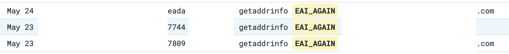
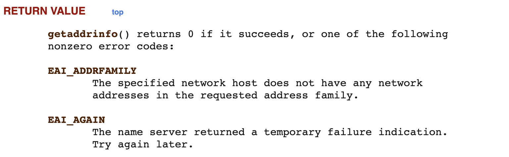
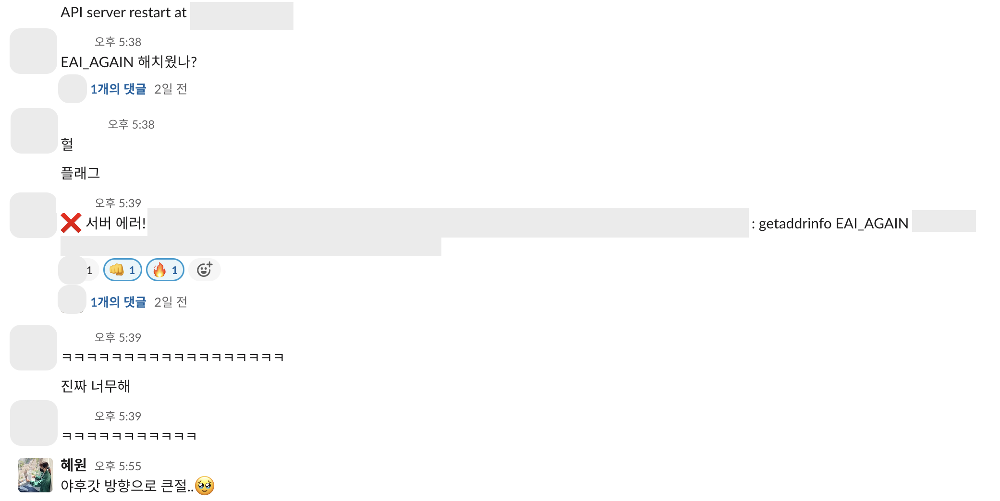
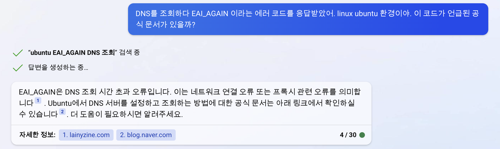

## ⚡️ 문제 상황  

언젠가부터 백엔드 서버 배포 직후에 아주 짧은 서비스 순단이 일어났다. 



배포 직후 외부 API를 호출 할 때 DNS 조회에 실패하는 걸로 추정되었다. 
여러번 발생하는 에러가 아니기에 다른 팀원이 애플리케이션 실행 후 트래픽 허용 전, `nslookup`으로 호출하는 모든 도메인을 한 번씩 조회하도록 배포 스크립트를 수정했다. 
DNS 조회 결과를 캐싱할 것으로 기대했기 때문이다.  

하지만 조치 후에도 여전히 `EAI_AGAIN`이라는 동일한 에러 메시지와 함께 순단이 발생했다. 
순단으로 인해 틀어진 여러 정합을 수동으로 맞춰야 하는 상황을 없애기 위해 이번 스프린트에 해결을 목표했다.  

<br>

## 🧶 EAI_AGAIN은 어디에서 오는가  

이 코드를 누가 언제 왜 던지는가 부터 알기 위해 라이브러리를 포함해 코드를 검색했는데 나오지 않았다. 
그래서 함수 이름으로 추정되는 `getaddrinfo`를 검색해보고, 에러 콜스택도 읽어봤다.  

  

프로젝트 및 노드 모듈 코드 내에 `getaddrinfo`라는 함수는 없었고, 대신 노드 모듈 내의 `dns.d.ts` 파일의 주석에 언급이 있었다.  

```typescript
 * See the `Implementation considerations section` for more information.
 * @see [source](https://github.com/nodejs/node/blob/v16.9.0/lib/dns.js)
 */
declare module 'dns' {
    import * as dnsPromises from 'node:dns/promises';
    // Supported getaddrinfo flags.
    export const ADDRCONFIG: number;
    ...
```

<br>

그리고 해당 파일의 제일 상단 주석에서 node DNS 모듈 내 `lockup()`과 다른 메서드들의 역할을 알 수 있었다.  

> The `dns` module enables name resolution. For example, use it to look up IP addresses of host names. Although named for the [Domain Name System (DNS)](https://en.wikipedia.org/wiki/Domain_Name_System), it does not always use the DNS protocol for lookups... (생략)  

설명은 대략 이런 내용이었다. 

`dns.lookup()`은 DNS 조회를 운영체제 기능을 통해 수행한다. 네트워크 통신이 일어나지 않을 수도 있다. 
시스템의 다른 애플리케이션들과 동일한 방식으로 동작하는 DNS 조회를 할 수 있다.  

반면 다른 메서드들은 실제 DNS 서버에 연결해 항상 네트워크를 통해 조회한다. `lookup()`과 사용하는 설정값이 다르다. 
다른 DNS 조회 기능을 사용하지 않고 언제나 네트워크를 통해 수행하고 싶다면 `resolve()`와 같은 다른 메서드를 사용하면 된다.  

  

<br>

난 에러 코드의 뜻을 알고 싶었을 뿐인데 서먹한 개념들만 나온다... 
에러 콜스택에서 `onlookup()`이라는 비슷한 이름의 메서드를 봤으니 이 메서드를 찾아봤다.  

어쩐지 모듈 내 코드에는 없고, 주석에 링크가 있던 `dns.js` 파일에서 발견할 수 있었다.  

```javascript
function onlookup(err, addresses) {
  if (err) {
    return this.callback(dnsException(err, 'getaddrinfo', this.hostname));
  }
  this.callback(null, addresses[0], this.family || isIP(addresses[0]));
}

function lookup(hostname, options, callback) {
  let hints = 0;
  let family = -1;
  let all = false;
  let verbatim = getDefaultVerbatim();
  ...

  const req = new GetAddrInfoReqWrap(); // 콜스택에서 본 친구다!  
  req.callback = callback;
  req.family = family;
  req.hostname = hostname;
  req.oncomplete = all ? onlookupall : onlookup; // 완료되면 onlookup을 호출하는구나 짐작된다  
  ...

  return req;
}
```

<br>

콜스택에서 봤던 `GetAddrInfoReqWrap.onlookup()`가 있었고, 해당 모듈과 다른 모듈의 테스트 코드에서 에러 코드를 찾을 수 있었다.  

<br>

```javascript
const dnsPromises = require('dns').promises;

dnsPromises.lookupService('127.0.0.1', 22).then(common.mustCall((result) => {
  assert(['ssh', '22'].includes(result.service));
  assert.strictEqual(typeof result.hostname, 'string');
  assert.notStrictEqual(result.hostname.length, 0);
}));

// Use an IP from the RFC 5737 test range to cause an error.
// Refs: https://tools.ietf.org/html/rfc5737
assert.rejects(
  () => dnsPromises.lookupService('192.0.2.1', 22),
  { code: /^(?:ENOTFOUND|EAI_AGAIN)$/ }
);
```  

<br>

`dns.lookup()`이 OS 기능을 사용한다는 것과 에러 코드 정의가 없는 것을 봤을 때, `EAI_AGAIN`은 OS에서 반환하는 코드인 것 같았다. 
그렇다면 배포 스크립트의 `nslookup`이 성공하지 않았던 것일까? 
배포 로그를 봤을 때 그건 아니었다. 잘 조회되고 있었다. 

사실 이쯤 해서 시도할 해결책은 결정나 있었다. 
팀원이 언급한 적 있던 [dnscache](https://github.com/yahoo/dnscache)로 노드 애플리케이션에서 별도 캐싱을 적용하는 것이었다. 
서버 로그를 봤을 때, 배포 직후 첫 요청에 실패하는 것이 아니라 새로운 서버에 트래픽이 흐르고 1~2분 지났을 시점에 한두건의 요청이 실패한다는 특정한 패턴이 있었다. 
그래서 애플리케이션 단에서 캐싱을 적용하면 해결될 것으로 기대했다.  

어쨌든 에러 코드의 명확한 스펙을 알게된 건 아니라 더 찾아보았다. 
사실 여기서 시간을 엄청나게 소비했는데... 
검색해보면 정보가 잘 안나왔다.  

특히 노드 모듈 테스트 코드도 그랬고, 틀린 도메인이나 설정값으로 요청해서 해당 에러가 생기는 경우가 대부분이었다. 
우리처럼 정상적으로 동작하다가 에러가 발생하고, 다시 정상적으로 되는 경우는 없었다. 
공식 문서 찾기에 지쳤을 때 문득 생각나서 빙챗으로 검색을 했는데 [linux 문서](https://man7.org/linux/man-pages/man3/getaddrinfo.3.html)를 바로 알려주는 것이었다.  

<br>

  

<br>

그리고 이 함수에 대해 상세한 설명을 해주신 블로그 글 [\[네트워크/C\] getaddrinfo 함수 - 제임스 딘딘](https://techlog.gurucat.net/293)도 함께 알려주었다. 
문서에 따르면 일시적인 조회 실패로, 잠시 후 다시 시도하라는 뜻이었다.  

모든 외부 API 호출이 해당 사유로 실패 가능했기 때문에, 전역적인 재시도 처리를 하는 것도 방법이었다. 
그래도 캐싱으로 충분할 것 같아 `dnscache`를 적용했다.  

```javascript
require('dnscache')({ enable: true })
```

<br>

해당 모듈을 적용하면 전역적으로 모든 `dns` 메서드를 래핑해준다 한다.  

적용 후 테스트 환경에서 세차례 정도 배포해보았는데, 순단이 발생하지 않았다. 
그래서 프로덕션에도 적용해 배포해본 결과 일단은 무찌른 것 같다. 아마도... 



<div style="text-align:center; font-style:italic; color:grey;">
  진짜로 순간 속았음  
</div>  

<br>  

## 🛶 잘 하는 개발자는 어떻게 될 수 있나요   

사실 글로만 보면 꽤 간단하게 해결한 것 같은데!!! 
여기에 페어로 이틀을 꼬박 소모했다.  

이유는 이 에러가 프로덕션 무중단 배포 시에만 발생했는데, 스테이지 환경은 동일한 배포 파이프라인이 구축되어 있지 않아서 재연이 어려웠기 때문이다. 
원인을 확실하게 알지 못하니 재연된 스테이지 환경에 적용 후 해결 되었는지 봐야 했는데... 
여러가지 다양한 이유로 재연 환경을 구축하기가 만만치 않았다. 
사실 나는 조수석에 앉아있었고 든든한 페어가 멋지게 뚝딱뚝딱 구축해줬지만... 

잘 하고 싶다는 고민이 많은 요즘이다. 
내가 생각하는 '잘 하는 개발자'는 언어나 분야에 제약받지 않는 사람이다. 
예를 들어, 정말 그림을 잘 그리는 사람은 동양화를 주로 그렸어도, 대리석 조각을 깎으라 시키면 잘 할 수 있다. 
동양화를 그리면서 체득한 양감이나 구도에 대한 이해와 손을 쓰는 능력은 조각에도 적용되기 때문이다.  

반면 나는 노드에서 익숙하지 않은 코드를 보면 스프링을 보듯이 이해 할 수가 없다. 
같은 백엔드인데도 그렇다. 
인프라도 그렇고... 열심히 하면 어떻게든 되겠지만 참 쉽지않다!!! 
'노드라서 자스라서 잘 모르겠다'는 말을 하고싶지 않은데 하지 않기가 어렵다.  

그래도 처음에는 노드 + 자스에 손 댈 일이 생길 때 마다 부담되고 고통스러웠는데 지금은 즐겁다. 
디버깅도 즐거워지는 때가 오겠지...  

그리고 프롬프트 엔지니어 얘기가 괜히 나온 게 아니라는 걸 느꼈다.  



빙챗의 엄청난 검색 능력을 보여주려고 다시 질문했는데 절대 그 때 주었던 리눅스 문서를 주지 않는다. 
로그인 하지 않고 검색했어서 히스토리를 찾을 수가 없는데, 어떻게 검색했었을까? 
내가 했는데도 기억이 안 나서 몹시 안타깝다.  

<br>

```toc
```
