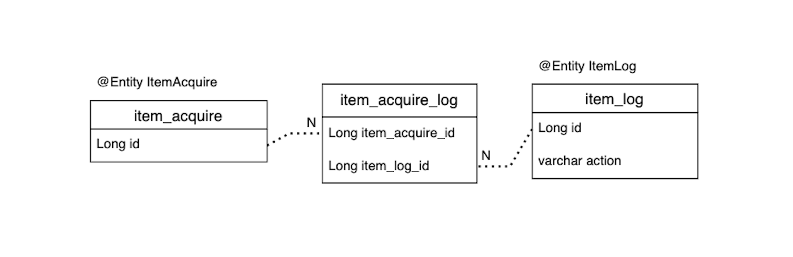
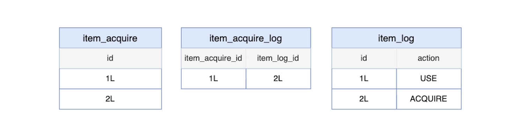
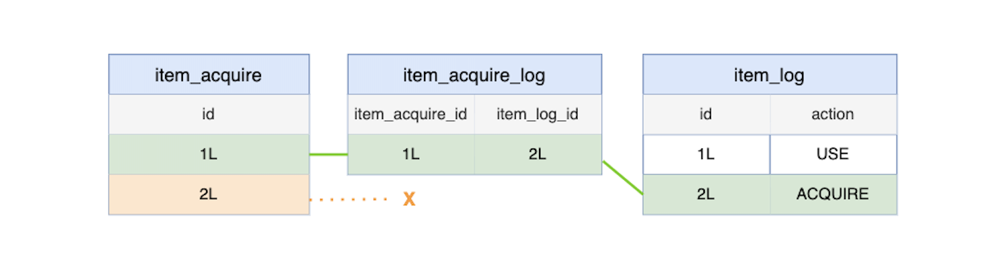
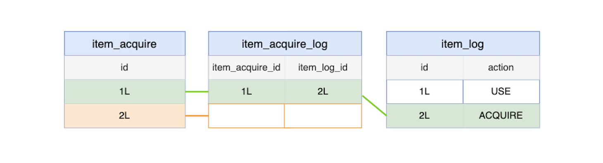
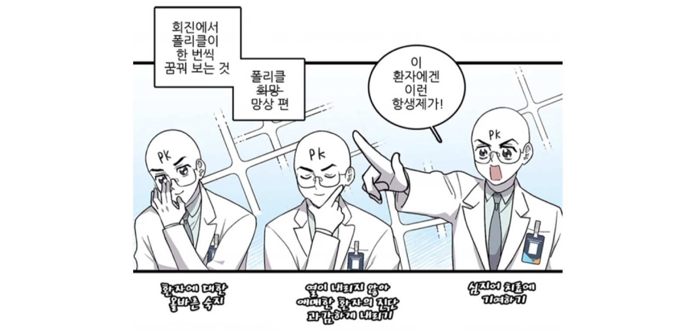
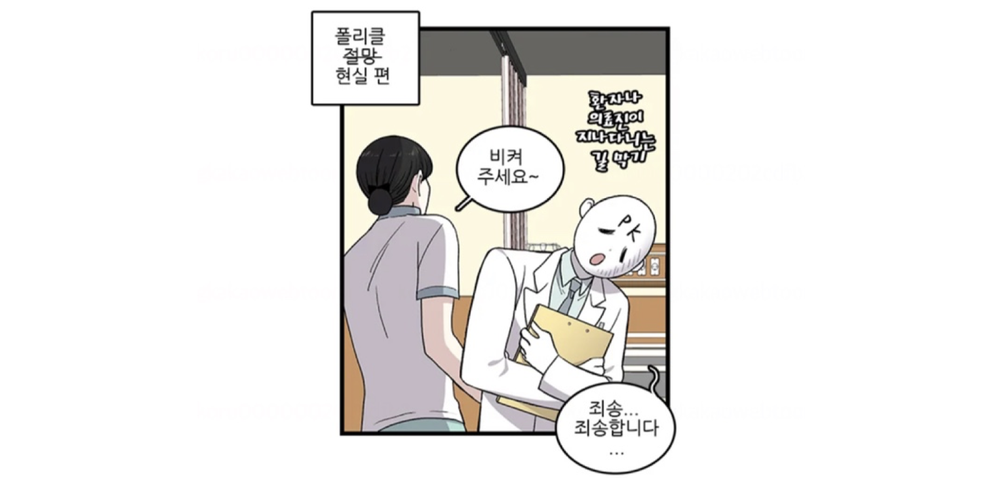
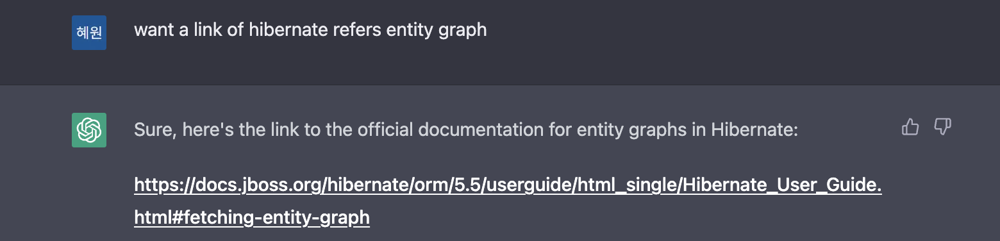

백엔드 면접 단골 질문 중 하나가 `JPA N+1 문제를 어떻게 해결하나요?`이다. 
물론 몇 달 전까지 나도 줄줄 외우고 있었다. 
dto로 갖고 오던가, 페치 조인이 엔티티 그래프가 어쩌고 배치 사이즈를... 
그리고 몇 개는 실제로 적용해서 문제를 해결해보기도 했지만, 비교적 전형적인 케이스만 다뤘기에 적용했더니 해결됐다, 끝! 이었다. 
그래서 최근에 `N+1`을 해결하기 위해 페치 조인을 쓰다가 동작을 잘 모른다는 걸 알게 되었다.  

<br>

## 🎁 문제 상황  

단방향 연관관계를 가진 두 엔티티가 있다. 
`ItemAcquire`는 유저가 획득한 아이템이다. 
`ItemLog`는 아이템을 획득, 또는 사용될 때 생기는 로그다.  

```java
@Entity
public class ItemAcquire {

    @Id
    @GeneratedValue(strategy = GenerationType.IDENTITY)
    private Long id;

    @ElementCollection
    @CollectionTable(name = "item_acquire_log", joinColumns = @JoinColumn(name = "item_acquire_id"))
    @Column(name = "item_log_id")
    private List<Long> itemLogIds = new ArrayList<>();
}

@Entity
public class ItemLog {

    @Id
    @GeneratedValue(strategy = GenerationType.IDENTITY)
    private Long id;

    @Enumerated(EnumType.STRING)
    private Action action;
}

enum class Action {
    ACQUIRE,
    USE
}
```

<br>

엔티티 `ItemAcquire`, `ItemLog`는 다음과 같은 비즈니스 로직을 가진다.  

1. 아이템 로그는 아이템에 취한 행동에 따라 `ACQUIRE(획득)`, `USE(사용)`이 정해진다.  
2. 아이템 획득은 `ItemAcquire 생성` -> `ItemLog(action = ACQUIRE) 생성` 순서로 이뤄진다.  
3. `아이템 획득 생성` 이 후 `아이템 획득 로그 생성`까지 로직에서 문제가 생기더라도, `아이템 획득`은 남아야 한다.   
4. 따라서 `ItemAcquire`는 아이템 로그를 가지지 않을 수도 있다. 
5. 두 엔티티는 단방향 간접참조로 연결되어있다. 아이템 로그는 아이템 획득 엔티티를 모른다.  

DB에는 두 테이블을 연결하는 `item_acquire_log` 테이블이 추가로 생성된다.  

  

```java
public class ItemService {

    public void acquire() {
        ItemAcquire itemAcquire = itemAcquireRepository.save(new ItemAcquire("포션"));

        // 여기서 예외가 발생하더라도 itemAcquire는 저장되어야 한다. 논리적으로 분리된 단위다. 
        inventoryService.put(itemAcquire);
        itemLogRepository.save(new ItemLog(itemAcquire.getId(), Action.ACQUIRE))
    }
}
```

<br>

예상 가능하듯이, `ItemAcquire`를 조회하고 하위 `itemLogIds`에 접근할 때 추가 조회 쿼리가 발생한다. 
이를 해결하기 위해 페치 조인을 사용했다.  

```java
public interface ItemAcquireRepository extends JpaRepository<ItemAcquire, Long> {

    @Query("select i from ItemAcquire i join fetch i.itemLogIds where c.id = :id")
    Optional<ItemAcquire> findById(@Param("id") Long id);
}
```

<br>

조회 쿼리는 원하는 대로 join을 사용하게 고쳐졌으나, `ItemAcquire`를 조회하는 몇 테스트가 실패했다.  

```java
public class ItemService {

    public Long acquire() {
        ItemAcquire itemAcquire = itemAcquireRepository.save(new ItemAcquire("포션"));

        // 여기서 예외가 발생하더라도 itemAcquire는 저장되어야 한다. 논리적으로 분리된 단위다. 
        inventoryService.put(itemAcquire);
        itemLogRepository.save(new ItemLog(itemAcquire.getId(), Action.ACQUIRE))
        return itemAcquire.getId();
    }

    public void getItem(Long id) {
        return ItemAcquireRepository.findById(id).orElseThrow(ItemNotExistException.class)
    }
}

@DisplayName("아이템이 생성되나 유저 인벤토리 등록에 실패한다.") 
@Test
void failPutInInventory() {
    Long itemId = itemService.acquire();
    // ItemNotExistException 발생 
    ItemAcquire item = itemService.getItem(itemId);

    assertThat(item.getItemLogIds()).isEmpty();
}
```

<br>

내가 기대한 결과는 `빈 itemLogIds를 갖는 ItemAcquire가 조회된다`였으나, 실제로는 `ItemNotExistException` 예외가 발생했다. 
이상한 점은 `itemId`을 id로 갖는 `ItemAcquire`가 분명 존재한다는 것이었다. 
이유를 모른 채로 다른 `N+1` 해결책인 `@EntityGraph`를 적용해 변경했더니 통과했다.  

```java
public interface ItemAcquireRepository extends JpaRepository<ItemAcquire, Long> {

    @Override
    @EntityGraph(attributePaths = "itemLogIds")
    Optional<ItemAcquire> findById(Long id);
}
```

<br>

`@EntityGraph`를 사용하는 경우에는 의도대로 `빈 itemLogIds를 갖는 ItemAcquire`가 조회된다.  

<br>

## 🔍 원인 탐색  

각 경우에 실행되는 sql문을 비교해 원인을 찾을 수 있었다.  

```sql
# join fetch로 실행되는 sql 
select
    itemacquire.id as id,
    itemacquire.item_log_id as item_log_id 
from
    item_acquire itemacquire 
inner join
    item_log itemlog 
        on itemacquire.id=itemlog.item_acquire_id 
where
    item_acquire.id=?

# EntityGraph로 실행되는 sql 
select
    itemacquire.id as id,
    itemacquire.item_log_id as item_log_id 
from
    item_acquire itemacquire 
left outer join
    item_log itemlog 
        on itemacquire.id=itemlog.item_acquire_id 
where
    item_acquire.id=?
```

<br>  

### inner join과 outer join

테이블에 다음과 같은 데이터가 있다.  

  

`inner join`을 사용할 경우, 조인 테이블에 join에 사용되는 id값이 없다면 조회가 되지 않는다.  

  

각 id에 대해 `findBy(Long id)`를 시행하면 하나의 엔티티만 나온다.  

- ItemAcquire(id=1L, itemLogIds = [2L])   

<br>

반면, `left outer join`은 join에 사용되는 id값이 없더라도 조회가 된다.  

  

각 id에 대해 `findBy(Long id)`를 시행하면 두 개의 엔티티가 나온다.  

- ItemAcquire(id=1L, itemLogIds = [2L])  
- ItemAcquire(id=2L, itemLogIds = [ ])  

의도한 join 방식이 `left outer join`이기에 우선 `@EntityGraph`를 적용해 해결했다.  

<br>

## 🍷 적용할 수 있었던 다른 선택지들   

### left join fetch 

JPQL에 `left join fetch`를 쓰면 `@EntityGraph`와 동일하게 `outer join`으로 가져올 수 있다.  

```java
public interface ItemAcquireRepository extends JpaRepository<ItemAcquire, Long> {

    @Query("select i from ItemAcquire i left join fetch i.itemLogIds where c.id = :id")
    Optional<ItemAcquire> findById(@Param("id") Long id);
}
```

<br>  

### FetchType.EAGER, 하지만...

또는, `itemLogIds`에 `FetchType.EAGER`를 사용하는 것도 방법이다.  

```java
@Entity
public class ItemAcquire {

    @Id
    @GeneratedValue(strategy = GenerationType.IDENTITY)
    private Long id;

    @ElementCollection(fetch = FetchType.EAGER)
    @CollectionTable(name = "item_acquire_log", joinColumns = @JoinColumn(name = "item_acquire_id"))
    @Column(name = "item_log_id")
    private List<Long> itemLogIds = new ArrayList<>();
}
```

<br>

하지만 이 방법은 [Hibernate 공식 문서](https://docs.jboss.org/hibernate/orm/5.5/userguide/html_single/Hibernate_User_Guide.html#fetching-strategies-dynamic-fetching-entity-graph)에서 권장하지 않는다.  

> JPQL 쿼리에서 EAGER 연관관계가 생략된 경우, Hibernate는 각 객체의 EAGER 연관관계를 조회하기 위해 또 다른 조회문을 실행해 N+1 문제가 발생하게 됩니다. 
> 따라서 LAZY를 설정하고 필요할 때만 쿼리별로 EAGER를 적용하는 게 낫습니다.  

`left outer join`을 사용하거나, `@EntityGraph`를 이용하는 게 낫다. 
`@EntityGraph`의 경우 [Hibernate 공식 문서](https://docs.jboss.org/hibernate/orm/5.5/userguide/html_single/Hibernate_User_Guide.html#fetching-strategies-dynamic-fetching-entity-subgraph)의 예시에는 `inner join`이 실행된다. 
내가 겪은 문제처럼 연관관계에 따라 엔티티가 조회되지 않을 수도 있는 경우에는 `outer join`을 실행하도록 구현되어있는 것 같다.  

<br>

## ☁️ 이상과 현실  
  
일을 하면서 내 지식의 얕음을 마주칠 때 마다 부끄러움 반 더 열심히 공부하자는 투지 반이 든다.  

  

  

<div style="text-align:center; font-style:italic; color:grey;">
  다음 웹툰 순정 히포크라테스. 초반엔 딱 이런 심정이었는데 요새는 이 정도는 아니고🥹 좋아하는 웹툰이라 가져와봤다.  
</div>  

<br>  

이번 문제는 도메인 로직 때문에 생경한 조합을 사용하면서 마주쳤다. 
`@ElementCollection`을 처음 써봤으며 트랜잭션도 일부 구간만 묶여있다. 
'전형적인' 경우였다면 `ItemAcquire` 생성과 `ItemLog` 생성이 동일 트랜잭션으로 묶여있어, 한 쪽만 생기는 일이 없었을 것 같다.  

이런 일을 마주하면 앞으로 어떻게 공부해야 더 깊이있고 효율적이게 공부할 수 있을까 고민이 든다. 
물론 처음부터 꼼꼼하게 공부한다면 좋았겠지만, 새로운 기술을 배우면서 야생형으로 학습하기 보다 경우의 수를 정복하는 데 중점을 두는 건 좋은 해결책이 아니라고 생각한다. 
우테코 때 부터 계속 했던 고민이라 선택한 극복법 중에 하나가 "관련된 부분 공식 문서 읽기"였는데 소홀해진 것 같아 반성했다.  

챗지피티 얘기를 지금 하면 뜬금없는 뒷북같긴 하지만, 그 때만 해도 공식 문서를 찾는 것 부터 일이었는데, 요즘은 문제의 키워드를 얻거나 관련 문서 링크를 찾는 데에 정말 유용하게 쓰는 중이다. 몇 달 새에 무서울 정도로 공부하기가 쉬워졌다.   

  

<div style="text-align:center; font-style:italic; color:grey;">
  존재하지 않는 섹션 링크를 붙이는 정도는 눈감아주자...
</div>  

<br>  

이번 문제는 페이지네이션이 없어서 평일에 `@EntityGraph`만 적용하고 넘어갔었다. 
주말에 공부를 하면서 공식 문서를 읽다 보니 `@BatchSize`보다 dto 프로젝션, 또는 fetch join을 권장한다는 것, 
`@EntityGraph`도 디폴트 `EntityGraphType` 옵션이 있어서 다른 옵션을 설정하면 표기한 연관 객체를 제외하고 EAGER로 불러올 수도 있다는 것... 등등 
많은 새로운 정보를 알게 됐다. 
작심삼일도 삼일마다 하면 된다고, 이번처럼 그냥 넘어가지 말고 나중에라도 공부하자고 매번 상기하고 실천해야겠다.  

<br>

```toc
```
