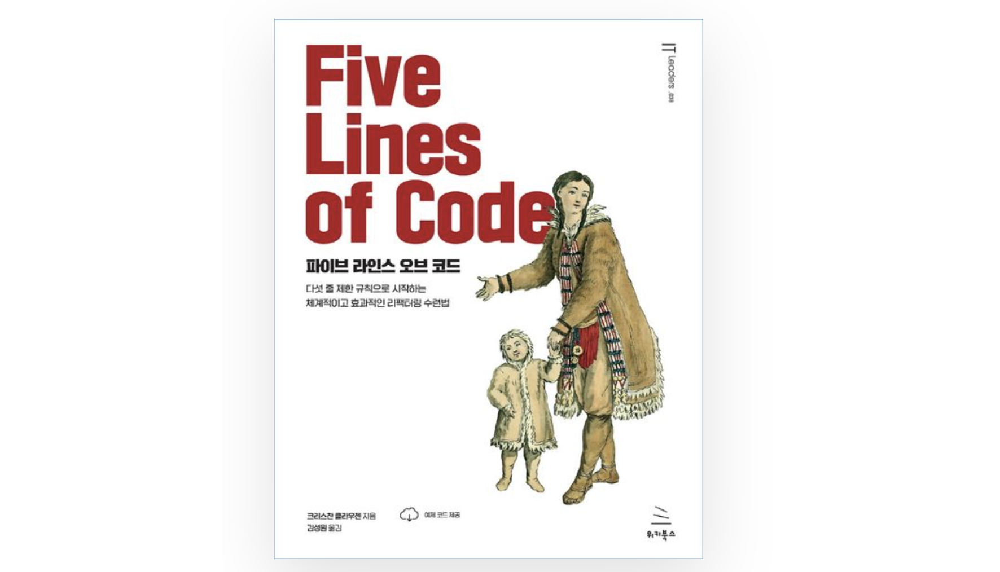

많은 스타트업에서 백엔드 언어로 자바스크립트를 쓰고 있다. 
나는 자바스크립트랑 node.js로 바닥부터 개발을 해보지 않아서 모르지만, 다른 언어와 프레임워크에 비해 프로덕트를 빠르게 낼 수 있어, 초기 스타트업에서 많이 사용한다고 들었다. 
그런데 나처럼 특정 언어와 프레임워크를 사용하는 백엔드 교육 과정으로 개발을 시작한 사람은 배운 것 밖에 쓸 줄 모른다. 
대부분의 교육 과정에서 가르치는 자바•스프링이 공개된 자료도 훨씬 많다.  

그런데 예전에 구직 사이트에서 신입 공고를 볼 때 자바스크립트•노드 스택이 많았다. 
가고 싶은 회사 중 한 곳이었던 인프런도 자바스크립트•노드 스택이었다. 
취준 때 스택에 상관없이 이곳저곳 서류를 넣고 면접을 보면서 <자바 스프링이 아닌 무언가>를 사용하는데 괜찮으세요 라는 질문을 받으면 언어랑 프레임워크는 도구일 뿐이죠!😉 라고 답하면서 허세는 잔뜩 부렸는데, 
솔직히 나도 할 줄 아는 걸로 해먹고 살고 싶었다. 편하니까.  

다행스럽게 자바•스프링을 사용하는 디어어 오게 되었는데... 도착해서 본 것은 거대한 자바스크립트•노드 레거시 덩어리였다.  


  

<div style="text-align:center; font-style:italic; color:grey;">
  디어 백엔드 채용 공고... 스프링이라며! 스프링이라며! 
</div>

<br>

낯선 언어와 프레임워크로 잘 개발하려면 뭘 하면 될까? 
일단 각잡고 자바스크립트와 노드 공부하기? 인프런에서 강의 끊기?  
이것도 좋은 방식이겠지만, 그냥 자신있게 해오던 대로 하면 된다. 언어랑 프레임워크는 도구일 뿐이죠. 라고 뭣모르고 뱉었던 말을 실천해본다. 🔥  

<br>

## 🚀 Jest로 테스트 짜기  

  

현재 자바스크립트•노드로 짜여진 디어의 메인 레거시 서버는 스프링 MVC 아키텍쳐와 비슷한 구조다. 
중간에 여러 서비스를 의존해 처리하는 application 레이어가 끼워져 있을 뿐이다.  

처음 테스트를 작성하려 했을 때 놀랐던 건 H2 처럼 자동으로 설정해주는 인메모리 DB가 있겠거니 한 거였는데 없었다. 
도커로 DB를 띄우는 방식을 생각했지만, DB에 접근하는 코드와 repository 계층 클래스들은 이미 몇 년간 버그없이 잘 사용하고 있어서 테스트 대상 우선순위에서 제외해도 될 것 같았다. 
그래서 repository 계층을 Jest로 모킹한 뒤 application 계층의 메서드를 호출해 통합 테스트를 짰다.  

예시로 디어에는 앱 설치 여부와 관계없이 돈을 대신 내고 친구를 태워줄 수 있는 `디어쏘기(treat)` 기능을 새로 출시했었다. (참고로 현재는 서비스를 중단했다.🥹) 
일부 지역에서 시험적으로 도입한 기능이라 해당 지역의 유저에게만 기능이 노출되어야 한다. 

1. 외부 서버를 호출하는 부분
2. DB에서 데이터를 읽어오는 부분  

두 부분을 모킹해 테스트한다.  

```javascript
const TreatApplication = require("../../../src/applications/TreatApplication")
const application = new TreatApplication()

describe('디어쏘기 지역인지 확인하다', function () {
    beforeEach(() => {
        application._experimentAreaService._otherServerConnector.getAreaPolicy = jest.fn()
        application._experimentAreaService._experimentalAreaRepo.findAllByAreaId = jest.fn()
    })
```

<br>

JPA 있으면 되는데~ 아 스프링은 H2로 테스트 해주는데~ 생각 그만하고 성실히 짠다.  

```javascript
describe('디어쏘기 지역인지 확인하다', function () {
    beforeEach(() => {
        application._experimentAreaService._otherServerConnector.getAreaPolicy = jest.fn()
        application._experimentAreaService._experimentalAreaRepo.findAllByAreaId = jest.fn()
    })

    test('디어쏘기 대상 지역이 아니라면 디어쏘기를 보여주지 않는다', async () => {
        // given
        application._experimentAreaService._otherServerConnector.getAreaPolicy.mockReturnValue(
            { areaId: 1 }
        )
        application._experimentAreaService._experimentalAreaRepo.findAllByAreaId.mockReturnValue(
            [ { area_id: 1, type: 'SHOP' } ]
        )

        // when
        const result = await application.shouldDisplay(37.123, 127.1234, moment())

        // then
        expect(result).toEqual(false)
    })

    test('디어쏘기 대상 지역이라면 디어쏘기를 보여준다', async () => {
        // given
        application._experimentAreaService._otherServerConnector.getAreaPolicy.mockReturnValue(
            { areaId: 1 }
        )
        application._experimentAreaService._experimentalAreaRepo.findAllByAreaId.mockReturnValue(
            [ { area_id: 1, type: 'TREAT' } ]
        )

        // when
        const result = await application.shouldDisplay(37.123, 127.1234, moment())

        // then
        expect(result).toEqual(true)
    })
})
```  

<br>

Jest로도 Junit에서 하던 테스트를 다 할 수 있다. 
다어쏘기는 고객이 발급받은 공유 코드를 친구에게 전달하면, 친구가 그 코드로 킥보드를 탈 수 있다. 
시행 지역 밖에 있거나 미납 상태인 고객에게 코드를 발급하면 안되기에 해당 상황에서 예외를 던지는 경우를 테스트한다.  

```javascript
describe('디어쏘기 공유 코드를 발급한다.', function () {

    // 코드를 발급하는 메서드 issueUrl(userId, latitude, longitude, now)
    
    test('디어쏘기 대상 지역이 아니라면 발급하지 않는다.', async () => {
        ...
        // when & then
        await expect(application.issueUrl(1, 37.123, 127.1234, moment()))
            .rejects.toThrowError(new IllegalArgumentError('디어쏘기 시행 지역이 아니에요.'))
    })

    test('미납 상태인 이용자에겐 발급하지 않는다.', async () => {
        ...
        // when & then
        await expect(application.issueUrl(1, 37.123, 127.1234, moment()))
            .rejects.toThrowError(new IllegalArgumentError('미납한 이용이 있으면 디어쏘기를 보낼 수 없어요. \n결제를 진행해주세요.'))
    })
```  

<br>

디어쏘기는 해당 기능이 신규 고객 유치에 도움이 되는가가 큰 관심사였다. 
그래서 디어쏘기 기능으로 로그인 또는 회원가입 한 사람을 추적하고 DB에 기록했다. 
앞선 방식으로는 이 데이터가 DB에 제대로 저장되는지, 다시 DB에서 데이터를 읽어 확인할 수 없다. 
그러니 대신 저장 메서드가 호출된 조건을 확인하기로 한다. 
Mockito가 지원하는 것과 동일한 기능이다.  

```javascript
describe('디어쏘기로 회원가입 또는 로그인했다면 기록을 남긴다', function () {

    test('기존 유저라면 로그인으로 기록을 남긴다', async () => {
        ...
        // when 
        await application.saveTreatAuthHistory(userId, false, now)

        // then
        expect(application._treatService._treatAuthHistoryRepo.save).toHaveBeenCalledWith(userId, LOGIN, toIsoDateTime(now))
    })

    test('신규 유저라면 회원가입으로 기록을 남긴다', async () => {
        ...
        // when
        await application.saveTreatAuthHistory(userId, true, now)

        // then
        expect(application._treatService._treatAuthHistoryRepo.save).toHaveBeenCalledWith(userId, SIGN_UP, toIsoDateTime(now))
    })
})
```  

<br>

그리고 프레임워크와 무관하게 큰 도움이 되었던 방법으로, 개발 전에 테스트 케이스 모두 다 써두기가 있다. 
우리 회사엔 기획자와 QA 담당자가 따로 없다. 내 개발은 내 스스로 책임진다.🔥 
테스트 케이스를 먼저 모두 짜고 시작하면 정책을 정리하고 예외 상황을 미리 파악하는데 도움이 된다. 
미처 고려하지 못했던 부분을 발견해 더 질좋은 서비스를 만들 수 있었다.  

예로, 결제수단으로 카드를 등록 시 타인 명의 카드 등록을 방지하기 위해 간단한 검증을 넣게 되었다. 
그러면 일단 어떤 경우에 통과하고, 어떤 경우에 통과시키지 않을지를 먼저 테스트로 정리하고 빠진 건 없는지 생각한다.  

```javascript
describe('결제수단 카드 등록 시 개인 카드라면 본인 명의인지 확인한다', function () {

    test('법인 카드라면 명의를 확인하지 않는다', async () => {
    })

    describe('개인 카드일 때, 유저의 생년월일과 카드의 생년월일이 일치하는지 확인한다', function () {

        test('일치하지 않으면 본인 명의가 아니라고 판단한다', async () => {
        })

        test('일치하면 본인 명의라고 판단한다', async () => {
        })
    })
})
```  

<br>

종종 구현하다 생각할 시간이 필요하면 전체 테스트를 돌려놓고 쉬곤 한다. 
불멍 때리듯 초록멍을 때리면 마음이 편해진다.  

  

DB 접근을 모킹해서 진짜 엄청 빠르다. 기분이 좋다.  

<br>

## 👾 객체지향적인 리팩터링  

`객체지향적인 코드 짜기`라는 말이 다소 진부해 지루하게 들리겠지만, 그렇지 않은 레거시 코드가 많다면 시작하려는 마음을 먹기부터 쉽지 않다. 
하면 이왕 시작한 거 한번에 바꿔야 할 것 같고, 깨끗하게 다 걷어내고 싶고 그렇다. 
하지만 달리는 기차의 바퀴를 뜯어서 닦을 수는 없다. (그리고 그러다가 기차를 터트린 적이 꽤 있다...🤯) 
조급한 마음을 버리고 작은 단계부터 한다.  

레거시 코드를 고치다 보면 DB에서 조회한 값을 직접 비교하던 로직을 클래스로 옮길 때가 많았다. 
아래는 유저가 미납한 요금이 있는지 확인하던 기존 코드다.  

```javascript
async checkUnpaidOfUser (userId) {
    const unpaidUseAmount = await this._getUserUnpaidUsePayment(userId)
    return !!(unpaidUseAmount)
}

async _getUserUnpaidUsePayment (userId) {
    const lastUse = await this._useRepo.getLastUseByUserId(userId)
    if (!lastUse) {
        return 0
    }
    if (lastUse.pay_fail_at === null || lastUse.pay_at) {
        return 0
    }
    if (lastUse.pay_refund) {
        if (lastUse.pay_refund_amount !== null) {
            return lastUse.pay_riding + lastUse.pay_reservation + Number(lastUse.additional_charge) - lastUse.pay_discount - lastUse.pay_refund_amount
        }
        return 0
    }
    return lastUse.pay_final
}
```

<br>

왜 해당 값들의 특정한 조합에 따라 미납 여부가 달라지는지 알려면 여러가지 슬픈 사연을 알아야 한다. 
이 말은 처음 코드만 보면 도무지 알 수가 없다는 뜻이다.🤗  

마침 추가 기능을 개발하면서 미납 여부를 확인하는 요구사항이 있길래, 클래스를 만들어 로직을 옮겼다.  

```javascript

/**
 * @param {number} userId
 * @return {Promise<boolean>}
 */
async checkUnpaidOfUser (userId) {
    return this._isUserHasUnpaidUse(userId)
}

/**
 * @param {number} userId
 * @return {Promise<boolean>}
 * @private
 */
async _isUserHasUnpaidUse (userId) {
    const lastUseRow = await this._useRepo.getLastUseByUserId(userId)
    if (!lastUseRow) {
        return false
    }
    const lastUse = new Use(lastUseRow)
    return !lastUse.isPaid()
}

class Use {

    /**
     * @return {boolean}
     */
    isPaid() {
        const paid = this.payAt || !this.payFailAt
        return paid || this._isFullRefunded() || this._doesNotHavePayRemainAfterPartialRefunded() || this.payFinal === 0
    }

    /**
     * @return {boolean}
     */
    _isFullRefunded() {
        return Boolean(this.payRefund && !this.payRefundAmount)
    }

    /**
     * @return {boolean}
     */
    _isPartialRefunded() {
        return Boolean(this.payRefund && this.payRefundAmount)
    }

    /**
     * @return {boolean}
     */
    _doesNotHavePayRemainAfterPartialRefunded() {
        return this._isPartialRefunded() &&
            (this.payRiding + this.payReservation + Number(this.additionalCharge) - this.payDiscount - this.payRefundAmount <= 0)
    }
}
```

<br>

뿐만 아니라 외부 서버에 요청해 받은 응답값 처럼 로직이 없는 데이터도 단순한 DTO 클래스로 감싸주었다. 
그리고 아주 간단한 로직이라면 DTO 내부로 옮겼다.  

```javascript
// before
async getPolicy(requestAt) {
    try {
        const response = await this._client.get('/policy', { requestAt })
        return response.data;
    } catch (err) {
        throw new ExternalServerError(err.response.data.message);
    }
}

// after
/**
* @param {moment.Moment} requestAt
* @return {Promise<PolicyResponse>}
*/
async getPolicy(requestAt) {
    try {
        const response = await this._client.get('/policy', { requestAt })
        return new PolicyResponse(response.data);
    } catch (err) {
        throw new ExternalServerError(err.response.data.message);
    }
}

class PolicyResponse {

    constructor(data) {
        /**
         * @type {number}
         */
        this.id = data.id;

        /**
         * @type {string}
         */
        this.status = data.status;

        /**
         * @type {RuleResponse[]}
         */
        this.rules = data.rules.map((it) => new RuleResponse(it));
    }

    /**
     * @returns {boolean}
     */
    isStopped() {
        return this.status === 'STOP'
    }
}

class RuleResponse {

    constructor(data) {
        /**
         * @type {number}
         */
        this.id = data.id;

        /**
         * @type {string}
         */
        this.name = data.name;
    }
}

```  

<br>

이 방법이 답답해 보일 수 있겠지만, 없는 필드에 접근하다가 `undefined is not a function`을 당하지 않을 수 있다. 
나는 이미 너무 너무 많이 충분히!!! 당했다.😇 
dto로 감싸기만 하더라도 코드 작성 시 IDE의 도움을 받을 수 있어서 한결 수월하다.  


<div style="text-align:center; font-style:italic; color:grey;">
  얼마나 소중한 기능인지 당연할 때는 몰랐어  
</div>

<br>

자바는 DTO 마다 클래스를 만들어야 해서 중첩된 값이 많아지면 클래스 파일도 늘어나는 게 조금 거슬렸는데, 그래도 자스는 한 파일 안에서 여러 클래스를 선언할 수 있어서 나았다.  

<br>

## 🧶 JSDoc으로 타입 힌트 넣기  


코드에 많은 개선이 이뤄지고, 테스트를 꼼꼼히 짜게 되고, 나도 자바스크립트에 익숙해진 지금은 잘 볼 일 없는 에러긴 하지만, 처음에는 정말 `undefined`라는 단어만 봐도 머리에 열이 올랐다. 
그냥 에러만 나면 다행인데, 스테이징 배포를 했는데 CPU가 치솟더니 접속이 안된다거나... 
내가 고통받는 걸 보고 프론트 개발자 팀원이 [JSDoc](https://jsdoc.app/)을 써보면 어떻겠냐고 했다.  

JSDoc을 사용하면 주석으로 변수, 매개변수, 함수 반환값 등의 데이터 타입을 지정할 수 있다. 
위에서 봤듯이 직접 선언한 클래스는 물론이고 라이브러리의 클래스를 지정하거나,  

```javascript
/**
 * @param {number} userId
 * @param {number} landmarkId
 * @param {moment.Moment} visitedAt
 * @return {Promise<void>}
*/
async visitLandmark(userId, landmarkId, visitedAt) { }
```

<br>

람다식도 지정 가능하다. 

```javascript

 /**
  * @param {() => Promise<*>} request
  * @param {number} retryCount
  * @return {Promise<*>}
 */
async requestWithRetry(request, retryCount) { ... }
```

<br>

레거시 코드에는 DB 테이블에서 특정 컬럼값만 가져오는 로직이 많았다. 
JPA에서는 엔티티 단위로 조회하는 경우가 많아 신경 쓸 일이 크게 없었지만, 여기다 JSDoc을 적용하려고 모든 경우의 수 마다 클래스를 별도로 선언하려니 아주 부담스럽다.  

다행히 클래스 정의 없이 프로퍼티를 명시하는 식으로도 사용 가능하다.  

```javascript
/**
 * @param {number} count
 * @return {Promise<{useId: number, eventId: number}[]>}
 * @param {number} userId
*/
findByUserIdOrderByADesc(userId) {
    const queryString = `
        select u.id as useId, e.id as eventId
        from use u 
                left join event e on u.id = e.use_id
        where u.user_id = ?
        order by u.id desc
    `
    return this._selectPluralRead(queryString, [userId])
}
```

<br>

아니면 아예 타입 선언을 주석 내에서 할 수도 있다.  

```javascript
/**
 * @typedef {Object} UseEvent
 * @property {number} use_id
 * @property {number | undefined} event_id
*/

/**
 * @param {number} userId
 * @return {Promise<UseEvent[]>}
*/
findByUserIdOrderByUseDesc(userId) { ... }
```

<br>

위 모든 단계를 거치니 자스에서 겪었던 불편이 많이 사라졌다. 
코드가 늘어나서 보기에 답답할 순 있지만 안정성이 짱이다. 
작성하는 시간도 오래 걸리지 않고, 문제가 생겨서 디버깅 하는 시간에 비하면 짧다! 이런 면에서 테스트 작성과 성격이 비슷하다 느꼈다.  

<br>

## ✍️ 잘 모르겠으면 직접 쳐보면 된다  

결과를 모르겠거나, 이해할 수 없는 자스 코드는 로컬에서 노드로 직접 실행해본다.  
자바 스프링 환경에서는 라이브러리나 프레임워크 원리를 공부하려고 학습 테스트를 종종 했는데, 
자스는 언어부터가 낯설어 간단한 코드라도 종종 하게 된다.  

최근에 객체 배열을 시간 문자열 필드 기준 역순 정렬했는데 정렬이 제대로 되지 않았다.  


<br>

분명 자스에서는 문자열 끼리 비교 연산자 계산이 잘 되었었다.  


<br>

숫자가 아니라서 뺄셈이 안 되는 구나! 하고 원래 식을 고치지만 여전히 안 된다. 


<br>

그러면 `Date` 인스턴스로 만들면 되지 않을까?  

  

<br>

`Date` 인스턴스로 만들어도 안되는구나 싶던 차에 혹시 해서 해 보니 이건 또 된다.  

  

<br>

자스에 익숙한 사람이 보면 어떻게 이런 걸 몰라 싶겠지만, sort의 람다식은 숫자를 반환해야 하며, 그 결과가 양수/0/음수임에 따라 정렬하게 된다. `Date` 인스턴스로 만들어 뺄셈을 했을 땐 결과가 숫자여서 되었던 것이다.  


<br>

생각해보면 자바도 `Comparator` 인터페이스를 동일한 방식으로 구현한다. 해당 코드는 `Date` 인스턴스 뺄셈으로 해결했지만, 기왕 공부한 거 문자열로 정렬하는 코드도 짜서 실행해보고 넘어간다.  

  

프로그래머스 레벨1 문제에도 못미칠 것 같은 예시라 부끄럽지만, 하다 보면 이것 보다 간단한 것도 자주 직접 실행해 본다. 
문법을 하나하나 외우며 하기 보다 이렇게 야생형으로 익히는 게 더 빨리 익는 것 같다.  

<br>

## ✏️ 그리고, 함께 공부   

처음 자스 코스를 열어봤을 때 막막했다. 
신입 같지 않은 멋진 모습을 보여주겠다고 생각했는데, 자스 코드를 보니까 이건 신입 개발자도 못 되고 대학생 때 처음으로 교양 프로그래밍 강의에 들어갔던 때 처럼 압도되었다.  

노드 -> 스프링 마이그레이션을 위한 리팩터링 중에, 인텔리제이로 제대로 인덱싱이 되지 않은 코드를 사용하지 않는 코드로 착각해 지우고 스테이징에 배포했다가 CPU를 터트리는 일이 잦았다. 또, 마이그레이션을 하면서 하위 호환을 맞추다 보니 점점 코드가 지저분해지고, 그 코드에 익숙해지니 점점 정리되지 않은 코드에 대한 민감도도 떨어진다고 느꼈다. 나만 이런 문제를 느낀 게 아니어서 팀에서 이를 개선하기 위한 스터디도 했다.  

  

그 중 하나가 [파이브 라인즈 오브 코드](https://product.kyobobook.co.kr/detail/S000200661796) 책을 읽고 액션 아이템을 정해 실천한 것이다. 
이 책은 메뉴얼처럼 구체적인 사례와 명확한 리팩터링 방법을 알려주는 게 특이하다. 
지금 다시 훑어보니 사람보다 기계를 학습시킬 때 효율적일 것 같다는 생각이 들 정도다.  

스터디를 할 당시, 우리 팀은 마이그레이션 하는 동시에 실험적인 기능을 빠르게 출시하고 있었다. 책에서 함께 뽑은 여러 액션 아이템 중, 그 때 뽑아 지금도 지키고 있는 것들을 몇 개 소개한다.  

- 최소 개발! 우리가 상상할 수 있는 문제가 아니라면 당면한 문제만 해결해야 한다. 
- 메서드 이름에 도메인 용어 사용하자 
- 사용하지 않는 코드 제거하자. (당연해 보이지만 쉽지 않다! 이미 그런 코드가 많고 시간이 촉박하며 이 코드를 지웠을 때 언.낫.펑이 터지진 않을까 하는 불안감이 항상 존재한다면!)  
- 메서드/함수에서 Ten Lines of Code 하자. 단, 추상화 수준을 맞춰서  

사실 스터디는 셋이 했는데, 현재 팀에 있는 건 나 뿐이지만... 그래도 체화해서 잘 지키고 있다. 이런 룰 없이 인원 변동이 있었다면 코드 퀄리티 유지가 쉽지 않았을 것이다.  

그 외에도 여러 심금을 울리는 얘기가 나온다.  

> 추상화는 인지된 복잡성의 감소를 위해 실제의 복잡성의 증가를 허용하는 것이다. (p151)  

> 프로그램이 시간이 고정된 도메인에 대한 개발팀의 공동 지식이라는 유사성에 주목했습니다. 프로그램은 개발자가 도메인에 대해 사실이라고 믿는 모든 것에 대한 완전하고 모호하지 않은 설명입니다. (p223)  

> 부수적 복잡성의 가장 단순한 유형은 기술적 무지입니다. 무의식적으로 코드에서 잘못된 결정을 내림으로써 좋지 않은 아키텍처를 만듭니다. …가장 중요하게는 의도적인 연습을 통해 기술을 향상시키기 위해 지속적으로 노력해야 합니다. 연습을 대신할 수 있는 것이란 없습니다. (p251)  

>  레거시 코드의 일반적인 정의는 ‘수정하기가 겁나는 코드’입니다. 이 상황은 종종 서커스 팩터의 결과입니다. …만약 이 시스템을 배포하는 방법은 존 밖에 모른다 라는 말을 듣는다면 해당 시스템에 서커스 팩터가 있다고 말합니다. (p254)  

> ‘아주 좋은’의 기준을 넘을 수 있는 시간이나 기술이 없다면 그냥 ‘나쁘게’ 놔두어야 합니다. 이 활동을 코드를 깨끗한 코드와 레거시 코드로 분리합니다. (p335)  

> 필요한 것 보다 더 많은 기능이나 더 일반적인 기능을 구축한다면 우리를 구할 방법은 존해하지 않습니다. 따라서 이 문제를 해결하는 유일한 방법은 최소한으로 구축하기 위한 끊임없는 노력입니다. …상상할 수 있는 문제가 아니라 이미 당면한 문제만 해결해야 합니다. (p318)  

딱 필요한 순간에 잘 읽은 책이었다.  

<br>

다른 하나는 [Practical Testing: 실용적인 테스트 가이드](https://www.inflearn.com/course/practical-testing-%EC%8B%A4%EC%9A%A9%EC%A0%81%EC%9D%B8-%ED%85%8C%EC%8A%A4%ED%8A%B8-%EA%B0%80%EC%9D%B4%EB%93%9C) 강의를 함께 듣는 스터디였다. 이 강의는 스프링 환경에서 테스트를 작성해본 경험이 적거나, 테스트를 도입하고 싶은데 막막한 사람에게 큰 도움이 될 것 같다.  


<div style="text-align:center; font-style:italic; color:grey;">
  딱 강의 소개대로!  
</div>  

<br>

스프링 테스트에 익숙한 사람도 있었고 아닌 사람도 있었는데, 같이 강의를 보면서 현재 팀의 테스트 작성 방식이 어떤지 점검하고, 어떤 좋은 점을 유지할지, 어떤 점을 보충할지, 통일되지 않은 부분은 어떻게 맞추면 좋을지 얘기해서 좋았다.  

<br>

## 🍹 회고  

메서드보다 더 긴 JSDoc을 써야할 때, 비교적 간단한 로직을 테스트하기 위해 모킹을 산더미처럼 해야할 때, `null`이나 `undefined` 값을 검사할 때... 자바스크립트를 자바스크립트 답게 쓰지 못하고 자꾸 익숙한 자바처럼 끼워맞추려는 욕심을 부린다는 생각이 종종 들곤 했다. 사실 자바스크립트 답게 쓰는 건 무엇인가? 를 말할 수 있을 만큼 잘 알지도 못한다.  
하지만 자바스크립트에서 자바로 단방향 마이그레이션 하는 중이고, 컨셉이 다른 두 언어를 함께 사용하며 개발하려니 한 쪽으로 생각하는 게 편하고 효율적이었다.  

이런 자잘한 과정 없이 달리는 기차를 마법처럼 비행기로 바꿀 수 있다면 얼마나 좋을까? 생각보다 훨씬 까다롭고 지치는 작업이라는 걸 해 보기 전엔 몰랐다. 재밌겠다고 꼭 해보고 싶다고만 생각했다. 허허... 

다만 자바스크립트와 노드 프레임워크 공부를 더 제대로 해야 할 필요성은 언제나 느낀다. 스프링을 공부 할 때를 떠올려보면, 단순히 스프링 애플리케이션을 실행해 사용하는 건 인강을 듣고 금방 따라할 수 있었다. 하지만 내부의 원리나 철학에 진심으로 관심을 가져 탐구하고 이해하기 까지는 꽤 오랜 시간이 걸렸다.  
따라하며 '일단 돌아가게 만들기' 급급했던 시기를 지나, 관심이 생기는 지금이 원리나 철학을 공부하기에 좋은 때가 왔다 싶다.  

만약 입사하기 전의 내 귓가에 *너 자바스크립트 해야함*을 속삭였다면 도망갔을지도 모른다. 
난 뭐... 속삭여 준 사람이 없어서 선택지가 없었다! 그래도 겁내지 않고 도전하니 좋았다. 
기술 스택 때문에 회사 지원이나 입사를 망설이는 사람이 있다면 얼마든 도전해보라고 얘기해주고 싶다. 
처음엔 멘붕이었는데 지금은 꽤 즐겁다.
다른 언어나 프레임워크를 하게 되어도 충분히 할 수 있을 것 같다! 👻  

마지막으로 회사가 오해를 살까 하는 걱정에 덧붙이자면, 노드보다 스프링을 훨씬 많이 짜고 생각하고 고민하고 있다. 끝!  


  


<br>

```toc
```
