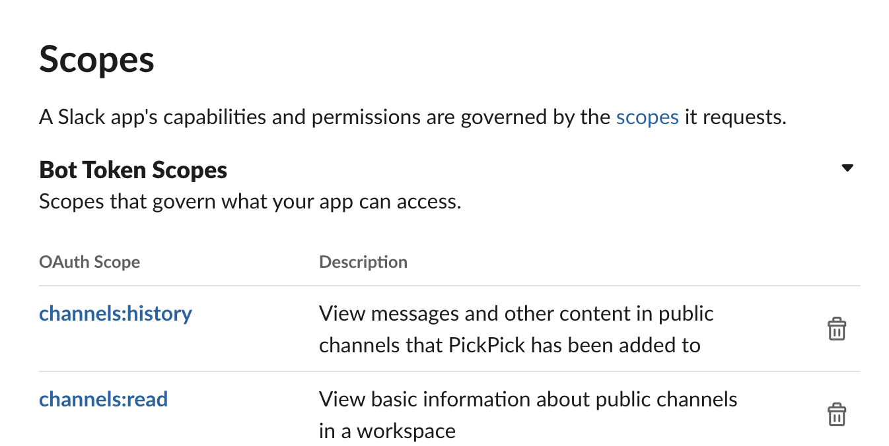
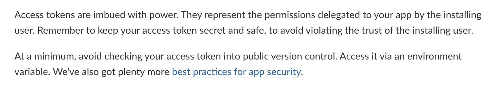
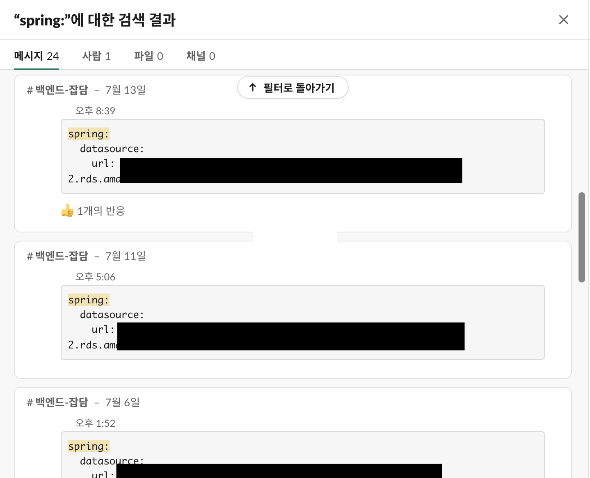
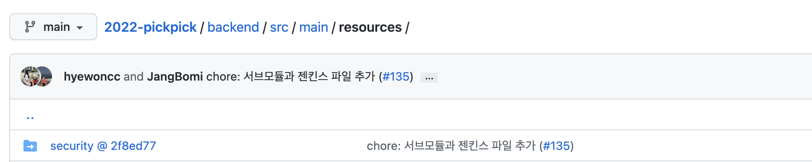
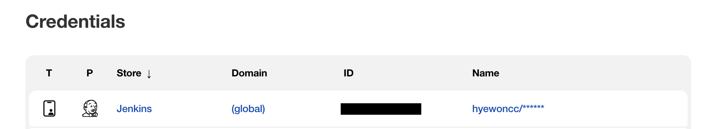
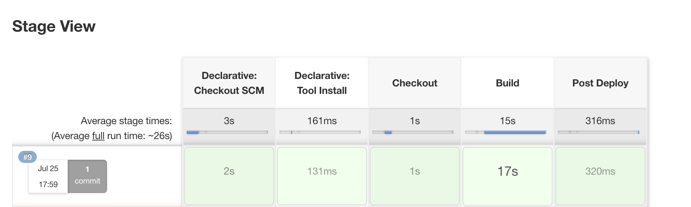

## 슬랙이 봇을 강퇴시켰어요  

서버에서 슬랙 API를 호출하려면 발급받은 봇 토큰이 필요하다. 해당 정보를 기밀이라고 생각하지 않았는데...  

1. 애초에 봇에게 호출할 수 있는 API 제한이 있다  
2. 연결된 워크스페이스가 개발을 위해 생성된 줍줍 팀 워크스페이스다  

라는 이유에서였다.  

  
<div style="text-align:center; font-style:italic; color:grey;">
  슬랙에서 scopes 라는 명칭으로 봇에게 api별 호출 권한을 설정 가능하다
</div>

그래서 깃헙에 `bot-token`을 포함한 `yml`을 올려놨는데... **어느날 API 응답이 오지 않았다.** 개발자 도구의 응답에는 `Expired Token`이라는 에러 문구가 떴고, 분명 워크스페이스에 정상 추가했던 봇이 사라져 있었다. <!--more--> **슬랙이 봇을 강제 추방**시킨 것이었다...   

얼마간 잘 썼기에, 일정 주기로 공개 저장소들을 크롤링 해 한번에 정지시키는 게 아닐까 싶다.  

<br/>

### 설명서를 잘 읽자  

슬랙 API에 들어가면 `토큰을 공개적인 버전 컨트롤에 올리지 말라`가 떡하니 명시되어 있다.  

  

> 봇 토큰에는 큰 권한이 있습니다. 토큰은 사용자가 앱을 설치함으로써 권한을 부여했음을 나타냅니다. 앱을 설치한 유저가 준 신뢰를 해치지 않도록 토큰을 안전하게, 기밀로 보관하세요.  
> **최소한 공개적인 형상관리에 토큰을 올리지 마세요.** 환경 변수를 통해 사용하시길 바랍니다. 더 많은 정보는 저희가 제공하는 [앱 보안을 위한 지침](https://api.slack.com/authentication/best-practices)을 참고하세요.  

하지만 직접 정지시킬 줄은 몰랐다. 깃헙에 올라간 상태로 꽤 오래 쓰고 있었기 때문에 더 그랬다.   
변명을 하자면 테스트용 팀 워크스페이스를 사용하고 있었고, 실서비스라면 절대 그러지 않았을 것이다. 그럼에도 보안에 너무 소홀했던 것 같다. 슬랙의 안내를 읽고 나니 앱을 설치함으로써 우리를 신뢰할 미래의 사용자에게 큰 잘못이 맞았다.  

<br/>

## 서브모듈 도입기  

### yaml 밀거래  

봇 정지를 당하고 `application.yml` 설정파일을 깃헙에서 내렸다. 그리고 `yml`파일을 팀 워크스페이스에서 밀거래(?)했다.  

  
<div style="text-align:center; font-style:italic; color:grey;">
  yaml 밀거래의 현장. 설정이 바뀔 때 마다 밀거래가 발생했다.
</div>

언제까지고 이렇게 할 수는 없을 뿐 더러, `배포 자동화`를 앞두고 있었기에 이를 해결해야만 했다.  

<br/>

### 서브모듈 등록  

1. 개발 중이라 설정이 완전히 고정되지 않았다    
2. 팀원 누구나 접근해서 수정할 수 있어야 한다  
3. 배포 자동화 시 최대한 관리가 편해야 한다  

이 세 가지를 고려해 `서브모듈` 사용을 제안했고 받아들여졌다. 연로그가 백엔드 팀원들을 모두 초대한 `organization`을 만들고 `private` 레포지토리를 개설했다. 여기에 `application.yml`을 올리고, 기존 프로젝트에 서브모듈을 추가했다.  

```shell
git submodule add <private repository 주소> <추가할 모듈명>
```

추가하면 폴더와 파일이 생기는데, 깃에는 내용을 제외한 폴더만 감지된다. 그리고 최상단에 경로에 서브모듈 경로 정보를 담은 `.gitmodules` 파일이 생성된다. 

```
[submodule "backend/src/main/resources/security"]
	path = backend/src/main/resources/security
	url = https://github.com/2022-pickpick/security.git
```

우리 팀은 `security`란 이름으로 서브모듈을 추가했다. 이 상태로 `push`하면 서브모둘이 `github`에 추가된 것을 볼 수 있다.  

  

접근 권한이 있는 상태로 모듈을 클릭하면 해당 private 레포로 이동한다. 하지만 권한이 없는 상태로 모듈을 클릭할 시, `404 에러 페이지`가 뜬다.    

<br/>

### + 젠킨스 배포  

이 후 젠킨스를 통한 빌드 및 배포 자동화가 이뤄졌다. 젠킨스에서는 깃헙 계정에서 발급한 토큰을 `credentianl`에 등록해 서브모듈의 접근 권한을 줄 수 있다.    

  

젠킨스 credential 깃헙 권한 등록 때 도움을 받은 포스트 - [[Jenkins]Git 연동하기(Git Token 발급 + Jenkins Credential 등록)](https://velog.io/@zzarbttoo/JenkinsGit-%EC%97%B0%EB%8F%99%ED%95%98%EA%B8%B0Git-Token-%EB%B0%9C%EA%B8%89-Jenkins-Credential-%EB%93%B1%EB%A1%9D)  

권한을 주지 않고 테스트 또는 빌드를 진행할 시, 설정값을 불러오지 못해 시행되지 않는다.  

  

`credential` 등록 후 서브모듈이 포함된 프로젝트가 성공적으로 빌드되는 것을 볼 수 있다.    

<br/>

```toc
```
