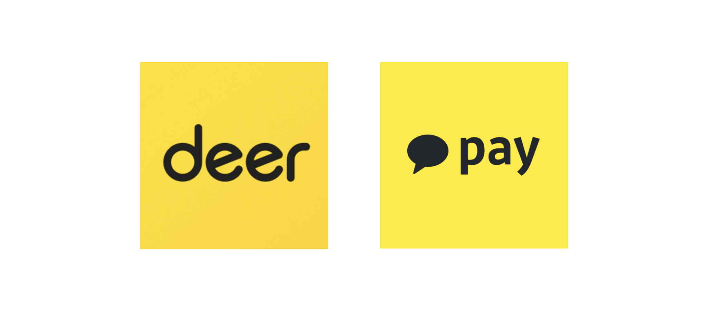
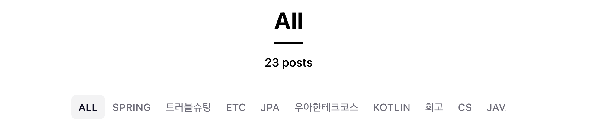
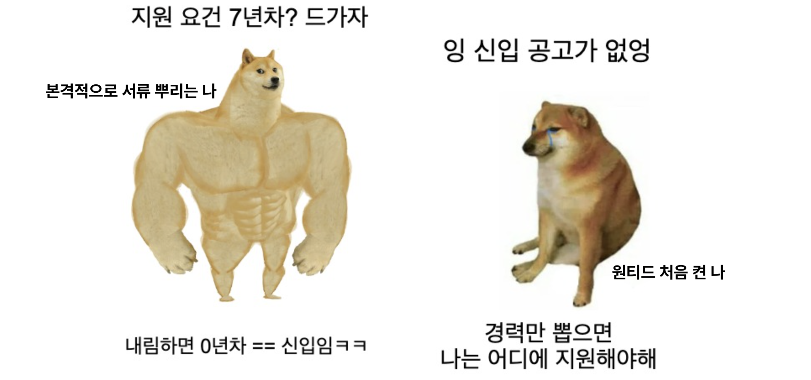
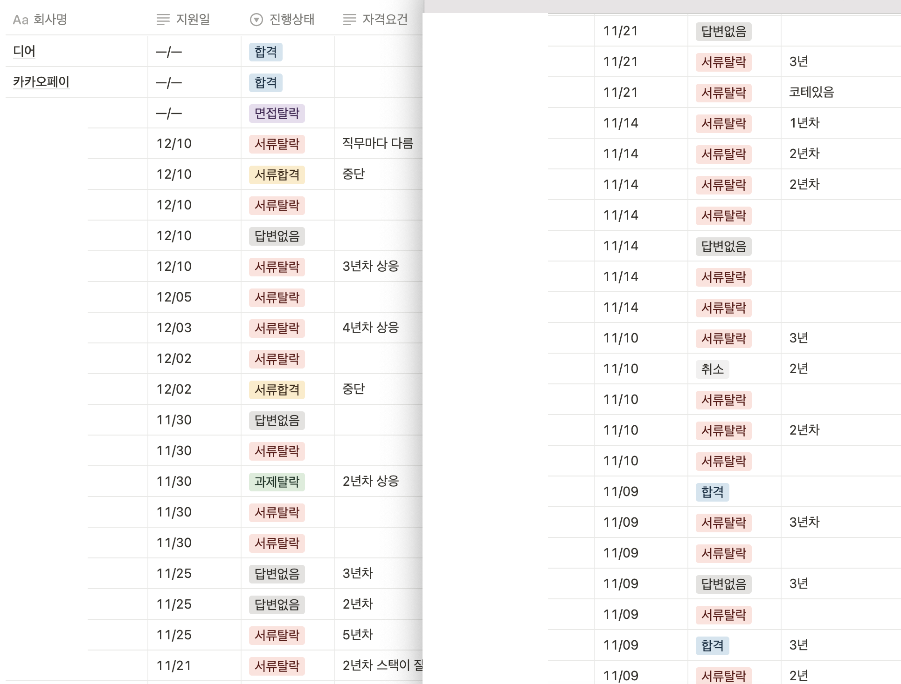

---
emoji: headers/goodbye-2022.png
title: '우아한테크코스를 떠나며'
date: '2023-01-06 02:35:00'
author: 써머
tags: 회고 우아한테크코스
categories: 회고 우아한테크코스
---  

유난히 길고 힘들었던 2022년이 지났다. 
`우아한테크코스`와 `취업`이라는 두가지로 축약되는 해였다. 
글을 쓰기 시작한 건 작년 30일인데, 이제야 올리려니 머쓱하지만😓 그래도 회고 완성했다!  

## 🔥 취업 회고    

  

감사하게도 `디어`와 `카카오페이`, 그리고 다른 두 곳에 최종 합격했다. 
카카오페이 합격 통보 시점에 나머지 진행 중이었던 곳들은 중단한다는 연락을 드렸다. 
모두 진지하게 고려중인 회사였으나, 현실적으로 두 회사의 입사일 전에 결과가 나오기 어려운 상황이었다.   

22년도 안에, 그러니까 해가 바뀌기 전에 취업하기가 목표였는데 기대보다 좋은 결과로 무사히 달성했다. 
`비전공자 10개월 교육으로 네카라쿠배 취업?!` 같은 어그로 업적을 달성한 스스로가 자랑스럽기도 하고(ㅋㅋ) 
취업연계를 제외한 곳에서도 예상 외의 좋은 기회를 많이 받았기에 어떤 점이 좋았고 아쉬웠는지 정리해봤다.  

### 💯 이건 정말 잘했다   

- #### 블로그를 썼다!!!  

  

우테코 기간 동안 블로그를 성실히 쓴 다른 크루들에 비하면 글 수는 적다. 
면접 보던 시점에 포스팅이 20개 정도 있었으니, 2주에 하나쯤 쓴 셈이다. 
그럼에도 면접에서 블로그에 대한 긍정적인 피드백을 많이 들었다. 
면접관 중에는 우테코를 모르는 분들도 계셔서 간략하게 부트캠프라고만 소개했는데, 
부트캠프 과정과 별개로 스스로 공부하고 생각한 내용을 꾸준히 정리했다는 점이 좋았다 짚어주신 적이 있다. 
블로그를 안했으면 취업이 어려웠을 거라는 생각이 든다.  
  
- #### 연차 신경쓰지 않고 지원했고, 실제로 서류 통과한 곳이 꽤 있었다 

  

최종 합격을 받았던 곳 중 조건이 3년차인 곳도 있었다. 
어차피 정말 신입이 갈 수 없는 자리면 서류에서 거를 거란 생각으로 많은 지원을 했다. 
그렇게 넣지 않으면 넣을 곳이 없었다...ㅎㅎ 
어떤 곳에서는 면접 때 신입이라 면접에 못 올 줄 알았다 했더니 도전하는 마음가짐이 좋다는 얘기를 해주셨다.😄 
좋게 봐주셔서 정말 감사했다.  

- #### 이력서와 면접을 위해 여러 노력을 했다  

이력서 속의 자신이 가증스러워서🙃 누구 보여주기가 참 부끄러웠는데... 
나름 용기내서 씨유께 피드백 부탁드린 걸 시작으로 주위에 개선을 위한 도움을 요청했다. 
그래서 구직을 종료하는 순간까지도, 계속 더 나은 버전을 만들 수 있었다. 
흔쾌히 도와주신 모든 분들께 감사드린다.  
면접은 스터디가 큰 도움이 됐다. 
내가 모르는 것이 무엇인지 확실히 알게되었을 뿐 더러, 다른 크루들이 우테코 기간동안 어떤 걸 집중해서 공부했는지 보고 배움을 보충할 수 있었다.  

<br>

### 👀 이것까지 신경썼다면 더 좋았을 걸  
  
- #### 정작 아껴뒀던 기업 중에 지원을 못 한 곳이 많다  

이 부분은 정말 크게 후회중이다!😭 
카카오페이 합격 후 취소했던 곳들도 합격했더라면 정말 진지하게 고려할 곳들이었고, 
공고를 정리한 노션을 보니 가고싶었는데 지원하지 않은 곳들이 많았다. 
확률이 크진 않았을 거라 생각하지만 어쨌든 복권을 긁어서 꽝이 나온 것과 안 긁어본 것은 다르니까...  

- #### 지원을 많이 해서 일정 분배가 어려웠다  

사실 서류 통과를 많이 성공한 건 아닌데, 이상하게 면접 일정이 몰려서 잡힌 때가 많았다. 
과제나 코딩 테스트까지 겹치면 우선순위를 정하기 쉽지 않았다. 
왜이렇게 무식하게 지원을 많이 했나 추억하는 의미로 쓰던 노션 캡쳐를 올려본다.  

  

심지어 다 캡쳐한 것도 아니다 😓  

<br>  

### 🧶 취업 후에 남은 생각들   

처음 면접을 보러 갈 때만 해도 취업을 못할까봐 무서웠다. 
대학생 때 스타트업을 하겠답시고 휴학하고 뛰쳐나간 나는 성적도 좋지 않았고, 
전공도 개발과 관련이 없었으며, 
프리랜서로 일해 증명하기 어려운 공백기가 있는, 
그러니까 취업에 불리한 점만 종합선물세트로 모아놓은 상황이었다. 
하지만 면접을 통해 내 경험과 생각을 다른 사람에게 말로 전하면서, 
취업 성공 여부와는 별개로 내면을 다질 수 있었다.  

레벨2 때 브라운과 면담 중 나는 바보인데 잘하는 사람 너무 많다는 얘기를 했다. 
그때 브라운이 `잘하는 사람의 잘하는 면을 따라하기보다, 써머만의 장점을 돋보이게 하면 어때요?`라는 조언을 해주셨다. 
물론 위로되는 말이었지만 한편으로는 저는 장점이 없어욧😭 하는 생각이 들었는데... 
면접을 거치며 브라운이 했던 `내 장점을 돋보이게 해라`의 진짜 의미를 알게 되었다.  

흔히 컴공, 소프트웨어 전공을 제외한 개발자를 `비전공자`라고 부른다. 
난 비전공자라 잘 못한다는 틀에 스스로를 가두지 말라는 말을 들으면서도, 가끔은 모르는게 당연하다는 변명으로 써먹었던 것 같다. 
하지만 요즘은 `나는 비전공자 아니지. 디자인 전공자잖아!` 가 되었다.  

평범한 사람인 나는, 대학 4년 교육의 차이를 어찌해도 단숨에 따라갈 수 없다. 
따라갈 수 있다고 말하면 오만이라 생각한다. 
하지만 내가 디자인을 전공했기에, 다른 사람들보다 잘 할 수 있는 점이 분명히 있다. 
디자인 전공인 나는 남들보다 프론트엔드와 잘 얘기할 수 있고, 기술을 모르는 사람들의 입장에서 소통할 줄 안다. 
또, 전공이 아님에도 노력해서 단기간에 이만큼 쌓았으니 앞으로 더 잘할 수 있다는 강점을 어필할 수 있었다. 
물론 기술면접에서 나쁘지 않은 결과를 보여줬기에 가능한 얘기다.😅  

<br>

## 🌈 우아한테크코스를 떠나며   

작년 한 해, 정말 많이 힘들었다. 
하굣길에 엉엉 운 날도 있고, 막바지엔 개인적인 사정으로 진지하게 우테코를 그만둘까도 고려했다. 
내 성취가 힘들었던 시간이나 어떤 사건에 대한 교환물이라고 생각하지 않음에도... 
지금도 가끔 이럴만한 가치가 있었을까? 하는 생각이 든다.  

그런데도 작년을 행복하고 즐거웠다고 말할 수 있는 건, 우테코에서 만난 사람들이 있어서다. 
친한 크루에게 짓궂은 농담으로 `퇴사하고 브라운조랑 알고 지내기` vs `회사다니고 브라운조랑 연락 끊기`를 물어본 적이 있다. 
(솔직히 전환된 게 부러워서 그랬다ㅎㅎ 미안합니다) 
그 크루는 전자를 골랐고, 나도 같은 마음이다.  

늘 의지했던 브라운과 브라운조 가족들, 믿음직한 선배같았던 공원, 매번 귀찮게 굴어도 잘 알려주신 제이슨, 
우테코 무사히 마칠 수 있도록 배려해주신 포비와 모든 코치분들, 
그리고 너무 멋진 줍줍 팀원들까지, 
모두 우테코에서 만난 소중한 인연이다.🤧  

우테코에서 말로 다 못할 만큼 많은 배려와 애정을 받았고, 
앞으로 개발자로 걷는 길에서 만나는 사람들에게 받은 감정만큼 베풀면서 살아가고 싶다. 
우테코를 떠나는 것이 내 인생이라는 이야기 속 한 장의 멋진 마무리자, 다음 장으로 넘어가는 설레는 순간으로 느껴진다. 
함께 떠나는 모든 사람들의 앞날에 행복하고 즐거운 일이 가득하길 바란다.  

<br>

```toc
```
