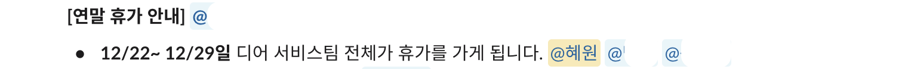

---
emoji: headers/goodbye-2023.png
title: '2023년 회고 겸 1년차 회고'
date: '2024-01-07 19:05:00'
author: 써머
tags: 회고
categories: 회고
---  

2023년도 회고를 이제와서 올린다니? 싶겠지만 이유가 있다. 
작년 말에 우리 팀은 12월 23일 ~ 1월 1일까지 끝내주는 휴가를 다녀왔다. 

  

그래서 휴가 기간동안 뭘 했냐면... 


밥먹고 잠자고 화장실 갈 때만 빼고 (그리고 그와중에 어떻게 인프런 강의를 하나 들었다) 발더스 게이트3 게임을 했다. 
그러려던 건 아닌데, 재밌다는 얘기를 하도 들어서 '그럼 딱 휴가 때 하고 남은 시간에 할 거 해야지~' 했으나 이렇게 볼륨이 큰 줄 몰랐다. 
해도 해도 안끝나서 거짓말처럼 1월 1일 밤 12시에 엔딩 크레딧을 봤다. 개발 블로그가 자기 홍보의 수단 중 하나란 걸 생각하면 회고 처음부터 미친듯이 게임했다는 얘기를 쓰는게 해로울 것 같은데, 이 얘기를하는 이유가 있다.  

올해 내내 회고글 써야지 생각만 계속 했다. 
3개월 수습 끝나면 써야지, 엇 늦었으니 6개월 반년 회고 해야지... 하다가 정신차리니 12월이었다. 
그럼 휴가 때 써야지ㅎㅎ 했다가 해가 지나고, 이제 3일 있으면 입사 1년차가 된다. 
그래도 재밌는 게임을 해서 후회는 없다. 
늦어서 민망하지만 하는 게 중요하니까 회고를 올린다.  

<br>

## 💯 잘 한 일

### 🦌 회사에서  

작년에 정말 많은 일을 했다고 생각했는데, 쭉 나열해놓고 보니 결국 몇 개로 간단하게 분류되어서 허무한 마음이 있다. 메타인지가 없는 채로 눈 앞의 일만 해서 더 그런 것 같다. 올해는 내가 뭘 하고 있는지 인지를 놓치지 말아야겠다. 어쨌든... 

### 레거시 정리  

레거시 서버에서 특정 서비스를 분리하고 사용하지 않는 코드를 많이 걷어냈다. 더 이상 정보를 아는 사람이 없는데 고장나면 서비스에 큰 지장을 주는 무서운 php 서버 같은 걸 페이드 아웃 시켰다. 레거시 속에서도 계속 사용할 코드는 꾸준히 리팩터링 했다.  

### 여러 프로덕트 출시  

대표적으로 결제 시 사용할 수 있는 '이용권' 관련 프로덕트를 만들었다. 이용권을 신규 유저를 위한 프로모션, 지류 쿠폰 지급, CS 보상 등의 여러 면에서 활용하고 있다. 한편 이용권 프로덕트 출시를 위해 레거시에서 관련 도메인을 분리하고 개선하는 작업도 했었는데, 이 작업 덕분에 유저 데이터를 추적하기 수월해졌다.  
또 앱 설치 없이 친구 태워주기나 그룹으로 무한 잠금해제 무료 혜택을 받는 구독제 등 만들었지만 반응이 저조해서 밀려난 것들도 있다. 그 외에도 많았고 여전히 만들어내고 있는데... 여러 기능을 빠르게 만들고 실험하면서 어떤 방식으로 접근할지, 어디까지 가라(?)로 칠 수 있을지, 그렇다면 정식 기능으로 편입시킬 때 어떤 방식으로 개선해야 할지 등을 치열하게 고민할 수 있었다.  

### CS 응대 어드민 개발  

CS 응대를 위한 서비스를 개발했다. 처음에는 지루한 작업이라고 생각했는데, 할 수록 백엔드 개발자다보니 평소에 잘 하지 않던 고민을 하게 되는 게 재밌었다. 예를 들어 정보를 어떻게 구성하고 배치해야 작업자가 편하게 처리할 수 있을지, 또는 기능 요청이 들어왔을 때 요청 뒤에 숨겨진 진짜 불편이 뭔지 생각하고 물어보기 등이 재밌었다. 


<br>

### 🌿 개인적으로  

### vim 사용  

예전에 그림 관련 작업을 할 때, 모든 프로그램 조작을 왼손으로 할 수 있게 세팅하고 오른손은 키보드에 올라올 일 없게 한 적이 있었다. 그 때는 손을 빨리 움직이는 게 중요했기 때문이다. 프로그래밍은 머리 써서 고민해야 할 때가 많으니 그 때랑 다르게 느껴져서 답답할 정도로 단축키 등을 잘 안쓰곤 했는데... 회사 사람들의 권유로 vim을 사용하기 시작했고 단축키도 적극적으로 쓰고 있다. 아직 초보자라 마우스로 손이 갈 때가 있지만 간지나서 만족한다.  

### 스터디 참석  

회사에서 여러 스터디에 참석했다. 일 한 건 아니어서 '개인' 칸에 넣었다. 요즘 난 한 게 없어 라는 생각을 자주 하는데, 회고해보니 테스트, 독서, 코틀린 등 생각보다 많은 공부를 했다. 지금은 [도메인 주도 설계](https://wikibook.co.kr/domain-driven-design/)를 일주일에 한 번, 백엔드 개발자끼리 모여 읽고 있다. 세 달 쯤 지난 것 같은데 반 넘게 읽었다.    


### 글쓰기 모임 주최  

당장 내 블로그 글쓰기 주기만 봐도 알겠지만, 일하면서 글쓰는 게 쉽지 않다. 취준 때는 기술 블로그 있는 회사 가면 글 왕창 올려야지 했는데 역시 배부르고 등따시면 바로 눕게된다!  
그래서 2023년도에 회사 블로그에 글을 쓰자는 사내 글쓰기 모임을 만들었다.  


[글](https://hyewoncc.github.io/fight-javascript/)은 완성했는데, 회사 블로그 용으로 다듬는 걸 아직 못해서 결국 23년도에 올리기는 실패했다. 주최인 나부터 못지켰고 달성률이 많이 낮았다. 그래서 아쉬운 일에 넣으려다가, 성공적으로 마무리하려면 어떻게 개선해야 할지 떠오른 것들이 있어서 잘 한 일에 넣었다. 모임 열고 실패도 해봤으니 올해 재도전 해야겠다.  

### 커피챗 참석  

글또 8기에서 처음 보는 분들과 커피챗을 했다. 낯을 많이 가리고 일 없으면 집 밖으로 안나가는 성격이라 커피챗을 하는 것 자체가 큰 도전이었다. 실용적인 네트워킹으로 접근하지 않아도 그냥 만나서 얘기하고 하는 게 좋았다.  

<br>

## ☁️ 아쉬운 일  

### 주도적 업무 부족  

인원이 적고 일의 범위가 넓어 다른 회사보다 의사결정에 기여할 기회가 많은 편인 것 같은데, 막상 1년 간 내가 나서서 벌인 일이 없는 것 같다. 이 생각을 안해보다 경력직 CX 매니저 팀원분이 들어오셨는데, voc를 분석해서 어떤 일을 하자고 의견을 내는 걸 보고 감탄했다. 포지션과 경력 차이가 있겠지만 그래도 저런 시도를 되든 말든 나도 해보는 게 중요한 것 같다. 올해는 꼭 해봐야겠다.  

### 자아 표류   

10월 들어서 조금 힘들었다. 회사와 관계없는 개인적인 일도 있었고, 팀 인원 변동으로 백엔드를 혼자 하게 되어 부담도 있었고, 누적된 피로도 있었다. 일과 생활의 능률이 곤두박질 쳤다.  

일단 백엔드를 혼자 하게 되니 '어차피 해도 잘 안될 것' 이라는 생각에 이전만큼 일이 재밌지 않았다. 주말에 하던 공부나 독서를 거의 할 수 없었다. 우테코 할 때 부터 8월까지 최소 주 2회는 운동을 했는데, 운동도 나가지 않고 PT도 건너 뛰었다. 도저히 나갈 수가 없었다! 나중에는 내 퍼포먼스에 문제가 있는 것 같아서 출근하기 무서울 정도였다. 팀장님과 면담할 때 이런 생각을 토로했는데 다행히도 딱히 내가 뒤쳐지고 있다거나 하는 건 못느꼈다 했다...  

왜 모든 게 버겁게 느껴지는 지점이 왔나 생각해보니, 개발을 공부하면서 남들보다 늦게 시작했으니 이제 헛짓거리 할 시간이 없다고 여겼다. 그래서 우테코 신청하기 몇 달 전부터인 21년도 중후반부터 '되어야 하는 개발자' 같이 살려고 노력했다. 예시로 우테코 자소서에도 게임 얘기를 썼고, 실제로 만들어 출시하는데 참여해봤고, 한창 때는 잠자는 시간 빼고 게임만 했을 정도로 하드 게이머였는데, 개발 공부를 시작하면서 스스로 신기할 정도로 거짓말처럼 단번에 뚝 끊었다. 그리고 놀랍게도 약 2년 간 게임을 전혀 하지 않았다. 개발과 관련된 무언가 하지 않고 노는 시간이 부끄럽게 느껴졌다. 운동 처럼 자기개발 성격이 없어서 더 그랬다.  

하여간 주말에 지쳐 누워서 이걸 해야해, 저걸 해야해 가책만 느끼며 꼼짝도 못하는 시기를 보내다 진짜로 내가 재밌어서 하는 일은 하나도 하지 않고 있다는 걸 깨달았다. 그래서 일주일에 한번 친구들이랑 게임을 했다. 그리고 휴가 때 발더스 게이트를 하고 나니까 이렇게 재밌어 할 거면 그냥 하고 지내지 싶었다. 놀았으니 더 열심히 해야겠다는 마음도 들었다.  

그래서 슬프지만 나는 '개발' 자체가 보상이 될 수 없는 사람임을 인정할 수 밖에 없었다. 스스로에게 보상을 주지 않고 달리게만 했다가 부딪힌 한계점이 연말에 왔었다. 이 말을 쓰는 지금도 속쓰리고 부끄러운데 더 고집 부리지 않으려고 한다. 결과적으로 더 일을 즐겁게 잘 할 수 있으면 되는 게 아닐까.  

<br>

## 🌈 그래서 올해는?  

그래서 올해는 내가 생각하는 '되어야 하는 개발자'에 억지로 맞추지 말고 내가 잘 일하고 잘 즐길 수 있는 한 해를 만들고 싶다. 나도 여전히 잘난 개발자가 되고 싶다. 그런데 남들 잘하는 점만 여기저기 떼와서 그런 사람인 척 하려니 불가능했다. 지속할 수 있는 방법을 찾아야 한다.  

이미 글을 지나치게 구구절절 쓴 것 같아서 만다라트로 대체한다. 24년도 회고에서 각 칸을 얼만큼 달성했는지 돌아보는 걸로 할 것이다!  


<br>

```toc
```
