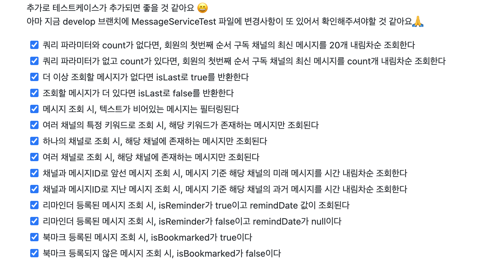
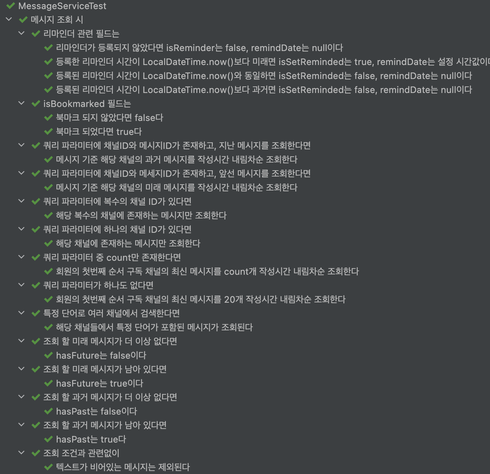

## 🛠 메시지 조회 테스트 개선기  

## 초난감 메시지 조회  

줍줍은 슬랙 메시지를 날짜이동, 윗방향 스크롤, 아래방향 스크롤, 단어검색, 특정 채널만 보기 등 여러 조건으로 조회할 수 있다. 
사용자 편의를 위해 이렇게 다양한 조회 조건을 지원하다 보니 동적 쿼리 생성이 필요해 `Querydsl`도 도입했다.  

<!--more-->

```java
List<MessageResponse> messageResponses = jpaQueryFactory
    .select(getMessageResponseConstructor())
    .from(QMessage.message)
    .leftJoin(QMessage.message.member)
    .leftJoin(QBookmark.bookmark)
    .on(existsBookmark(memberId))
    .leftJoin(QReminder.reminder)
    .on(remainReminder(memberId))
    .where(meetAllConditions(channelIds, messageRequest))
    .orderBy(arrangeDateByNeedPastMessage(needPastMessage))
    .limit(messageCount)
    .fetch();
```  

  
<div style="text-align:center; font-style:italic; color:grey;">(분명히 빠진 경우의 수가 있을) 조회 테스트 케이스 모음</div>
<br>

작성된 `Querydsl` 조회 코드와 테스트 작성을 위해 파악된 케이스만 봐도 복잡도가 짐작 갈 것이다.  

<br>

## 어떤 점을 개선하고 싶었나   

해당 메시지 조회 기능 개발은 다른 팀원들이 맡았다. 
그래서 올라온 PR을 봤는데, 동작은 잘 했으나 코드 개발에 참여하지 않은 입장에서 테스트가 알아보기 어려웠다.  

```java
@Sql({"/truncate.sql", "/message.sql"})
@Transactional
@SpringBootTest
class MessageServiceTest {

    private static final long MEMBER_ID = 1L;

    @Autowired
    private MessageService messageService;

    @DisplayName("메시지 조회 요청에 따른 메시지가 응답된다")
    @MethodSource("slackMessageRequest")
    @ParameterizedTest(name = "{0}")
    void findMessages(final String description, final MessageRequest messageRequest,
        final List<Long> expectedMessageIds, final boolean expectedLast) {
        // given
        MessageResponses messageResponses = messageService.find(MEMBER_ID, messageRequest);

        // when
        List<MessageResponse> messages = messageResponses.getMessages();
        boolean last = messageResponses.isLast();

        // then
        assertAll(
                () -> assertThat(messages).extracting("id").isEqualTo(expectedMessageIds),
                () -> assertThat(last).isEqualTo(expectedLast)
        );
    }

    private static Stream<Arguments> slackMessageRequest() {
        return Stream.of(
                Arguments.of(
                        "5번 채널에서 메시지ID가 1인 메시지 이후에 작성된 메시지 7개 조회",
                        new MessageRequest("", "", List.of(5L), false, 1L, 7),
                        createExpectedMessageIds(8L, 2L),
                        false),
                Arguments.of(
                        "쿼리 파라미터가 전혀 전달되지 않았을 경우, 회원의 채널 정렬 상 첫번째 채널의 최신 20개 메시지를 작성시간 내림차순으로 응답해야 한다.",
                        new MessageRequest("", "", Collections.emptyList(), true, null, 20),
                        createExpectedMessageIds(38L, 19L),
                        false),
                Arguments.of(
                        "쿼리 파라미터가 전혀 전달되지 않았을 경우, 회원의 채널 정렬 상 첫번째 채널의 최신 20개 메시지를 작성시간 내림차순으로 응답해야 한다.",
                        new MessageRequest("", "", null, true, null, 20),
                        createExpectedMessageIds(38L, 19L),
                        false)
        );
    }

    private static List<Long> createExpectedMessageIds(final long startInclusive, final long endInclusive) {
        return LongStream.rangeClosed(endInclusive, startInclusive)
                .boxed()
                .sorted(Comparator.reverseOrder())
                .collect(Collectors.toList());
    }
}
```  

처음 테스트를 읽었을 때 왜 읽기 어렵다고 느껴졌을까? 
먼저 데이터가 `@Sql`문으로 들어가는 게 원인 중 하나였다.  

```sql
insert into channel (id, name, slack_id)
values (5, '임시 채널', 'ABC1234'),
       (3, '공지사항 채널', 'DEF5678');

insert into member (id, slack_id, thumbnail_url, username, first_login)
values (1, 'U03MC231', 'https://summer.png', '써머', false);

insert into channel_subscription(id, view_order, channel_id, member_id)
values (1, 2, 3, 1),
       (2, 1, 5, 1);

insert into message (id, modified_date, posted_date, text, member_id, channel_id, slack_message_id)
values (1, '2022-07-12 14:21:55', '2022-07-12 14:21:55', 'Sample Text', 1, 5, 'ABC1231'),
       (2, '2022-07-12 15:21:55', '2022-07-12 15:21:55', 'Sample Text', 1, 5, 'ABC1232'),
       (3, '2022-07-12 16:21:55', '2022-07-12 16:21:55', 'Sample Text', 1, 5, 'ABC1233'),
       ...
```  

메시지 조회를 하려면 미리 저장된 **1.멤버(사용자) 2.채널 3.채널 구독** 데이터가 필수로 필요했다. 
기본적으로 메시지에 `멤버, 채널` 의존관계가 있고, 조회 시 구독하는 채널 메시지만 필터링 하는 분기가 기본으로 있었기 때문이다. 
특히 채널 구독인 `channel_subscription`을 보면 자바 코드에 비해 데이터 가독성이 떨어짐이 확실히 보인다. 
멤버 한 명, 채널 하나, 구독 하나를 기준으로 봤을 때 `sql`코드 보다 `java`코드가 흐름이 명확하다.  

```sql
insert into member (id, slack_id, thumbnail_url, username, first_login)
values (1, 'U00001', 'https://hope.png', '호프', false);

insert into channel (id, name, slack_id)
values (1, '공지사항', 'C00001'),

insert into channel_subscription(id, view_order, channel_id, member_id)
values (1, 1, 1, 1);
```

```java
Member hope = members.save(new Member("U00001", "호프", "https://hope.png");
Channel notice = channels.save(new Channel("C00001", "공지사항"));
subscriptions.save(new ChannelSubscription(notice, hope, VIEW_ORDER_FIRST));
```

<br>

그 다음으로, 조회 조건이 들어있는 `MessageRequest`의 값을 알기 어려웠다.  

```java
Arguments.of(
    "5번 채널에서 메시지ID가 1인 메시지 이후에 작성된 메시지 7개 조회",
    new MessageRequest("", "", List.of(5L), false, 1L, 7),
    createExpectedMessageIds(8L, 2L),
    false),
Arguments.of(
    "쿼리 파라미터가 전혀 전달되지 않았을 경우, 회원의 채널 정렬 상 첫번째 채널의 최신 20개 메시지를 작성시간 내림차순으로 응답해야 한다.",
    new MessageRequest("", "", Collections.emptyList(), true, null, 20),
    createExpectedMessageIds(38L, 19L),
    false)
```

테스트 케이스가 적은 것이 영향을 끼쳤겠지만, 한글 설명을 읽어도 요청 조건이 명확하지 않다. 
예를 들어 `"", ""`은 어떤 값이 비어있는 것을까? 
왜 세 개의 테스트 케이스에서 다 `빈 문자열`일까? 
하나는 검색 `키워드`, 다른 하나는 특정 `날짜(시간)`을 문자열로 받는 것이라는 걸 테스트 코드에서 유추할 수 있을까?    

마지막으로 `createExpectedMessageIds()`로 만들어진 메시지 id가 어떤 메시지를 나타내는지 알기 어려웠다. 
`38L, 37L... 19L`이라는 일련의 `pk`을 가진 메시지의 특성을 알려면 `sql`파일을 봐야 한다. 
현재 `MethodSource`에는 없는 테스트 케이스지만, 만약 `키워드 검색` 테스트 케이스가 추가된다면 어떻게 될까?  

```java
Arguments.of(
    "키워드와 특정 채널로 검색하면, 해당 키워드가 존재하는 최신 20개 또는 그 이하 메시지를 작성시간 내림차순으로 응답해야 한다.",
    new MessageRequest("", "", Collections.emptyList(), true, null, 20),
    createExpectedMessageIds(20L, 15L),
    false)
```

이러면 실제로 키워드 검색이 수행되었는지 알기 위헤 `sql`의 `20L, 19L, ..15L` 아이디 메시지 텍스트를 봐야 할 것이다. 
복잡한 테스트 케이스가 늘어난다면 이를 일일히 확인하는 건 더 어려워진다. 
게다가 인수 테스트, 컨트롤러 통합 테스트 등 여러 계층의 여러 테스트에서 동일한 `sql` 파일들을 공유하고 있기 때문에, 
데이터 하나를 고쳤다가 여러 테스트가 깨질 수 있었다.  

<br>

## 1차 개선 - sql을 제거하고 요청, 응답에 맥락을 부여하자  

1차 개선은 크게 네 가지 항목에서 진행되었다.  

### 1. sql파일에서 자바 코드로  

`sql`내의 픽스쳐를 모두 자바 코드로 옮겼다. 
하나씩 필요한 `Member, Channel, ChannelSubscription`은 바로 생성하고, 메세지의 경우 `Enum`을 통해 생성했다.  

```java
public enum MessageFixtures {

    PLAIN_20220712_14_00_00("일반 텍스트", LocalDateTime.of(2022, 7, 12, 14, 0, 0)),
    PLAIN_20220712_15_00_00("일반 텍스트", LocalDateTime.of(2022, 7, 12, 15, 0, 0)),
    ...
    EMPTY_20220713_14_00_00("", LocalDateTime.of(2022, 7, 13, 14, 0, 0)),
    EMPTY_20220713_15_00_00("", LocalDateTime.of(2022, 7, 13, 15, 0, 0)),
    ...
    KEYWORD_20220714_14_00_00("줍줍 텍스트", LocalDateTime.of(2022, 7, 14, 14, 0, 0)),
    KEYWORD_20220714_15_00_00("줍줍 텍스트", LocalDateTime.of(2022, 7, 14, 15, 0, 0)),
    ...

    public Message create(final Channel channel, final Member member) {
        return new Message(UUID.randomUUID().toString(), this.text, member, channel, this.dateTime, this.dateTime);
    }
```

```java
class MessageServiceTest {

    @Test
    void findMessagesEmptyParameters() {
        // given
        Member summer = members.save(summer());
        Channel notice = channels.save(notice());
        messages.saveAll(createMessages(notice, summer));
        ...
    }

    private Member summer() {
        return new Member("U00001", "써머", "https://summer.png");
    }

    private Channel notice() {
        return new Channel("C00001", "공지사항");
    }

    private List<Message> createMessages(final Channel channel, final Member member) {
        return Arrays.stream(MessageFixtures.values())
                .map(messageFixture -> messageFixture.create(channel, member))
                .collect(Collectors.toList());
    }
}
```

<br>

### 2. 복잡한 MessageRequest는 팩토리 클래스로 만들기  

`MessageRequest`를 만드는 팩토리 클래스 `MessageRequestFactory`를 만들었다. 
여기서 `메서드 이름`으로, 요청 케이스마다 어떤 맥락의 요청인지 드러나게 했다. 

```java
public class MessageRequestFactory {

    public static MessageRequest emptyQueryParams() {...}

    public static MessageRequest emptyQueryParamsWithCount(final int limit) {
        return new MessageRequest("", "", null, true, null, limit);
    }

    public static MessageRequest fromLatestInChannelIds(final List<Long> channelIds, final int limit) {...}

    public static MessageRequest fromLatestInChannels(final List<Channel> channels, final int limit) {...}

    public static MessageRequest searchByKeywordInChannels(final List<Channel> channels, final String keyword, final int limit) {
        return new MessageRequest(keyword, "", extractChannelIds(channels), true, null, limit);
    }

    public static MessageRequest searchByKeywordInChannelIds(final List<Long> channelIds, final String keyword,final int limit) {...}
```

이제 `MessageRequest`를 생성하는 곳에서는 복잡한 생성자 대신, 요청에 부합하는 팩토리 메서드를 사용하면 된다.  

```java
@DisplayName("쿼리 파라미터가 없고 count가 있다면, 회원의 첫번째 순서 구독 채널의 최신 메시지를 count개 내림차순 조회한다")
@Test
void findMessagesEmptyParametersWithCount() {
    // given
    Member summer = members.save(summer());
    Channel notice = channels.save(notice());
    messages.saveAll(createMessages(notice, summer));
    ...

    MessageRequest request = emptyQueryParamsWithCount(MESSAGE_COUNT);
```

<br>

### 3. 예상 응답은 고정된 특정 값이 아닌, 실제 로직이 적용된 값으로      

예를 들어 `키워드 검색`시, 기존 방법인 `id`를 비교하는 대신, 
**조회된 메시지가 모두 해당 키워드를 갖고 있는가?** 를 검증했다.  

```java
@DisplayName("여러 채널의 특정 키워드로 조회 시, 해당 키워드가 존재하는 메시지만 조회된다")
@Test
void findMessagesInChannelsWithKeyword() {
    // given
    ...
    MessageRequest request = searchByKeywordInChannels(List.of(notice, freeChat), MESSAGE_KEYWORD, MESSAGE_COUNT);

    // when
    MessageResponses response = messageService.find(summer.getId(), request);

    // then
    List<MessageResponse> foundMessages = response.getMessages();
    boolean isContainingKeyword = foundMessages.stream()
        .allMatch(message -> message.getText().contains(MESSAGE_KEYWORD));

    assertThat(isContainingKeyword).isTrue();
}
```

날짜순 정렬 같은 조회 조건도, **로직 상 의도한 대로 필터링 한 메시지 값들의 id가 조회된 id값들과 일치하는가?** 를 검증했다. 

```java
@DisplayName("쿼리 파라미터와 count가 없다면, 회원의 첫번째 순서 구독 채널의 최신 메시지를 20개 내림차순 조회한다")
@Test
void findMessagesEmptyParameters() {
    // given
    ...
    MessageRequest request = emptyQueryParams();

    // when
    MessageResponses response = messageService.find(summer.getId(), request);

    // then
    List<MessageResponse> foundMessages = response.getMessages();
    List<Long> expectedIds = expectedOrderedIds(messagesInFreeChat, MESSAGE_COUNT_DEFAULT);

    assertAll(
        () -> assertThat(foundMessages).extracting("id").isEqualTo(expectedIds),
        () -> assertThat(foundMessages).hasSize(MESSAGE_COUNT_DEFAULT)
    );
}

private List<Long> expectedOrderedIds(final List<Message> savedMessages, final int count) {
    List<Long> foundPastMessagesIds = savedMessages.stream()
        .filter(message -> !message.getText().isEmpty())
        .sorted(Comparator.comparing(Message::getPostedDate).reversed())
        .map(Message::getId)
        .collect(Collectors.toList());

    return foundPastMessagesIds.subList(0, count);
}
```

이렇게 하면 `Enum` 픽스쳐에 변경이 일어나도 부작용을 일으키지 않는다는 장점도 있다. 
중간에 필요한 메시지를 추가하거나 값을 바꿔도 의도한 로직대로 필터링한 예상값과 비교하기에, 수정에 대한 부담이 줄어들었다.  

<br>

### 4. 검증 단위를 잘게 쪼개기   

테스트를 개선하면서 어떻게 해도 마음에 쏙 들지 않아 주변에 조언을 많이 구했다. 
**로직을 잘 모르는 사람도 쉽게 읽을 수 있는 테스트** 가 목적이어서 정말 많이 보여주고 다녔던 것 같다.  

그 중에 `한 번에 모든 조건을 검증하지 않아도 괜찮다`는 조언에 눈이 확 트이는 기분이었다. 
이전까지는 모든 조회 조건을 한 번에 검증하려 했다.  

> 복수의 채널에서 특정 메시지를 기준으로 과거 메시지를 조회하면, 텍스트가 빈 메시지는 걸러지고 해당 채널의 메시지만 나오며... 더 조회할 메시지 여부에 따라 isLast가 정해진다  

이렇게 검증하던 조건을 개별 테스트 케이스로 다 분해했다.  

> 텍스트가 빈 메시지는 걸러진다  
> 더 조회할 메시지 여부에 따라 isLast가 정해진다  
> 복수 채널에서 특정 메시지를 기준으로 과거 메시지를 조회하면, 작성시간이 더 늦은 메시지만 조회된다  

```java
@DisplayName("더 이상 조회할 메시지가 없다면 isLast로 true를 반환한다")
@Test
void findMessagesIsLast() {
    ...
    MessageResponses response = messageService.find(summer.getId(), request);
    boolean isLast = response.isLast();

    assertThat(isLast).isEqualTo(true);
}

@DisplayName("메시지 조회 시, 텍스트가 비어있는 메시지는 필터링된다")
@Test
void emptyMessagesShouldBeFiltered() {
    ...
    MessageResponses messageResponses = messageService.find(summer.getId(), request);

    List<MessageResponse> foundMessages = messageResponses.getMessages();
    boolean isEmptyMessageFiltered = foundMessages.stream()
        .noneMatch(message -> message.getText().isEmpty());

    assertThat(isEmptyMessageFiltered).isTrue();
}

@DisplayName("여러 채널의 특정 키워드로 조회 시, 해당 키워드가 존재하는 메시지만 조회된다")
@Test
void findMessagesInChannelsWithKeyword() {
    ...
    MessageResponses response = messageService.find(summer.getId(), request);

    List<MessageResponse> foundMessages = response.getMessages();
    boolean containsKeyword = foundMessages.stream()
        .allMatch(message -> message.getText().contains(MESSAGE_KEYWORD));

    assertAll(
        () -> assertThat(foundMessages).hasSize(2),
        () -> assertThat(containsKeyword).isTrue()
    );
}
```

<br> 

## 🤔 새로 생긴 문제들   

해당 개선 후 [PR](https://github.com/woowacourse-teams/2022-pickpick/pull/421)을 올렸는데, 코드리뷰에서 생각하지 못한 의견을 좀 받았다. 
그중 가독성은 관점 차이라고 생각했고, 아래 문제들은 개선 필요성에 공감했다.  

### 1. 개별 테스트 케이스 마다 다른 데이터를 적재  

검증 조건을 분해하면서, 검증에 필요한 최소 데이터만 저장했다. 
이유는 데이터 개수가 검증 유효성에 큰 영향을 끼치지 않는다고 생각했기 때문이다. 
예를 들어 `키워드 검색`의 경우, 키워드가 없는 메시지 하나, 키워드가 있는 메시지 두개만 저장했다.  

```java
@DisplayName("여러 채널의 특정 키워드로 조회 시, 해당 키워드가 존재하는 메시지만 조회된다")
@Test
void findMessagesInChannelsWithKeyword() {
    // given
    Member summer = members.save(summer());
    Channel notice = channels.save(notice());
    Channel freeChat = channels.save(freeChat());

    messages.save(MessageFixtures.PLAIN_20220712_15_00_00.create(freeChat, summer));

    messages.save(MessageFixtures.KEYWORD_20220714_14_00_00.create(notice, summer));
    messages.save(MessageFixtures.KEYWORD_20220714_14_00_00.create(freeChat, summer));
    ...
}
```

리팩토링 전 테스트 작성자의 주요 의도는 **같은 데이터가 적재되어 있을 때, 의도대로 필터링 되는가**였다. 
기존 코드를 작성했던 팀원에게 필요한 데이터만을 저장하면 엄격한 테스트가 아니게 된다는 의견을 들었고, 동의했다.  

<br>

### 2. 저장-삭제 반복 비용 발생  

위와 연결점이 있는 얘기였는데, 많은 테스트 각각마다 데이터를 저장-삭제하고 있었다. 
특히 메시지를 반복 저장하는 부분이 문제였다. 
팀에서 `XXXRepository` 클래스를 만들 때, `JPARepository`대신 `Repository`를 상속해 사용하기로 했기에, 
`saveAll(Iterable<Message> messages)`대신 `save(Message message)`로 단건 저장을 반복해야 했다.  
그래서 테스트에서 쓰기 위한 목적으로 `saveAll(Iterable<Message> messages)`을 추가했는데, 
테스트를 위한 코드가 프로덕션에 추가되어서는 안된다는 의견에 동의해서 삭제했다. 
결국 복수 메시지 저장을 `save(Message message)`를 **메시지 수x테스트 수**만큼 반복해 비효율적으로 하고 있었다.  

<br>

## 2차 개선 - @Nested 테스트  

어떻게 해야 픽스쳐 저장 비용을 아낄 수 있을까? 고민하다가 `@Nested`를 도입했다.  

```java
@SpringBootTest
class MessageServiceTest {
    ...
    @Autowired
    private DatabaseCleaner databaseCleaner;

    @DisplayName("메시지 조회 시")
    @TestInstance(Lifecycle.PER_CLASS)
    @Nested
    class find {

        @AfterAll
        void afterAll() {
            databaseCleaner.clear();
        }

        Member summer = members.save(summer());
        Channel notice = channels.save(notice());
        Channel freeChat = channels.save(freeChat());

        List<Message> noticeMessages = createAndSaveMessages(notice, summer);
        List<Message> freeChatMessages = createAndSaveMessages(freeChat, summer);
        List<Message> allMessages = messages.findAll();

        ChannelSubscription first = subscriptions.save(new ChannelSubscription(notice, summer, VIEW_ORDER_FIRST));
        ChannelSubscription second = subscriptions.save(new ChannelSubscription(freeChat, summer, VIEW_ORDER_SECOND));

        @DisplayName("조회 조건과 관련없이")
        @Nested
        class alwaysFilter {

            MessageRequest request = fromLatestInChannels(List.of(notice), allMessages.size() + 1);
            MessageResponses response = messageService.find(summer.getId(), request);

            @DisplayName("텍스트가 비어있는 메시지는 제외된다")
            @Test
            void filterEmptyMessages() {
                List<MessageResponse> foundMessages = response.getMessages();
                boolean isEmptyMessageFiltered = foundMessages.stream()
                        .noneMatch(message -> message.getText().isEmpty());

                assertThat(isEmptyMessageFiltered).isTrue();
            }
        }

        @DisplayName("조회 할 과거 메시지가 남아 있다면")
        @Nested
        class pastMessagesRemain {

            MessageRequest request = onlyCount(MESSAGE_COUNT);
            MessageResponses response = messageService.find(summer.getId(), request);

            @DisplayName("hasPast는 true다")
            @Test
            void messagesHasPastTrue() {
                boolean hasPast = response.hasPast();

                assertThat(hasPast).isTrue();
            }
        }
        ...
```

제일 바깥 `@Nested` 클래스 필드에 픽스쳐를 선언함으로써 아래 두 가지 목적을 달성했다.  

1. 모든 테스트 케이스가 같은 데이터를 공유한다.  
2. 데이터 적재 비용을 절감한다.  

덤으로 `@DisplayName`을 더 상세하게 적을 수 있어, 테스트 실행 시 이해하기 더 쉬워졌다.  



하지만 새로 생긴 고민거리도 있다.  

### 1. 테스트 라이프 사이클을 변경으로 인한 격리 저하    

`JUnit`의 기본 테스트 클래스 라이프 사이클은 `PER_METHOD`이다. 
개별 `@Test` 메서드 마다 새 클래스가 생성되는 전략이다. 
이를 `PER_CLASS`로 바꿔, `@Nested` 내부의 메소드들이 한 클래스 데이터를 공유하게 했다. 
철저하게 `조회`만 시도하는 테스트라 데이터 적재 비용과 비교해서 감수 가능한 부분이라 여겼다. 

### 2. 사용하지 않는 변수 할당   

픽스쳐 저장을 위한 사용하지 않는 필드 변수 할당이 생겼다. 
예를 들어 위의 코드에서는 두 개의 구독이 필요해, 두 개의 `ChannelSubscription` 객체를 저장했지만, 전체 코드에서 쓰지 않고 있다. 
변수를 할당하지 않으려면 테스트 메서드 안에서 저장해야 할텐데, 여러 테스트에 쓰이고 있어 불가능했다. 
`@BeforeAll`로 저장하는 방안도 있었지만, 다른 픽스쳐와 같은 레벨에서 선언되는 게 더 명확하게 느껴져 하지 않았다.  

이 두가지는 앞으로 더 나은 방안을 찾아보려 한다.  

<br>

## 짧은 회고  

해당 테스트 리팩토링은 생각했던 기간보다 훨씬 더 긴 기간을 작업했다. 
[첫 PR](https://github.com/woowacourse-teams/2022-pickpick/pull/421)만 해도 방학이 끼긴 했지만, 머지하기 까지 거의 한 달이 걸렸었다. 
그동안 다시 pull 받고, 또 받고... 커밋 내역이 너무 지저분해져서 정리해서 포스 푸시하고... 난리도 아니었다 😂 
무엇보다 긴 기간 동안 팀원들을 붙잡고 여러번 이건 어떻냐, 저건 괜찮냐 계속 물어봤는데... 
늘 성심성의껏 보고 의견 나눠준 팀원들에게 정말 고맙다!!🥺  

이 과정에서 테스트가 프로덕션 코드보다 더 각자의 관점과 우선순위가 다르다는 걸 느꼈다. 
우리 백엔드 팀은 의견이 갈릴 때, 충분히 의견을 나누고도 정해지지 않는다면, 이슈를 맡은 사람의 의견을 존중해 맡긴다는 컨벤션이 있다. 
그래서 첫 개선 때 approve는 다 받았기에 사실 빨리 머지를 해도 되는 상황이었다. 
그래도 어떻게든 명쾌한 동의를 받고싶다! LGTM를 받고싶다! 는 욕심으로 오래 끌었던 것 같다. 
처음에는 다른 의견을 납득하기 어려웠지만, 일단 이를 반영하려고 시도하는 과정에서 훨씬 나은 코드가 나왔다. 
이제까지 너무 내 스타일과 의견을 고수한 건 아닐까? 너무 좁은 시야로 보고 있었던 건 아닐까? 반성하는 계기가 되었다. 
백엔드는 남은 프로젝트 기간 동안 테스트 전체 개선을 최우선 과제로 잡았는데... 더 열린 마음으로 잘 할 수 있을 것 같다!!!  

```toc
```
