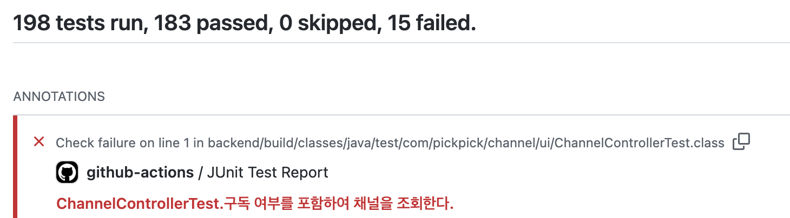
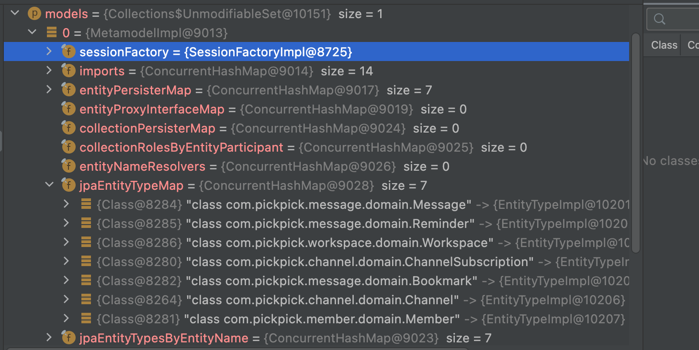
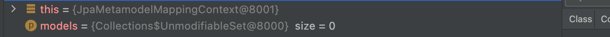
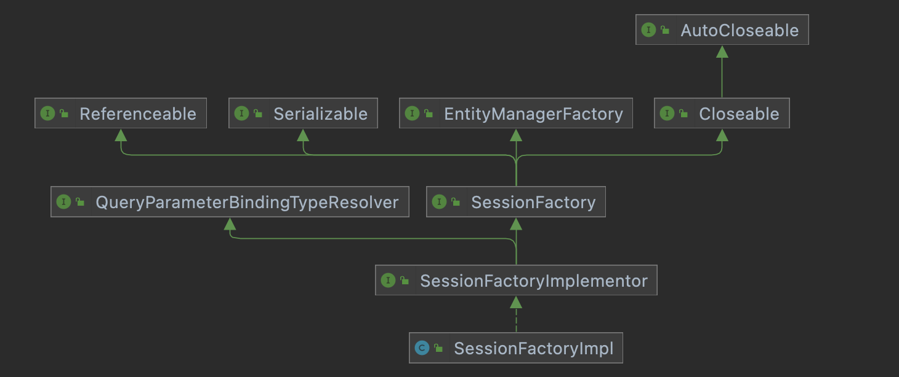

## 💣 문제상황

[줍줍](https://github.com/woowacourse-teams/2022-pickpick)에는 북마크 설정한 메시지를 모아서 보는 기능이 있다. 
기존에는 이 북마크 목록을 보여줄 때, 북마크가 등록 된 **메시지의 생성 시간** 순서대로 보여줬다. 
그러다 사용자 편의를 위해 이를 **북마크 등록 시간** 순서대로 보여주기로 바꿨다. 
이 때, 북마크 등록 시간을 편하게 관리하기 위해 `JPA Auditing`을 도입했다. 
그리고 [해당 PR](https://github.com/woowacourse-teams/2022-pickpick/pull/568)은 순조롭게 머지 되었는데...  

팀원 봄이 진행한 [컨트롤러 테스트를 WebMvcTest로 개선하는 PR](https://github.com/woowacourse-teams/2022-pickpick/pull/570)에서 문제가 생겼다. 
봄의 로컬에서 테스트가 잘 돌아가는 상태였는데, PR의 [github action](https://github.com/woowacourse-teams/2022-pickpick/actions/runs/3179844507/jobs/5182750602)에서는 테스트가 실패했다.  

  

`@WebMvcTest`로 변경한 모든 `RestDocs`용 컨트롤러 테스트가 같은 이유로 실패하고 있었다.  

```java
java.lang.IllegalStateException: Failed to load ApplicationContext...
Caused by: org.springframework.beans.factory.BeanCreationException: Error creating bean with name 'jpaAuditingHandler': Cannot resolve reference to bean 'jpaMappingContext' while setting constructor argument; 
nested exception is org.springframework.beans.factory.BeanCreationException: Error creating bean with name 'jpaMappingContext': Invocation of init method failed; 
nested exception is java.lang.IllegalArgumentException: JPA metamodel must not be empty!
...
Caused by: org.springframework.beans.factory.BeanCreationException: Error creating bean with name 'jpaMappingContext': Invocation of init method failed; 
nested exception is java.lang.IllegalArgumentException: JPA metamodel must not be empty!
...
```

`JPA metamodel must not be empty`라는 문구가 눈에 띈다. 
해당 문구로 라이브러리를 검색해보면 `JpaMetamodelMappingContext`라는 클래스가 나온다.  

```java
public class JpaMetamodelMappingContext
		extends AbstractMappingContext<JpaPersistentEntityImpl<?>, JpaPersistentProperty> {

	private final Metamodels models;
	private final PersistenceProvider persistenceProvider;

	/**
	 * Creates a new JPA {@link Metamodel} based {@link MappingContext}.
	 *
	 * @param models must not be {@literal null} or empty.
	 */
	public JpaMetamodelMappingContext(Set<Metamodel> models) {

		Assert.notNull(models, "JPA metamodel must not be null!");
		Assert.notEmpty(models, "JPA metamodel must not be empty!");
        ...
```

사실 이 문구로 검색하면 많은 사람들이 해결법을 이미 올려두었다. 
그런데 여기까지 오니, `JPA metamodel`이 대체 뭔데? `null`도 아니고 `empty`라고? 
이거랑 `Auditing`은 무슨 상관이지? 등등 궁금한 점이 생겨서 코드를 조금 열어봤다.  

<br>

## 👾 JPA Metamodel  

그렇다면 테스트가 잘 실행 될 때와, `@WebMvcTest`를 붙여 실행되지 않을 때, 저 `models`에는 무슨 값이 들어가있을까? 
정상적으로 실행되는 경우, `MetamodelImpl`이라는 클래스의 인스턴스에 엔티티 클래스와 관련된 정보가 담겨있다.  

  

`@WebMvcTest`로 실행되지 않을 때는 해당 `models`가 비어있다.  

  

이 이슈를 검색하면 제일 자주 나오는 해결법이 `@WebMvcTest`를 쓰는 곳에 아래와 같이 `@MockBean`을 추가로 사용하는 것이다.  

```java
@WebMvcTest
@MockBean(JpaMetamodelMappingContext.class)
public class ControllerTest { ... }
```  

일단 이 해결법을 적용했었지만, 내부 코드를 열고 보니 의문이 든다. 
이렇게 하면 `JpaMetamodelMappingContext` 생성자의 `Assert`문이 실행되지 않으니 터지지는 않는다. 
그런데 컨트롤러 슬라이스 테스트에서 사용하지 않을 JPA 관련 빈을 모킹해주는 것이 맞을까?  

어쨌든 이 `MetamodelImpl`이 어디서 생성되는가를 보자면...  

  

```java
@Incubating
public class TypeConfiguration implements SessionFactoryObserver, Serializable {
    ...
    public MetamodelImplementor scope(SessionFactoryImplementor sessionFactory) {
		log.debugf( "Scoping TypeConfiguration [%s] to SessionFactoryImpl [%s]", this, sessionFactory );

		for ( Map.Entry<String, String> importEntry : scope.metadataBuildingContext.getMetadataCollector().getImports().entrySet() ) {
			if ( importMap.containsKey( importEntry.getKey() ) ) {
				continue;
			}

			importMap.put( importEntry.getKey(), importEntry.getValue() );
		}

		scope.setSessionFactory( sessionFactory );
		sessionFactory.addObserver( this );
		return new MetamodelImpl( sessionFactory, this );
	}
    ...  
```

`SessionFactoryObserver`를 구현한 `TypeConfiguration` 클래스의 `scope`라는 메서드에서 생성해주고 있다. 
그리고 이 메서드를 호출하는 곳은 `Hibernate`의 `SessionFactoryImpl`라는 클래스다. 
이 클래스는 `JPA`의 `EntityManagerFactory`를 상속하고 있다.  

  

```java
public class SessionFactoryImpl implements SessionFactoryImplementor {
    ...
	public SessionFactoryImpl(
			final MetadataImplementor metadata,
			SessionFactoryOptions options,
			QueryPlanCache.QueryPlanCreator queryPlanCacheFunction) {
        ...
        ( (MetamodelImpl) this.metamodel ).initialize(
			metadata,
			determineJpaMetaModelPopulationSetting( properties )
		);
```

여기서 `MetamodelImpl.initialize()`를 호출하고... 

```java
public class MetamodelImpl implements MetamodelImplementor, Serializable {
    ...
    public void initialize(MetadataImplementor mappingMetadata, JpaMetaModelPopulationSetting jpaMetaModelPopulationSetting) {
            this.imports.putAll( mappingMetadata.getImports() );
```

파라미터로 전달받은 `mappingMetadata`에서 여러 값을 불러와 저장하게 된다. 
이 `mappingMetadata`는 `SessionFactoryBuilderImpl`을 통해 `SessionFactoryImpl`에 주입되고, 
`SessionFactoryBuilderImpl`은 `DefaultSessionFactoryBuilderService`을 통해 생성되는데... 
의 과정을 따라가다보니 어느새 `MetadataImpl`로 돌아오고 있었다. 😵  

결론은 이 `MetamodelImpl`은 엔티티 정보를 담은 JPA `Metamodel`의 하이버네이트의 구현체며, 그래서 `@WebMvcTest`에서 생성되지 않았던 것이다. 
원래 최초 생성 시점을 찾으려고 했는데 결국 찾지 못했다.  

JPA 관련 빈이 로딩되는 `@DataJpaTest`가 붙은 테스트는 `models`가 정상적으로 생성되어 있는 것을 볼 수 있었다.  

<br>

## 🎧 EnableJpaAuditing  

그렇다면 어떤 경위로 이 `Metamodel`이 필요했던 걸까? 
Auditing을 위해 추가했던 `@EnableJpaAuditing` 어노테이션을 보면 `JpaAuditingRegistrar` 클래스를 import 하고 있다.  

```java
@Import(JpaAuditingRegistrar.class)
public @interface EnableJpaAuditing { ... }
```

`JpaAuditingRegistrar`는 spring data jpa에 들어있는데, spring의 `ImportBeanDefinitionRegistrar` 클래스를 상속하고 있다.  

  

[스프링 @Enable 설정 세 가지 구현 방식 - 자바캔](https://javacan.tistory.com/entry/spring-at-enable-config) 포스팅에서 해당 클래스 이해에 도움을 받았는데, 이 클래스를 구현해 빈 설정을 직접 등록할 수 있다고 한다. 
바로 상위의 `AuditingBeanDefinitionRegistrarSupport`에서 하위 `JpaAuditingRegistrar`의 `registerAuditListenerBeanDefinition`를 호출하고 있고... 

```java
public abstract class AuditingBeanDefinitionRegistrarSupport implements ImportBeanDefinitionRegistrar {
    ...
	@Override
	public void registerBeanDefinitions(AnnotationMetadata annotationMetadata, BeanDefinitionRegistry registry) {

		Assert.notNull(annotationMetadata, "AnnotationMetadata must not be null");
		Assert.notNull(registry, "BeanDefinitionRegistry must not be null");

		AbstractBeanDefinition ahbd = registerAuditHandlerBeanDefinition(registry, getConfiguration(annotationMetadata));
		registerAuditListenerBeanDefinition(ahbd, registry);
	}
    ...
```

이 메서드에서 포스팅 초반에 봤던 키워드를 발견할 수 있다.  

```java
class JpaAuditingRegistrar extends AuditingBeanDefinitionRegistrarSupport {
    @Override
	protected void registerAuditListenerBeanDefinition(BeanDefinition auditingHandlerDefinition,
			BeanDefinitionRegistry registry) {

		if (!registry.containsBeanDefinition(JPA_MAPPING_CONTEXT_BEAN_NAME)) {
			registry.registerBeanDefinition(JPA_MAPPING_CONTEXT_BEAN_NAME, //
					new RootBeanDefinition(JpaMetamodelMappingContextFactoryBean.class));
		}
    ...
```

`JPA metamodel must not be empty` 에러 문구가 있던 `JpaMetamodelMappingContext` 클래스가 기억나는가? 
`JpaMetamodelMappingContextFactoryBean`라는 정직한 이름의 팩토리 빈에서 해당 클래스를 생성해주고 있다.  

```java
public class JpaMetamodelMappingContextFactoryBean extends AbstractFactoryBean<JpaMetamodelMappingContext> implements ApplicationContextAware {
    ...
    @Override
	protected JpaMetamodelMappingContext createInstance() {

		if (LOG.isDebugEnabled()) {
			LOG.debug("Initializing JpaMetamodelMappingContext…");
		}

		JpaMetamodelMappingContext context = new JpaMetamodelMappingContext(getMetamodels());
        context.initialize();

		if (LOG.isDebugEnabled()) {
			LOG.debug("Finished initializing JpaMetamodelMappingContext!");
		}

		return context;
	}

	/**
	 * Obtains all {@link Metamodel} instances of the current {@link ApplicationContext}.
	 **/
	private Set<Metamodel> getMetamodels() {

		if (beanFactory == null) {
			throw new IllegalStateException("BeanFactory must not be null!");
		}

		Collection<EntityManagerFactory> factories = BeanFactoryUtils
				.beansOfTypeIncludingAncestors(beanFactory, EntityManagerFactory.class).values();

		return factories.stream() //
				.map(EntityManagerFactory::getMetamodel) //
				.collect(StreamUtils.toUnmodifiableSet());
	}
```

`getMetamodels()` 메서드에 친절하게 현재 애플리케이션 컨텍스트의 모든 `Metamodel` 인스턴스를 찾는다고 적혀있다. 
아까 보았던 `EntityManagerFactory`도 보인다.  

<br>

## 👀 더 나은 해결법?  

`@WebMvcTest`로 실행할 때는 JPA 관련 빈이 로딩되지 않아서. 라는 이유를 납득하기 위해 많이 돌아왔다. 
`@MockBean`을 쓰면 `@WebMvcTest`를 사용하는 테스트가 늘어날 때 마다 붙여줘야 한다는 문제가 있다. 
하지만 이 사소한 귀찮음이 진짜 문제는 아니라고 생각한다. 
**진짜 문제**는 `@WebMvcTest`에서 의도한 대로 빈 설정이 분리되고 있지 않는 상황이 아닐까?  

Auditing을 도입할 때, `Application` 클래스에 `@EnableJpaAuditing`을 붙였었다.  

```java
@EnableJpaAuditing
@ConfigurationPropertiesScan
@SpringBootApplication
public class PickpickApplication {

    public static void main(String[] args) {
        SpringApplication.run(PickpickApplication.class, args);
    }
}
```

`@MockBean` 해결법이 검색에 많이 나오는 걸 보면, 이렇게 설정한 사람들이 많은 듯 하다. 
이를 `@Configuration` 클래스를 분리해 `@EnableJpaAuditing`를 거기 붙이는 해결 방법이 있다.  

```java
@ConfigurationPropertiesScan
@SpringBootApplication
public class PickpickApplication {

    public static void main(String[] args) {
        SpringApplication.run(PickpickApplication.class, args);
    }
}

@Configuration
@EnableJpaAuditing
public class AuditingConfig {
}
```

이렇게 하면 `@WebMvcTest`에서 `@MockBean`을 사용하지 않아도 된다. 
해당 방식으로 리팩토링 하기를 제안해봐야겠다.  

<br>

### 📚 부록 - 자바독을 잘 읽자    

추가로 볼만한 부분이 있다. 
Auditing을 사용할 엔티티에 붙이는 리스너 클래스다.    

```java
@Entity
@EntityListeners(AuditingEntityListener.class)
public class Bookmark { ... }
```

해당 리스너 클래스의 자바독 주석을 보면 `@Configuration` 클래스를 분리한 것을 볼 수 있다.  

```java

/**
 * JPA entity listener to capture auditing information on persiting and updating entities. To get this one flying be
 * sure you configure it as entity listener in your {@code orm.xml} as follows:
 * ...
 * After that it's just a matter of activating auditing in your Spring config:
 *
 * @Configuration
 * @EnableJpaAuditing
 * class ApplicationConfig {
 *
 * }
 */
@Configurable
public class AuditingEntityListener { ... }
```

물론 베스트 프랙티스라고 올려둔 것은 아니겠으나... 자바독을 챙겨보는 습관을 기르면 도움이 될 것 같다.  

로컬에서 잘 돌아가고, 머지 때 충돌도 나지 않는 코드가, 깃헙 액션에서 터지는 이번 같은 때가 종종 있다. 
CI 구축... 참 소중하다.  

<br>

```toc
```
