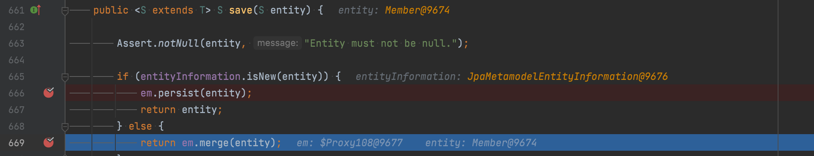
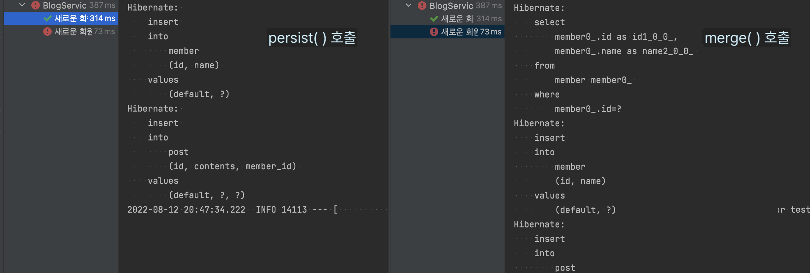
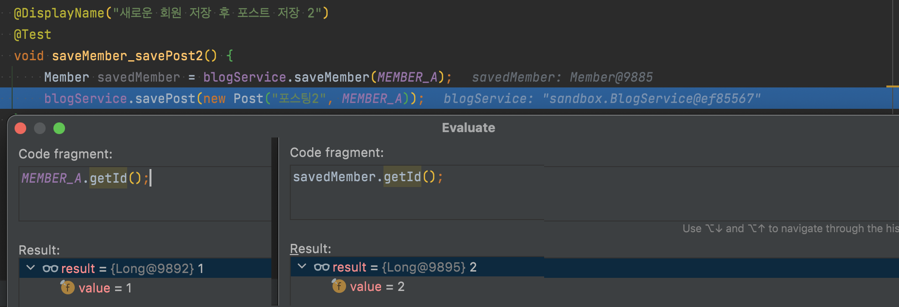

## 문제상황  

[우테코 QNA 미션](https://github.com/woowacourse/jwp-qna)에서 상수로 선언된 엔티티 픽스쳐가 있었다. 레벨3 같은 팀 크루인 봄이 해당 미션을 진행하다 테스트가 터져 어쩌다보니 같이 원인을 찾게 되었다. 상황을 비슷하게 복구해보자면 이런 구성이었다.  <!--more-->

```java
@Transactional
@SpringBootTest
class BlogServiceTest {

    @Autowired
    private BlogService blogService;

    private static final User USER_A = new User("A", new ArrayList<>());

    @DisplayName("새로운 회원 저장 후 포스트 저장 1")
    @Test
    void saveUser_savePost1() {
        blogService.saveUser(USER_A);
        blogService.savePost(new Post("포스팅1", USER_A));
    }

    @DisplayName("새로운 회원 저장 후 포스트 저장 2")
    @Test
    void saveUser_savePost2() {
        blogService.saveUser(USER_A);
        blogService.savePost(new Post("포스팅2", USER_A));
    }
}
```  

원본 미션 코드에서는 픽스쳐가 `public static final`로 별도 클래스에 선언되어 있었다. 그런데 테스트 클래스 하나에서만 사용되고 있어서 해당 클래스로 옮겼던 것 같다. 나도 픽스쳐를 옮겼다가, 평소 쓰는 방식대로 한다고 지웠었다.  

어쨌든 `User`와 `Post`는 `Post -> User`의 단방향 연관관계였고, `BlogService`는 `UserRepository, PostRepository`를 통해 저장해주는 상태였다.  


```java
@Entity
public class User {

    @Id
    @GeneratedValue(strategy = GenerationType.IDENTITY)
    private long id;

    @Column(length = 20, nullable = false)
    private String name;
    ...
}

@Entity
public class Post {

    @Id
    @GeneratedValue(strategy = GenerationType.IDENTITY)
    private Long id;

    @Column(length = 500, nullable = false)
    private String contents;

    @ManyToOne
    @JoinColumn(name = "user_id", nullable = false)
    private User writer;
    ...
}
```

그러다 테스트가 터지며 의문의 에러메시지를 마주했다.  

> org.springframework.dao.DataIntegrityViolationException: could not execute statement; SQL [n/a]; constraint [FK83S99F4KX8OIQM3RO0SASMPWW]; nested exception is org.hibernate.exception.ConstraintViolationException: could not execute statement    

좀 더 내려보니 `insert` 수행이 안 되는 상황이었다.  

> Caused by: org.h2.jdbc.JdbcSQLIntegrityConstraintViolationException: Referential integrity constraint violation: "FK83S99F4KX8OIQM3RO0SASMPWW: PUBLIC.POST FOREIGN KEY(USERS_ID) REFERENCES PUBLIC.USERS(ID) (CAST(1 AS BIGINT))"; SQL statement:
> insert into post (id, contents, user_id) values (default, ?, ?) [23506-214]
 
무언가 ***외래키가 없어서 post에 insert가 안 되는 상황인가...?*** 하는 추측은 했지만 이유를 알 수가 없었다. 분명히 `@Transactional`로 변경을 롤백한 후에, `saveUser()`를 통해 `USER_A`를 저장해줬기 때문이다.  

<br>

### 추측 1.persist()와 merge() 실행 차이?    

`Post`를 저장하는데 외래키가 없는 게 맞다면 `User`를 저장할 때 문제가 생기는 것이라 추측했다. 그래서 디버거를 찍으며 따라가다 보니 `SimpleJpaRepository`라는 클래스의 `save()` 메서드에 도착했다. 여기서 **먼저 실행돼 통과하는 테스트는 persist()**를, **나중에 실행돼 실패하는 테스트는 merge()**를 호출하고 있음을 확인했다.  

  

그래서 실제로 저장된 적 없는 데이터인데 `merge()`로 처리되어서 들어가지 않는건가? 생각했다. 그런데 `show_sql`을 설정해 콘솔에서 sql문을 보니 `insert`가 실행되고 있었다.  

  

알아보니 `merge()`는 아래 순서로 엔티티를 처리한다고 한다.  

1. id 값으로 1차 캐시 조회  
2. 1차 캐시에 없다면 `select`문으로 DB에서 조회 후 있다면 1차 캐시에 저장  
3. 조회 결과 마저 없으면 `insert`를 수행  

<br>

### 추측 2.id값이 달라서?  

그럼 대체 왜 저장된 값의 PK가 없다고 하는 것일까?  

  

디버거를 통해 찍어보니, 저장 된 뒤의 id는 `2L`인데 static 픽스쳐의 id는 `1L`이었다. FK로 1L의 값을 넣으니 찾을 수 없어 무결성 제약 조건에 위배되었던 것이다. `@Transactional`로 데이터는 초기화 되었지만, h2에서 id값은 초기화하지 않아서 생긴 문제였다. 생각보다 허망한 이유였다.  

<br>

## 해결안  

### 1. 픽스쳐 공유하지 않기  

평소 테스트를 할 때 일회용 인스턴트를 쓰고 버리는(?) 방식을 선호했다.  

1. 테스트 격리를 위해 데이터도 격리한다   
2. 생성되는 데이터를 메서드 내에서 바로 보고싶다  

그래서 같은 데이터를 쓰더라도 다 분리했기에 익숙한 형식으로 바꿨다.  

```java
@DisplayName("새로운 회원 저장 후 포스트 저장 1")
@Test
void saveUser_savePost1() {
    User user = new User("A");
    blogService.saveUser(user);

    Post post = new Post("포스팅", user);
    blogService.savePost(post);
}

@DisplayName("새로운 회원 저장 후 포스트 저장 2")
@Test
void saveUser_savePost2() {
    User user = new User("A");
    blogService.saveUser(useer);

    Post post = new Post("포스팅", user);
    blogService.savePost(post);
}
```  

솔직히 테스트 픽스쳐를 공유해서 쓰다가 실제로 문제를 마주쳐 봐서 이렇게 한 것은 아니었고... [테스트 픽스처 올바르게 사용하기 by.향로](https://jojoldu.tistory.com/611) 이 포스팅을 읽었어서가 크다. 어쨌든 상수 픽스쳐를 사용한 건 처음이었다.  

<br>  

### 2. @GeneratedValue 떼기  

그럼 `id`를 직접 지정해주면 되지 않을까 싶어서 static 픽스쳐에서 지정해주고 `@GeneratedValue`를 제거했다.  

```java
@Entity
public class Member {

    @Id
    private Long id;

    @Column(length = 20, nullable = false)
    private String name;
    ...
}

@Transactional
@SpringBootTest
class BlogServiceTest {
    private static final Member MEMBER_A = new Member(1L, "A");
    ...
}
```

이러니 테스트는 통과했지만 사실 이렇게 짤 일은 없다고 생각한다. 그냥 다른 방법으로도 통과시켜 보려고 해본 것이다.    

<br>

## 그럼 기존 코드는 왜...? 🤔  

상수 픽스쳐 선언이 근본적으로 좋지 않은 방식이라면 왜 기존 미션 코드에서 사용하고 있었을까?  
[기존 서비스 테스트 코드](https://github.com/woowacourse/jwp-qna/blob/main/src/test/java/qna/service/QnaServiceTest.java)를 보면 서비스를 슬라이스 테스트 하고 있다. 

```java
@Test
public void delete_성공() throws Exception {
    when(questionRepository.findByIdAndDeletedFalse(question.getId())).thenReturn(Optional.of(question));
    when(answerRepository.findByQuestionIdAndDeletedFalse(question.getId())).thenReturn(Arrays.asList(answer));
    ...
```

`Repository`의 메서드를 모두 모킹하고 있기 때문에 `JPA`와 무관한 테스트였다. 따라서 정말 *고정된 값*으로써의 상수 픽스쳐를 사용해도 괜찮았던 것이다. 이를 통합 테스트로 바꾸면서 생긴 문제였다.  

테스트 간 데이터 격리가 중요하다는 말이 맞는 말이긴 하지만, 이전까진 고정관념처럼 무작정 받아들여 박혀있었다. 그런데 이번 문제를 맞딱드리면서 고정관념이 아닌 *진짜 나의 생각*이 된 것 같아 좋았다. 어쨌든, 테스트 격리 잘 하자.  

<br>

```toc
```