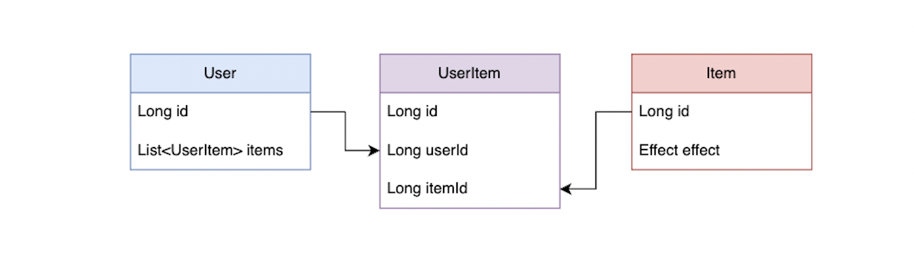

## 🧶 문제상황  

[서버 오픈 전 부하테스트로 대비하기](https://hyewoncc.github.io/load-test/)의 경험으로, 요즘 코드를 짤 때 외부 호출이 끼어있다면 트랜잭션을 최소로 잡고 있다. 
거기다 더티 체킹도 사용하지 않고 명시적으로 다시 저장해주는 방식을 사용 중이다. 이건 교휸이 있어서는 아니고, 그냥 성향이다. 더 읽기 명확한 것 같고?  



```java
public class ItemService {
    
    private final UserRepository userRepository;
    private final UserItemRepository userItemRepository;
    private final ExternalItemClient itemClient;

    public void add(Long userId, Item item) {
        itemClient.checkAvailable(item.getId());
        User user = userRepository.findById(userId).orElseThrow(UserNotExistException::new);
        user.add(item);
        userItemRepository.save(user.getItems());
    }
}
```

여기에 아이템을 삭제하는 기능을 추가 개발하게 되었다.  

```java
public class ItemService {

    public void delete(Long userId, Long itemId) {
        itemClient.checkExpired(itemId);
        userItemRepository.deleteByUserIdAndItemId(userId, itemId);
    }
}
```

<br>

그리고 테스트를 실행하니, 아래와 같은 에러 메시지를 던지며 터졌다.  

> No EntityManager with actual transaction available for current thread - cannot reliably process 'remove' call; nested exception is javax.persistence.TransactionRequiredException: No EntityManager with actual transaction available for current thread - cannot reliably process 'remove' call
> org.springframework.dao.InvalidDataAccessApiUsageException: No EntityManager with actual transaction available for current thread - cannot reliably process 'remove' call; nested exception is javax.persistence.TransactionRequiredException: No EntityManager with actual transaction available for current thread - cannot reliably process 'remove' call

<br>

## ❓ Transactional 없어도 잘되던데  


이 에러를 보자마자 스치는 기억이 있었으니... 
팀원에게 코드리뷰를 받다가 `트랜잭션이 없는데 제대로 동작해? 확인한 거지?`라는 얘기를 들었었다. 
그 때 잘 되는데? 트랜잭션이랑 이거랑 관련 없지 않아? 하고 넘어갔는데, 원인은 모르지만 이 얘기였구나! 했다.  

에러 메시지를 검색하면 서비스 메서드에 `@Transactional`을 붙이면 해결된다는 얘기가 많이 나온다. 
붙여보니 잘 된다. 
나도 외부 호출 문제를 겪기 전에는 으레 이렇게 짜곤 했으니, 이런 문제를 겪을 일이 없었다.  

```java
public class ItemService {

    @Transactional
    public void delete(Long userId, Long itemId) {
        itemClient.checkExpired(itemId);
        userItemRepository.deleteByUserIdAndItemId(userId, itemId);
    }
}
```

<br>

그런데 여기서 이상하다 느낀 게, 서비스에 `@Transactional` 없다고 동작 안하는 게 맞나? 
한 트랜잭션에서 처리하고 싶지 않을 수도 있는데? 하는 거였다. 
그리고 이제까지는 왜 문제가 없었지? 하는 점도 이상했다.  

이유는 금방 찾을 수 있었는데, `JpaRepository`의 구현체인 `SimpleJpaRepository`에서 이미 메서드에 `@Transactional`을 붙여 놓아서다.  

```java
@Repository
@Transactional(readOnly = true)
public class SimpleJpaRepository<T, ID> implements JpaRepositoryImplementation<T, ID> {

    @Transactional
	@Override
	public void deleteById(ID id) {

		Assert.notNull(id, ID_MUST_NOT_BE_NULL);

		delete(findById(id).orElseThrow(() -> new EmptyResultDataAccessException(
				String.format("No %s entity with id %s exists!", entityInformation.getJavaType(), id), 1)));
	}
}
```

<br>

그래서 `JpaRepository`에 미리 선언된 메서드를 호출할 경우에, 서비스 클래스에서 `@Transactional`을 붙이지 않아도 문제가 없었던 것이다. 
따라서 레포지토리 클래스에 추가로 정의한 메서드에 `@Transactional`을 붙여줘도 문제를 해결할 수 있다.  

```java
@Repository
public interface UserItemRepository extends JpaRepository<UserItem, Long> {

    @Transactional
    void deleteByUserIdAndItemId(Long userId, Long itemId);
}
```

<br>

그러다 직접 사용할 메서드를 선언해야 하는 `Repository` 인터페이스를 상속하면 어떻게 될까 궁금해졌다.  

```java
public interface UserItemRepository extends Repository<UserItem, Long> {

    // @Transactional이 없는데 동작할까?  
    UserItem save(UserItem userItem);

    void deleteByUserIdAndItemId(Long userId, Long itemId);
}
```

  

이 역시 구현체는 `SimpleJpaRepository`로 동일해, 미리 구현되어 있는 메서드는 `@Transactional` 없이도 동작한다.  

<br>

## 🛺 관성을 이기기  

JPA 쓴 지가 언젠데 이제까지 이걸 몰랐을까? 자문했을 때, 일하면서 기출변형같은 문제를 마주쳐서 그런 것 같다. 
[실종된 데이터와 연관 객체 조회하기](https://hyewoncc.github.io/fetch-join-and-entity-graph/) 포스팅도 그랬다. 
보통 JPA를 쓰면 서비스 클래스에 `@Transactional`부터 붙이고 시작하니까 이런 식의 오류를 마주칠 일이 적다. 
이런 문제를 해결할 때 왜 나는 좀 더 꼼꼼히 공부하지 않았을까? 자책했는데, 요즘은 해결하면서 배워가면 충분한 거 아닌가? 로 생각이 조금 바뀌었다.  

처음 JPA를 접하면서 지금 수준까지 일단 파보려고 했다면 개발을 재밌게 공부할 수 있었을까? 재미야 둘째쳐도, 효율적으로 공부할 수 있었을까? 
요즘 익숙한 스프링보다 낯선 Node.js의 오류와 싸우는 시간이 길어서 이런 생각이 더 드는 것 같기도 하다. 
자바스크립트랑 Node를 마스터하고 해결해야지 하면 아직 오류 하나도 제대로 못고쳤을지 모른다. 
앞으로 수많은 이걸 왜 몰랐지를 마주칠텐데, 그 때 마다 스트레스 받을 필요가 없다.  

또 다른 생각은 관성을 이기자는 것이다. 매번 다짐하는데 잘 안되는 걸 보면, 내가 관성에 약한 편인 것 같다. 
이 문제를 금방 해결할 수 있었던 건, 팀원이 말했던 `트랜잭션이 없는데 제대로 동작하냐`는 리뷰 덕분이었다. 
그 때도 난 잘 되던데 하고 그냥 넘어갔었다.  

  

<div style="text-align:center; font-style:italic; color:grey;">
  이런 상태가 될 때가 종종 있다 
</div>

<br>

허투루 지나가지 않고 왜 제대로 동작하지 않을 것 같냐고 물어봤다면 더 빨리 배울 수 있었다. 
하던 대로 하지않고 절박한 마음으로 일하고 공부하는 그런 열정을 가질 수 있도록... 의식적으로 노력해야겠다. 
말만 썼는데 벌써 쉽지 않다.  

그리고 위에서 문제가 되었던 `deleteByUserIdAndItemId()`는 결국 요구사항에 맞춰 소프트 딜리트로 바뀌면서 자연스레 해결됐다.  

```java
public class ItemService {

    public void delete(Long userId, Long itemId) {
        itemClient.checkExpired(itemId);
        UserItems userItems = UserItems.of(userItemRepository.findAllByUserId(userId));
        userItems.delete(itemId);  
        userItemRepository.saveAll(userItems.getUserItems());
    }
}
```

<br>

원래 소프트 딜리트로 만들었어야 할 로직인데, 옆길로 새서 좋은 걸 배웠다.  

<br>

```toc
```

