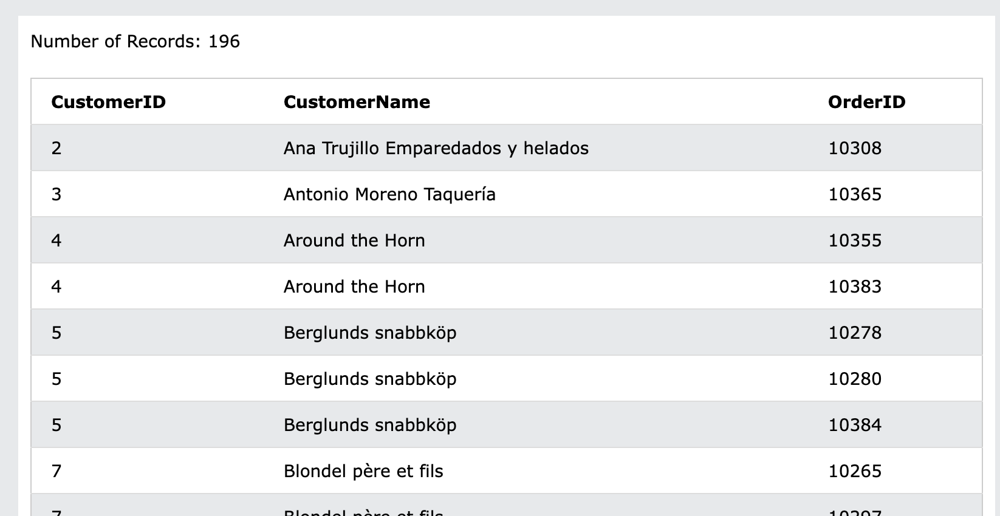
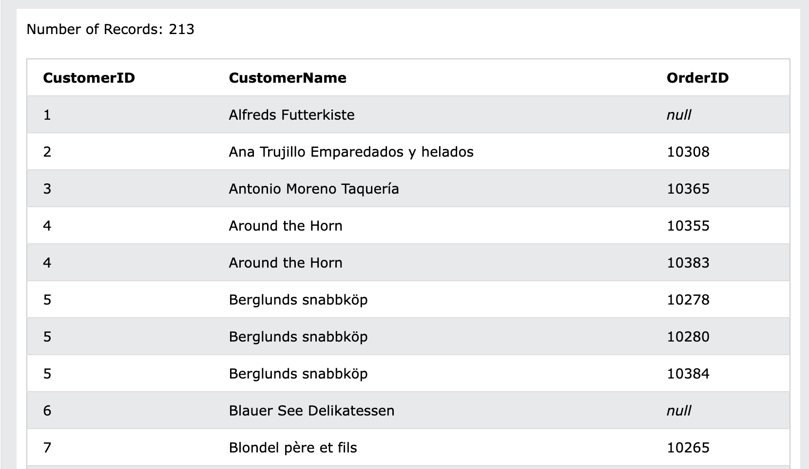
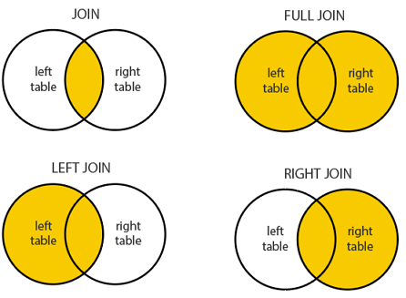

## left join / (inner) join  

7SQL 스터디를 하다 자신만만하게 풀었는데 기대한 답이 나오지 않는 문제가 있었다.  

> 주문을 한 번도 하지 않은 모든 고객을 찾아주세요.  

<!--more-->

스터디는 [w3schools의 sql 실습 페이지](https://www.w3schools.com/sql/trysql.asp?filename=trysql_select_all)를 이용했는데, 고객의 정보가 있는 `Customers` 테이블과 `Orders` 테이블이 있다. 주문이 없는 고객을 찾기 위해 `Customers` 테이블에 `Orders` 테이블을 `join`한 다음, `OrderId`에 `null`이 있는 걸 확인하려 했다.  

```sql
select c.customerid, c.customername, o.orderid 
from customers c 
join orders o on c.customerid = o.customerid
order by c.customerid;
```

그런데 실행 결과를 보니 `OrderId`가 없는 `id` `1, 6`고객은 아예 결과에 잡히지 않았다.  

  

아직 sql 문법에 익숙하지 않아서 `inner, left` 키워드를 차례로 앞에 붙여봤는데, `left join`일 때만 `OrderId`가 `null`인 경우도 포함되어 나왔다.  

  

찾아보니 `inner join`은 `차집합`, `left join`을 포함한 `outer join`은 `합집합`을 나타낸다 한다.  

  

`A left join B`를 하면, A 테이블의 모든 행을 조회하면서 B에 없는 값은 `null`로 처리된다. 나머지 `outer join`은 해당 사이트에서 지원하지 않아 써보진 못했지만, 스터디 덕분에 차이를 확실히 알게 되었다.  

<br/>

```toc
```
