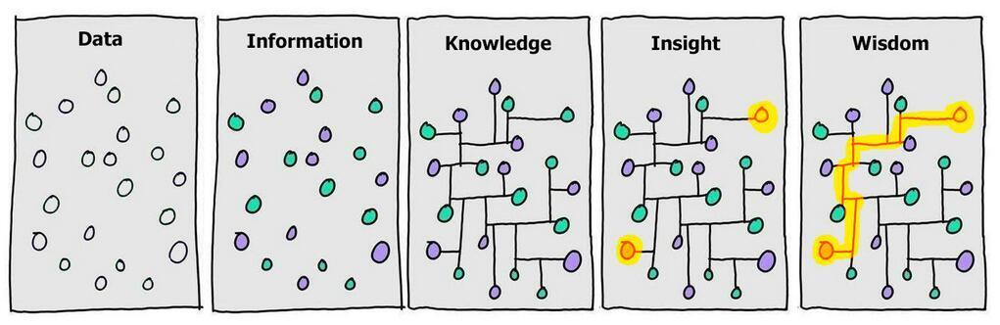

나는 살면서 스터디를 해 본 적이 없다. 공부는 혼자 하거나 최소 친구와 하는 게 편하고 좋았다. 개발도 비전공으로 독학 후 국비학원을 다녔다. 다른 사람들과 개발 얘기를 한 적도 당연히 거의 없었다. 이런 성향을 고치고 싶어 이펙티브 자바 스터디를 열었고, 레벨1을 겪으며 `남들과 개발 얘기하는 즐거움`을 깨우치고 독서회를 열게 되었다. 방학을 맞아 가벼운 회고를 써본다.  

<!--more-->


<br/>

## 객체지향의 사실과 오해 독서회  
- 기간 : 일회성(약 2시간)
- 성격 : 독서회  
- 인원
  - 발표 : 4명 
  - 참관 : 7명   
- 목표 : 독서 인사이트 공유  
- 진행 방식 : 제한없는 자유발표 + 짧은 회고 

정확한 날짜는 기억나지 않지만, 블랙잭 미션이 끝난 주의 금요일 저녁이었던 것 같다. 슬랙으로 신청을 받았는데, 신청 인원이 생각보다 저조해서 의기소침해져 있었다. 모집글에는 단 한 명만 신청해도 둘이서 진행한다고 써놓긴 했지만... 그런데 뜻밖에도 참관객이 많이 와서 기뻤다.  


발표 인원이 4명 뿐이라 별도의 시간 제한 없이 자유로운 발표로 진행했다. 객체지향이라는 넓은 주제를 다루는 책이라, 자유발표여도 각자 발표의 중점이 다르기를 기대했다. 역시나 각기 다른 생각을 들을 수 있어서 좋았다. 다만 가벼운 마음으로 오라고 했는데 웬걸, 나 빼고 다들 프레젠테이션을 준비해오셔서 민망했다.  

발표가 끝나고 짧은 회고를 가졌다. 참관한 분들 중에 책을 덜 읽은 분도, 안 읽은 분들도 계셨다. 원래는 따로 참관을 받을 생각이 없었다. 정확히는 참관이 있을 거라는 생각을 못했다. 그런데 참관한 분들이 많은 도움이 되었고 재밌게 들었다셔서, 앞으로 이런 스터디를 열 때는 참관객 환영을 꼭 써놔야겠다.   

아쉬운 점. 그날 발표한 것 중에 완전히 잘못 이해하고 틀리게 발표한 내용이 있었다...😳 죄송합니다. `정적 타입/동적 타입` 관련해 상태 패턴을 예시로 들었는데, 완전히 틀린 맥락이었다. 이걸 어제 포스팅을 위해 책을 다시 훑어보며 깨달았다. 일회성이라 그런지 이것 빼고 운영 면에서 아쉬운 점은 없다.    

<br/>

## 컵라면 3개 스터디(이펙티브 자바)  

- 기간 : 2월 21일 ~ 4월 5일  
- 성격 : 요약설명
- 인원 : 15명  
- 목표 : 책 훑어보기  
- 진행 방식 : 하루 3명, 5분 내외의 아이템 요약 발표 + 중간, 마지막 회고  

줌 강의를 듣다 종종 이펙티브 자바 관련 내용이 나올 때, 구구가 채팅창에 아이템을 집어주는 걸 보고 만들기를 결심했다. 이펙티브 자바 책을 우테코에 들어와서 처음 알았다. 그런데 양과 난이도가 만만치 않았고, 그 내용이 필요할 때가 아니면 읽어도 와닿지 않았다. 그래서 `이런 내용을 담은 아이템이 책에 존재한다고 책을 파악`하는 걸 목표로 잡았다.  

  

Data에서 Information단계로 가기라 할 수 있다. 기간이 긴 만큼 시간을 짧게 설정했다. 애초 계획은 3분 x 3인 발표 = 9분 이었으나, 지나치게 촉박해 조정하다 보니 끝날 때는 컵라면 8개 스터디 쯤 되었다. (자꾸 그 쪽 스터디는 컵라면이 불어 터진다던데 하고 놀리는 크루가 있었다 🙄)  

개설할 때 계획과 달리, 중간에 노션에서 깃헙 레포로 이주하게 되었다. 초반에 글을 옮기느라 약간 품이 들었다. 하지만 옮기고 나니 옮기길 잘했다는 생각이 백번 든다. 15명이 한땀 한땀 쓴 [핸드북](https://github.com/woowacourse-study/2022-daily-effective-java)은 쭉 유용하게 쓰일 것 같다. 


아쉬운 점. 수업과 관련된 아이템을 공유하려고 했는데 흐지부지 되었다. 문제는 Data -> Information의 단계기에 코치가 아이템을 집어주지 않는 이상, 수업을 듣고 내가 아이템을 찾아내기는 힘든 것에 있었다. 특히 내가 발표하지 않은 아이템은 더 그랬다. 애초 스터디의 성질과 어긋나는 목표였던 것 같다. 오히려 스터디가 끝난 지금 대강 내용을 아니, 레벨2 수업을 들으면서 생각나면 스터디원들과 공유할까 한다.  

<br/>

## 종합 회고  

나는 낯을 많이 가린다. 그래서 레벨1 초기에 다른 사람이 먼저 스터디를 열었다면 고민만 하다 가지 못했을 것 같다. 이런 성격을 정면돌파하려고 스터디를 개설하면서도 누가 오긴 할까 걱정이 많았다. 그런데 다들 열심히 참가해주셔서 놀랐다. 특히 거의 6주에 걸친 이펙티브 자바 스터디를 무사히 마칠 수 있었던 건, 전적으로 그 기간 동안 성실히 참여해주신 14명의 크루들 덕분이다. 우테코가 아니었다면 이렇게 좋은 스터디원을 만나기 쉽지 않았을 것이다. 회고에서 감사하다는 말을 과분하게 많이 들었는데, 오히려 반대였다고 진심으로 생각한다.   

레벨2에서도 적당한 책이 있다면 스터디를 한 개 쯤은 더 열어보고 싶다. 각 책에 따른 스터디의 성격과 목표를 분명히 설정했기에 괜찮은 마무리를 맺을 수 있었다 본다. 필독서 목록이 나오면 고민해봐야겠다.   

아, 테코톡에 대한 극심한 공포가 있었는데 두 스터디로 많이 나아졌다... 스터디 때도 언급했지만 테코톡이 **너무!** 무서워서 스터디를 더 열심히 열었다. 지금은 스터디 자체가 즐겁다. 정말입니다.😉 

```toc
```
