💡 해당 글은 사내에 작성한 문서를 허가 하에 개인 포스팅용으로 적절히 수정한 글입니다.

 디어에 입사하고 처음 맡은 일은 개발 중이던 신규 인터널 API 서버 개발을 마무리하고 프로덕션 환경에 올리는 것이었다. 
전체 사이클에서 내 생각에 한 80% 지점에 참여하게 되었다. 
현재 신규 서버는 프로덕션 환경에 올라간 채로 '회사 사람들이 디어 앱을 통해 하는 요청' 이라는 티끌의 트래픽만 받고 있는데, 다음 2주 간의 스프린트에 전체 트래픽을 100% 전환하는 게 목표다. 
그래서 이번 스프린트 중에 이 서버의 성능을 테스트하고, 운영 환경에 적절한 인프라 설정값을 찾는 과제를 수행했다.  

<br>

## 🏗 인프라 구조  

 모든 인프라 구조도는 극히 단순화하여 그렸다.  

### 기존 프로덕션 인프라 구조  

 신규 인터널 서버는 기존 디어 서버에서 외부 API 연동이 잦은 특정 도메인을 분리한 서버다. 
기존에는 디어 앱에서 특정 요청이 들어오면, 디어 서버를 거쳐, 경우에 따라 또 다른 인터널 서버를 경유해 로직을 수행했다.  

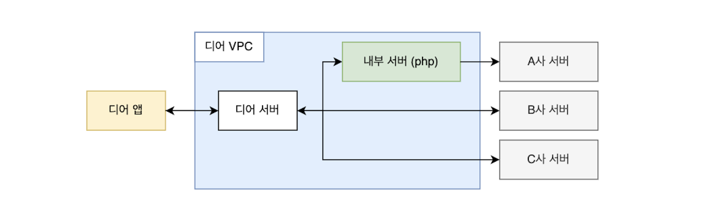  

 신규 인터널 서버를 분리하면서 구조도 변했다.  

 <br>

### 신규 서버 도입 후 인프라 구조  

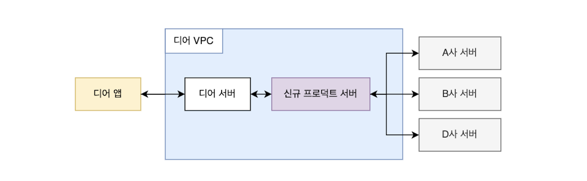  

 앞으로 해당 도메인과 관련된 모든 요청은 신규 서버를 경유한다. 
신규 서버가 분리되면서 요청을 처리할 외부 서버를 간편하게 추가할 수 있게 되었다. 
실제로 이번에 D사 서버 연동을 추가해야 했는데, 첫 삽을 뜨기부터 스테이지 테스트를 완료하기 까지 단 이틀이 걸렸다.  

 신규 서버를 도입하면서 목표는 '사용자 관점에서 아무 변화도 없어야 한다' 였다. 
현재 디어 서버에서 이뤄지는 해당 도메인의 트래픽, 나아가서 회사가 올해 목표하는 트래픽 양을 문제없이 처리할 수 있어야 했다. 
이를 위해 부하테스트를 진행했다.  

<br>

### 부하테스트 인프라  

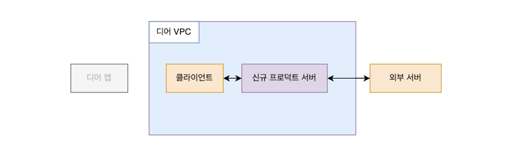  

 앞선 구조도에서 볼 수 있듯이, 신규 서버는 디어 서버를 유일한 클라이언트로 가진다. 
즉, 외부에서 요청을 받을 일이 없다. 
따라서 실제와 비슷하며 프로덕션 보안정책을 준수하는 테스틀 위해 VPC 내에서 요청을 보낼 목 클라이언트가 필요하다. 
또한, 외부 서버와 통신을 해야하며, 이 요청의 응답 속도나 상태가 제어 밖이라는 점도 특징이다. 
그래서 외부 목 서버도 필요했다. 
더 정확한 테스트를 위해서라면 디어 앱을 모킹한 곳에서 요청을 보내야겠지만, 테스트의 주 목적을 생각해 내부 클라이언트(디어 서버)까지만 모킹하고 여기서 요청을 보냈다.  

 외부 목 서버는 스프링으로 만들었다. 
며칠 간 쌓인 신규 서버 로그 데이터를 통해 외부 서버의 API 응답 속도를 대략 알 수 있었다. 
이 중 평균 소요시간이 제일 긴 서버의 경우 약 2초의 시간이 걸릴 때가 많았다. 
따라서 목 서버는 간단하게 스레드를 2초간 정지하고 응답하도록 만들었다.  

```java
@RestController
public class MockController {

    @PostMapping
    public MockApiResponse main(MockApiRequest request) throws InterruptedException {
        Thread.sleep(2_000L);
        return new MockApiResponse(...);
```

<br>

## 📝 테스트 시나리오 짜기  

### 목표 트래픽 처리량 설정  

  

 시나리오 작성의 목표는 '최대한 현실과 비슷하게'였다. 
먼저 신규 서버가 감당해야 할 최소 트래픽을 계산했는데, 해상도를 제일 높여 잰다면 '디어를 운영한 모든 기간 중에 트래픽이 제일 많았던 시간의 순간 트래픽량'이 필요하다. 
하지만 몇 년 간의 데이터를 분석하기보다, 현실적으로 서비스가 계속 성장해왔음을 감안해 범위를 2022년도의 데이터로 한정하고, 다음과 같은 과정으로 간략히 구했다.  

1. 2022년도의 365일 중, 해당 요청이 가장 많았던 날짜를 구한다.  
2. 해당 날짜의 기록을 분당 group by 하여, 제일 트래팩이 많았던 시간의 요청 수를 구한다.  

 데이터 전문가가 보면 킹받을지도 모른다는 걱정이 잠깐 들지만 나름 합리적인 계산이었다. 
2022년도의 x월 x일에 가장 많은 요청이 있었고, 특정 시간대에 요청이 제일 많았다. 
분당 최대 요청수를 초단위로 단순화해보면 신규 서버는 최소 `n tps`를 처리할 수 있어야 했다. 
다만 이번년도에 내가 속한 디어서비스팀은 모든 걸 10x로 목표하고 있다. 
따라서 신규 서버도 최소 `10*n tps`를 지원하는 것을 목표한다.  

<br>

### 유저 행동 설정  

 디어에서 해당 도메인을 경유지로 이뤄지는 요청은 세 가지가 있다. 1.단순 요청  2.별도 요청  3.자동 요청  
뭔가 최대한 정보를 마스킹하려다 보니 요상해지는데 꿋꿋하게 설명하겠다. 
3번 요청은 항상 1과 함께 이뤄지되, 3이 선행될 경우 1에서 외부 서버 요청이 일어나지 않는다는 특성이 있다. 
좋은 테스트를 위해 각 요청이 어떤 비율로 일어나는지 알아야 한다. 
만약 1번 요청과 2번 요청이 1:1 비율로 발생하는데, 1번 요청만 테스트 시나리오에 사용한다면 현실과 큰 괴리가 생기기 떄문이다.  

 2022년도에 1번 유형 요쳥은 약 x건이 일어났다. 
2번 요청은 x건의 0.5% 정도가, 3번 요청은 0.6% 정도 발생했다. 
초당 요청량을 생각했을 때 이정도 비율은 큰 의미가 없을 것 같아 1번 요청을 단일한 시나리오로 작성하려 했다. 
다만 이미 테스트 DB에 3번-1번 요청을 연달하 하도록 설정된 유저 데이터가 있길래, 추후 테스트 대상 유저 데이터를 선정할 때 해당 비율로 섞고, 2번 요청은 제외했다.  

<br>

## 🧪 테스팅 툴 선정  

 테스팅 툴은 1.빠르게 실행가능 할 것  2.이용이 간단할 것을 중점으로 선정했다. 
2주간의 스프린트 계획을 짤 때 부하테스트에 약 2~3일을 배정했고, 목표 tps를 테스트 할 때 너무 상세하거나 복잡한 기능을 필요하지 않다고 생각했다. 
그래서 별도의 서버를 필요로 하는 툴은 제외하고, 코드나 설정 파일로 간단히 실행 가능한 [hey](https://github.com/rakyll/hey), [artillery](https://www.artillery.io/), [k6](https://k6.io/)를 후보로 골랐다.  

### hey  

 hey는 다음과 같이 커맨드라인에서 간단히 요청을 보낼 수 있다.  

```shell
hey -z 10s -m GET http://new-server.stage.com/actuator/health
```

<br>

 해당 명령어는 10초간 신규 서버의 헬스체크 주소로 요청을 보낸다. 
문서를 보면 요청 수, 초당 동시 실행할 worker의 수, 지속 시간, 헤더 등등을 설정할 수 있다. 
curl 명령어와 비슷하다.  

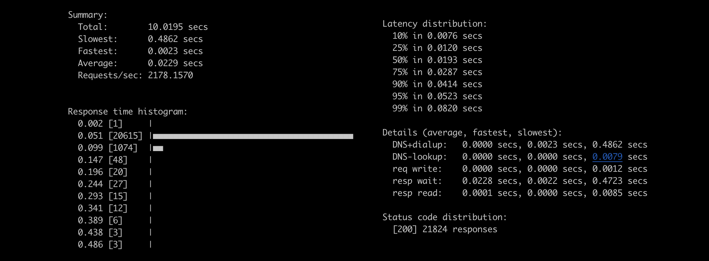  

 테스트 결과를 이런 형태로 출력해 보여준다.  

 사용법은 제일 간단했지만, 일련의 요청 흐름을 실행할 수 없었다. 
1,2,3번 유형에 관계없이 모든 요청의 흐름은 디어 서버에서 신규 서버로 1. POST 요청을 보낸다  2. GET 요청으로 이전 요청의 결과값을 조회한다  두 가지 요청이 항상 묶음으로 보내졌기에, hey로는 원하는 시나리오 테스트를 할 수 없었다.  

<br>

### k6 하려다 못 함 

 두번째로 k6는 자바스크립트로 테스트를 작성할 수 있다는 점이 매력적이었다. 그런데 설치에 문제가 있었다. 
처음 목 클라이언트와 목 서버 인스턴스를 제일 저렴한 `t2.micro`로 생성했다. 
사실 현실과 가까운 테스틑가 목적이라면 실제 클라이언트인 디어 서버와 비슷한 스펙으로 설정해야 했다. 
하지만 당시에는 거기까지 생각하지 못했고, 후에 문제를 만나 바꾸게 된다. 
어쨌든 `t2.micro` 인스턴스는 스펙이 부족해 k6를 설치할 수 없었다... 그래서 우선 artillery로 넘어갔다.  

<br>

### ⭐️ artillery  

 마지막으로 artillery는 node.js로 만들어진 툴이다. 
hey처럼 커맨드라인으로 간단한 테스트가 가능한 동시에, `json`, `yaml`로 자세한 시나리오 테스트를 작성할 수 있어 선택했다. 
테스팅 결과 역시 `json`과 `html` 파일로 출력 가능하다. 
[Artillery를 이용한 스트레스 테스트 - Outsider's dev story](https://blog.outsider.ne.kr/1238) 해당 블로그 포스팅에서 많은 도움을 받았다.  

<br>

## ✍️ yaml로 시나리오 작성  

 테스트 대상 신규 서버의 엔드포인트는 총 두 개다. 

```shell
POST http://new-server.stage.com/deers
{
  "userId": 유저 아이디,
  "deerId": 생성할 엔티티와 관련된 아이디, 
  "data": 특정값  
}
```

```shell
GET http://new-server.stage.com/deers?userId=:userId&deerId=:deerId
```  

<br>

 그런데 문제가 있다. 로직 상 한 번 POST 요청이 성공하면 동일한 `deerId`로 다시 요청할 수 없다. 
따라서 `deerId`가 요청마다 다르지 않으면 테스트가 불가능하다. 
artillery는 [매 요청마다 랜덤한 문자열을 생성하는 플러그인](https://www.artillery.io/docs/guides/plugins/plugin-fuzzer)을 지원하지만, 숫자는 찾지 못했다. 
대신 `csv` 파일에서 랜덤한 값을 요청마다 지정하는 기능이 있었다.  

 그래서 자바스크립트로 간단히 1000부터 100000까지 숫자가 적힌 `numbers.csv` 파일을 아래와 같이 만들었다.  

 ```csv
 1000
 1001
 ...
 99999
 100000
 ```

 <br>

 또, 디어 앱에서부터 유저 흐름을 생각하면, 한 유저는 대게 단일한 요청을 보낸다. 
짧은 시간 내 여러 요청을 보내는 경우는 외부 API 연동이 실패해 재요청하는 경우 뿐이다. 
궁금해서 외부 API 처리 실패율을 단순하게 '실패한 횟수 % 전체 횟수'로 계산했는데, 실패율이 가장 높은 외부 서버 기준으로 약 `0.2%`에 불과했다. 
적은 비율이라 테스트에서 한 유저는 한 번만 요청을 보낸다 가정했다. 
만약 요청 특성 상 특정 시간에 한 유저가 여러 요청을 보낼 수 있었다면, 유저가 평균 몇 번 요청을 보내는지 조사하고 반영해야 했을 것이다.  

 테스트 DB에 존재하는 유저 데이터 id 목록을 조회해 마찬가지로 `users.csv`라는 파일로 만들고 시나리오를 `yaml`로 작성했다. 
artillery 공식 문서가 친절해서 조건을 하나씩 추가하며 작성하기 수월했다.  

```yaml
config:
  target: "http://new-server.stage.com"
  http:
    timeout: 10
  phases:
    - duration: 10
      arrivalRate: 5
  plugins:
    expect: { }
  payload:
    -
      path: "users.csv"
      fields:
        - "userId"
    -
      path: "numbers.csv"
      fields:
        - "deerId"

scenarios:
  - name: "specific scenario"
    flow:
      - post:
          url: "/deers"
          json:
            userId: "{{ userId }}"
            deerId: "{{ deerId }}"
            data: 100
          headers:
            Content-Type: "application/json"
            capture:
            - json: "code"
              as: code
          expect:
            - statusCode: 200
            - equals:
              - "{{ code }}"
              - "success"
      - get:
          url: "/deers?deerId={{ deerId }}&userId={{ userId }}"
          capture:
            - json: "code"
              as: code
          expect:
            - statusCode: 200
            - equals:
              - "{{ code }}"
              - "success"
```

<br>

 설정을 간략히 설명하자면, 신규 서버(target)로 60초간(duration) 초당 5명의 요청(arrivalRate)을 보낸다. 
응답이 10초간 오지 않을 시 요청이 실패(timeout)한 것으로 취급한다.  

 해당 스크립트를 실행하면 POST, GET 요청이 각각 연달아 나간다. 
또한 요청마다 `csv` 파일에서 랜덤 지정된 `userId`와 `deerId`값이 각각 json 바디, url에 지정된다. 
`expect` 플러그인으로 응답 코드와 응답 바디값에 간단한 검증도 붙였다. 
실행 시 옵션을 주면 결과를 json 파일로 생성할 수 있고, 이를 보기 편한 html로 변환할 수 있다.  

```shell
npx artillery run --output report.json script.yaml
```

```shell
artillery report ./report.json
```

<br>

## 🛠 문제 해결하기  

### 예상치 못한 삽질  

 그렇게 가벼운 마음으로 테스트의 테스트를 실행했는데 당황스런 결과가 나왔다. 
초당 요청 수가 5에 불과했는데 요청 하나를 빼고 다 실패했다.  

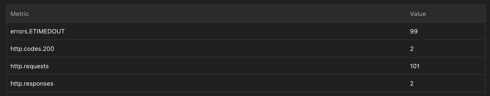  

 이유가 짐작하지 않아 요청 수를 계속 낮추면서 실행했는데, 결과적으로 `2tps`일 경우에만 안정적으로 처리됐다. 
너무나 예상 밖의 결과라 당황했다. 
결국 팀원의 도움을 받아 로깅을 보고 원인을 찾았는데, 목 서버에서 응답을 주지 못하고 있었다. 
앞에서 언급한 '모킹 인스턴스를 `t2.micro`로 설정해 생긴 문제'였다. 
목 서버의 인스턴스를 더 좋은 사양으로 업그레이드 하니 테스트가 정상적으로 수행되었다.  
 
 테스트를 할 때 프로덕션과 최대한 비슷한 인프라 환경을 구축하는 것이 좋다고 생각하면서도, 이런 식으로 문제가 바로 생길 줄 몰랐다. 
그래서 목 클라이언트 인스턴스도 더 나은 사양으로 함께 변경했다. 
다만, 프로덕션 환경과 완전히 동일한 사양으로 올리는 것은 여전히 낭비라고 생각해 적당히 올렸다.  

<br>

### 그래도 예상 범위였던 문제 해결하기  

 그리고 테스트를 다시 시작했는데, 또다시 한자릿수 tps에 막혔다. 
아까와 달리 목 서버와 클라이언트에는 문제가 없었다. 
한자릿수의 요청을 1분간 보냈을 때, 약 10초 후 부터 DB 커넥션 풀이 고갈되는 현상이 발생했다.  

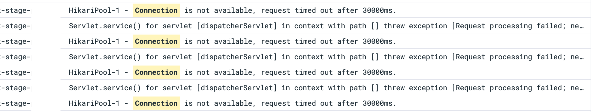

<div style="text-align:center; font-style:italic; color:grey;">
  그래도 로그를 바로바로 확인할 수 있는 환경이라 원인 파악이 쉬웠다  
</div>  

<br>
<br>

 히카리 CP 설정은 모두 default 값이었기에, maximum pool size를 우선 default인 10에서 30으로 늘려보고 다시 실행했다. 
그러니 커넥션 고갈이 시작되는 시간을 미뤄졌지만 결국 특정 시간 이후에 고갈되는 현상은 그대로였다.  

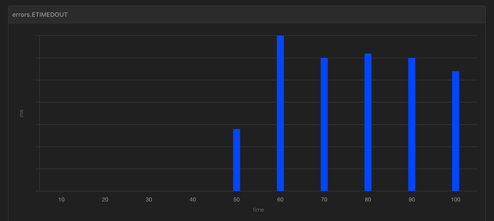

<div style="text-align:center; font-style:italic; color:grey;">
  Hikari CP maximum pool size가 30, 인스턴스가 1개일 때   
</div>  

<br>
<br>

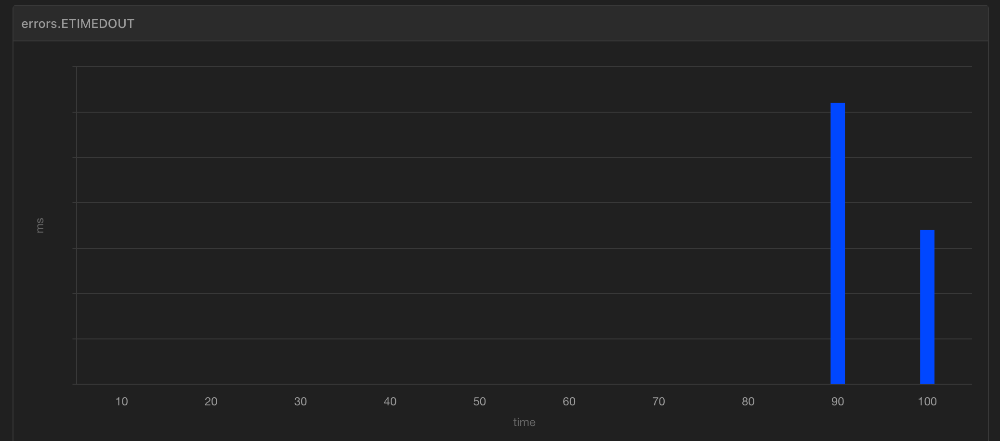  
<div style="text-align:center; font-style:italic; color:grey;">
  Hikari CP maximum pool size가 40, 인스턴스가 2개일 때   
</div> 

<br>
<br>

 우선 가장 빠른 해결법으로 DB 커넥션 수 늘리기가 있었다. 
신규 서버는 aws RDS를 사용했고, 바로 다음 사양으로 업그레이드하면 10배가 넘는 커넥션이 지원됐다. 
22년도와 동일한 패턴과 양의 트래픽이 들어온다면 일단 문제는 생기지 않는 해결법이다.  

 다만 올해의 목표를 생각했을 때, 또 확장성을 고려했을 때 너무 불안한 해결법으로 느껴졌다. 
올해 여러가지 정책을 시도하게 될 것 같은데, 만약 해당 도메인의 요청이 늘어나는 이벤트라도 한다면 바로 문제가 된다. 
아직 오지 않을 일은 대게 영원히 오지 않는다고 하지만 그래도 최소 목표치인 `10*n tps`는 안정적으로 달성하고 싶었다.  

 다른 하나는 신규 서버에서 DB 커넥션을 물고 있는 시간을 줄이기였다. 
신규 서버의 사양을 올리고, 커넥션을 최대한 써도 요청 시간을 늘리면 결국 커넥션 풀 고갈이 발생하는 걸 보고, 목 서버의 응답 시간을 2초에서 0.5초로 줄여보았다. 
그러니 tps가 문제없이 쭉쭉 올랐다. 
반대로 말하면 외부 서버의 응답 시간이 더 길어지면 tps가 더 내려갈 수도 있었다. 
신규 서버는 외부 서버의 응답을 최대 5초까지 대기하도록 설정했으니 가능성 있는 이야기다.  

 신규 서버는 기존 DB와 새로운 DB에 동시에 접근한다. 
앞 인프라 구조에서 생략했던 DB를 추가하면 아래와 같다.  

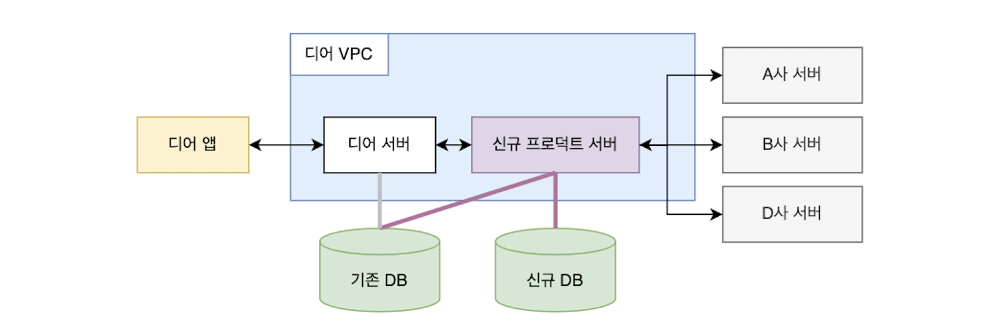  

<br>

 요청이 들어온 후 시간에 따라 각 자원에 접근하는 순서를 그려봤다.  

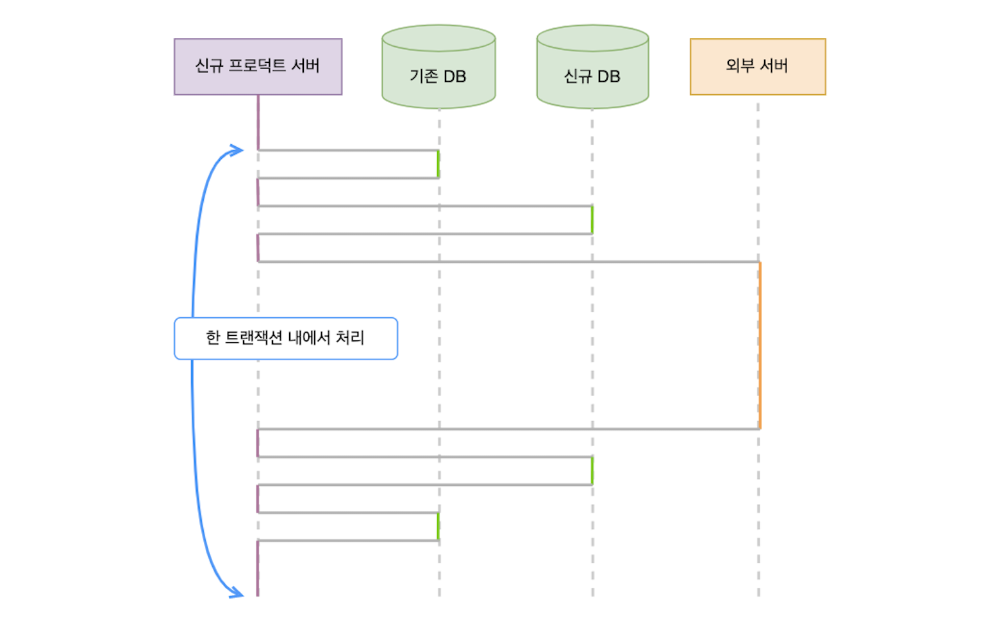  

<br>

 여기서 문제는 이 모든 접근이 하나의 트랜잭션으로 묶여있는 점이었다. 
트랜잭션 내에서 외부 서버에 요청을 보내서, 실제로 필요한 시간보다 훨씬 길게 커넥션을 점유했다.  

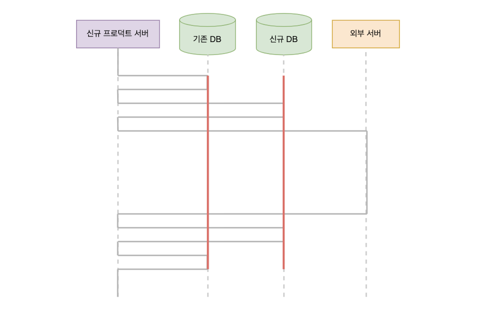  

<br>

 그래서 외부 서버 요청 로직을 트랜잭션 밖으로 분리하는 리팩터링을 진행했다. 
다행히 외부 서버 요청 전 DB 접근은 조회가 대부분이었다. 
일부 값을 변경하는 로직도 있었지만, 외부 서버 요청 성공 여부와 무관하게 값이 변경되어도 비즈니스 로직 상 문제가 없았다. 
결론적으로 외부 서버 요청이 성공할 때만 트랜잭션을 시작하고 각 DB에 접근하도록 개선했다.  

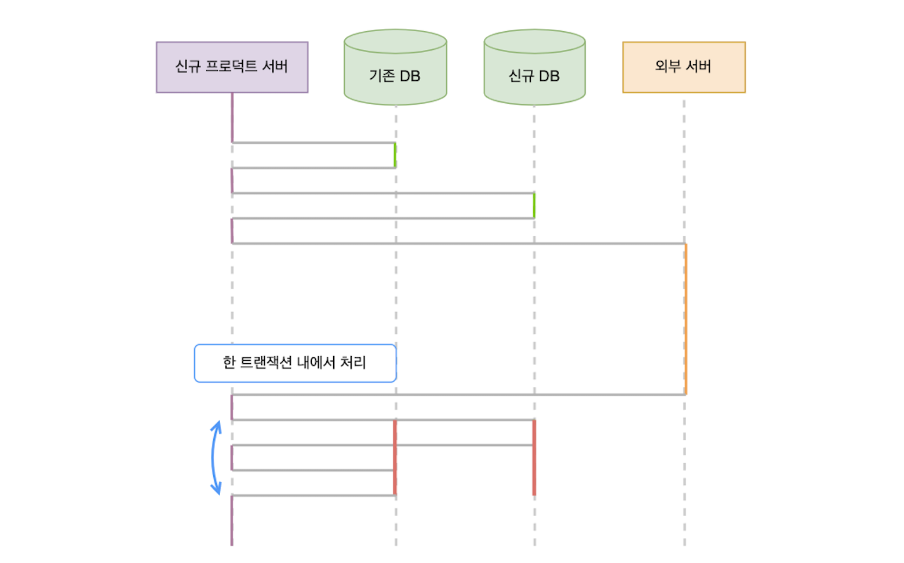

<br>

 구조를 개선하고 나니 원래 목표했던 `10*n tps`의 두 배까지 한 인스턴스로 안정적으로 처리 가능했다. 
커넥션 풀도 조정하며 테스트를 재차 수행한 결과, 30개로 충분해 30개로 줄였다.  

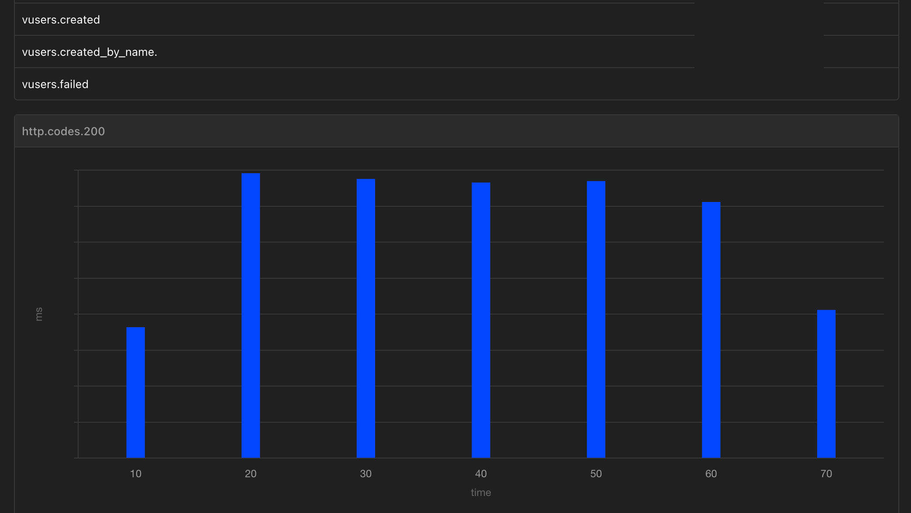  

 1분간 초당 `20*n`명의 가상 유저가 요청을 연달아 2개씩 보내도 실패하지 않는 최종 테스트 결과다.  

 <br>

## 💬 짧은 회고  

 글은 깔끔하게 썼지만 사실 많은 고비가 있었다. 
해당 작업에 2\~3일이 걸릴 것이라 예상했는데, 실제로는 5\~6일 정도를 소요했다. 
인프라 설정부터 쉽지 않았고, chat gpt와 함께 짠 테스트 스크립트는 돌아가지 않아 삽질을 반복했고, 
(결과적으로 chat gpt가 계속 없는 설정을 쓸 수 있다고 잘못 알려준 문제였다😡 공식 문서 링크를 달라고 하니 not found가 뜨는 링크만 계속 줬다!!!), 
원인 파악부터 리팩터링 후 다시 부하테스트, 스테이지 테스트, 이후 배포까지 생각보다 많은 일을 해야했다.  

 돌이켜보았을 때, 앞으로 낯선 문제를 해결할 때 접근 방식을 개선해야겠다는 생각이 든다. 
글에서는 단순히 '목 서버에서 요청 응답을 하지 못해서 사양을 높였다'라고 나와있지만, 사실 그 때 나는 멘붕 상태였다. 
신규 서버가 문제인가? 왜 커넥션 풀 문제도 아닌데 응답이 안 오지? 인스턴스 CPU 상태도 괜찮은데? 하고 허둥대면서 팀원한테 도움을 요청했다. 
로깅을 본 팀원이 `분할 정복` 처럼 문제를 작은 단위로 나눠 보라고 했다. 
먼저 목 서버만 떼어서 문제를 해결해보고, 안되면 다른 방법을 찾아보라며, 자기가 볼 때는 사양이 너무 낮다는 힌트도 줬다.  

 예상치 못한 문제, 또는 잘 모르는 영역의 문제에 부딪히면 늘 분할 정복을 잊게 된다. 
익숙한 스프링에서 문제를 만났다면 디버깅을 찍고, 예외 스택을 따라가며 해결했을 것 같은데, 익숙하지 않은 영역으로 오니 생각이 실타래처럼 엉켰다. 
지금 해결법도 결과적으로 목표한 tps를 달성하긴 했지만, 편하고 자신있는 방식으로 편향해 해결했다는 생각이 든다. 
인스턴스 모니터링을 분석하거나, 톰캣의 스레디풀 등을 조사하기 보다 알고 있는 문제에 먼저 덤볐다. 
이게 '진짜 문제'가 맞기를 빌면서... 
어쩌면 다른 문제 또한 있었고 함께 해결했다면 tps를 더 개선할 수 있었을 것 같다. 
문제 단위를 충분히 잘게 쪼개는 동시에, 컴포트존 너머의 영역에도 도전하기를 의식적으로 수행해야겠다.  

<br>

```toc
```
