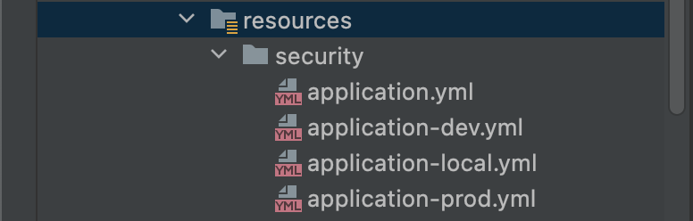

## 문제상황  

### 서비스 배경지식  

#### 첫번째 참고  

현재 개발중인 [줍줍](https://github.com/woowacourse-teams/2022-pickpick)은 슬랙 무료 워크스페이스의 사라지는 메세지들을 대신 저장하고 보여주는 서비스다. 
메세지 저장을 위해 최초 어플리케이션 구동 시, 해당 워크스페이스에 속한 모든 회원 정보를 가져온다. 
이 역할을 `MemberInicializer`라는 클래스의 `@PostContruct`안에 작성했다. 이유는 아래와 같았다.   <!--more-->

1. 어플리케이션이 구동하는 동안 발생하는 신규 가입, 탈퇴 이벤트는 실시간 반영이 된다  
2. 하지만 어플리케이션 최초 구동 전, 또는 업데이트 배포로 어플리케이션이 중지된 사이에 발생한 이벤트는 반영이 안된다  
3. 따라서 재구동 시 한 번 슬랙 API를 호출하여, 유저 정보를 업데이트한다  

유저 정보를 메시지에서 참조하고 있어서 저장이 선행되어야 했다. 
또, 로그인 시 이 정보와 `OAuth` 슬랙 로그인으로 받은 정보를 대조해서 자체 토큰을 발급하는 까닭도 있다.  

<br>

#### 두번째 참고  

슬랙은 `MethodClient`라는 이름으로 슬랙 API에 HTTP 요청을 보내고 응답을 받는 객체를 제공한다. 
그래서 슬랙 API 호출이 필요한 곳에서는 이 `MethodClient` 빈을 주입받아 사용한다. 
이렇게 만들어진 `MemberInitializer` 코드는 다음과 같다.  

```java
@Component
public class MemberInitializer {

    private final MethodsClient slackClient;
    private final MemberRepository memberRepository;

    public MemberInitializer(final MethodsClient slackClient, final MemberRepository memberRepository) {
        this.slackClient = slackClient;
        this.memberRepository = memberRepository;
    }

    @PostConstruct
    void setupMember() throws SlackApiException, IOException {
        List<String> savedSlackIds = findSavedSlackIds();
        List<Member> currentWorkspaceMembers = fetchWorkspaceMembers();
        List<Member> membersToSave = filterMembersToSave(savedSlackIds, currentWorkspaceMembers);

        memberRepository.saveAll(membersToSave);
    }
    
    private List<Member> fetchWorkspaceMembers() throws IOException, SlackApiException {
        // 실제로 슬랙 API 호출이 이뤄지는 부분
        return toMembers(slackClient.usersList(request -> request)
                .getMembers());
    }
    ...
```

<br>

### 테스트 시 외부 API 호출을 대체할 @MockBean 사용  

테스트에서 실제 슬랙 API를 호출하지 않기 위해 해당 `MethodClient`를 `@MockBean`을 통한 가짜 객체로 바꿔쳤다.  

```java
@AutoConfigureMockMvc
@SpringBootTest
class AuthServiceTest {

    @MockBean
    private MethodsClient slackClient;

    void login() throws SlackApiException, IOException {
        // given
        Member member = members.save(new Member("slackId", "username", "thumbnail.png"));

        given(slackClient.oauthV2Access(any(OAuthV2AccessRequest.class)))
                .willReturn(generateOAuthV2AccessResponse());
        ...
```

사유는 다음과 같다.   

1. 슬랙의 서버 상태에 의존하는 테스트가 된다  
2. 원하는 특정 값 또는 상황을 테스트하기 어렵다  
3. (아직 걸린 적은 없지만) 호출 제한이 걸릴 수 있다  

참고로 [슬랙 API](https://api.slack.com/docs/rate-limits)는 명세 별로 등급에 따라 호출 횟수를 제한한다. `Tier2`의 경우 분당 약 20회로 제한되는데, 테스트가 늘어난다면 충분히 걸릴 수 있는 횟수로 보인다.   

그런데 한 인수테스트에서 `@MockBean`을 선언하자 `ApplicationContext` 로드가 실패했다.  

> Failed to load ApplicationContext
java.lang.IllegalStateException: Failed to load ApplicationContext
	at org.springframework.test.context.cache.DefaultCacheAwareContextLoaderDelegate.loadContext(DefaultCacheAwareContextLoaderDelegate.java:132)
	at org.springframework.test.context.support.DefaultTestContext.getApplicationContext(DefaultTestContext.java:124)
	at org.springframework.boot.test.mock.mockito.MockitoTestExecutionListener.postProcessFields(MockitoTestExecutionListener.java:110)  
> ...  
> Caused by: org.springframework.beans.factory.BeanCreationException: Error creating bean with name 'memberInitializer': Invocation of init method failed; nested exception is java.lang.NullPointerException
	at app//org.springframework.beans.factory.annotation.InitDestroyAnnotationBeanPostProcessor.postProcessBeforeInitialization(InitDestroyAnnotationBeanPostProcessor.java:160)  
> ...  
> Caused by: java.lang.NullPointerException
	at com.pickpick.member.application.MemberInitializer.fetchWorkspaceMembers(MemberInitializer.java:46)
	at com.pickpick.member.application.MemberInitializer.setupMember(MemberInitializer.java:31)
	at java.base/jdk.internal.reflect.NativeMethodAccessorImpl.invoke0(Native Method)  
> ...  

<br>

## 해결시도  

### 1. 빈 재정의하기  

[예전에 DAO 객체를 테스트 할 때, 실제 DB 대신 HashMap을 이용한 가짜 객체를 사용](https://hyewoncc.github.io/2022/04/25/spring-study-1.html#%EC%9D%BC%EB%8B%A8-%ED%95%B4%EA%B2%B0%EC%9D%80-%ED%96%88%EC%9C%BC%EB%82%98)했다. 
이 때 추출한 인터페이스의 구현체를 빈으로 등록하고, 테스트에서 덮어 씌웠다. 그래서 `@PostConstruct` 내용물이 텅 빈 가짜 클래스를 만들어 해당 방식을 시도했다. 하지만 아랑곳않고 예외가 터졌다.  

```java
public class FakeMemberInitializer {

    private final MethodsClient slackClient;
    private final MemberRepository memberRepository;

    public MemberInitializer(final MethodsClient slackClient, final MemberRepository memberRepository) {
        this.slackClient = slackClient;
        this.memberRepository = memberRepository;
    }

    @PostConstruct
    void setupMember() throws SlackApiException, IOException {
      // 텅 빈 메서드  
    }
    ...
```

`@PostConstruct`의 실행 시점이 문제였다. 
이 방법을 시도하면서 기대한 실행 시점은 아래와 같았다.  

1. `MemberInitializer`가 생성되고, 주입된다  
2. `FakeMemberInitializer`가 덮어 씌워진다  
3. `FakeMemberInitializer`의 텅 빈 `setupMember()`가 호출된다  

그런데 실제로는 `1-3-2`의 순서로 실행되는 것 같았다. 
테스트용 깡통 빈으로 덮어 씌우기 전에 `@MockBean`으로 대치된 `MethodClient`를 사용하니 `NullPointerException`이 발생한 것이었다.  

<br>

### 2. @Profile로 생성 막기  

`@PostContruct`를 쓰는 한, 빈의 생성 자체를 막아야 한다고 판단했다. 
그래서 `@Profile`을 통해 해당 빈이 프로뎍션 환경에서만 생성되도록 했다.  

```java
@Profile("prod")
@Component
public class MemberInitializer {

    private final MethodsClient slackClient;
    private final MemberRepository memberRepository;
    ...
```

`@Profile`을 도입하는 동시에 다른 팀원의 도움으로 로컬, 개발, 운영 설정의 분리도 함께 이루어졌다. 각 환경에 필요한 `yml` 설정 파일을 지원 형식에 따라 명명했다.  

  

그리고 각 배포 스크립트에서 명령어로 어떤 `profile`을 활성화 시킬 것인지 지정해줬다.  

```shell
java -jar -Dspring.profiles.active=prod pickpick-0.0.1-SNAPSHOT.jar
```

생각해보면 이제까지 테스트에서 컨텍스트가 로딩될 때 마다 실제로 호출이 일어나고, 사용하지 않는 데이터가 적재되었다. 로컬 환경에서야 H2니 운영 데이터 오염이나 DB 비용 지불의 문제는 없었다. 하지만 테스트가 늘어났다면 호출 제한에 걸려 실제 운영에 지장을 초래할 수도 있었다. 더 큰 문제가 생기기 전에 `@Profile`을 도입해서 다행이었다.  


## 앞으로의 과제?  

보다 실제 상황과 비슷한 테스트를 하려면, 테스트 환경에서도 `MemberInitializer`가 생성되는 게 맞다고 생각한다. 특히 인수 테스트에서 컨텍스트가 처음 생성되었을 때 일부 유저가 저장되고, 이 유저에 대한 프로필 수정, 탈퇴 등의 이벤트가 발생했을 시, 제대로 작동되는지 보면 좋을 것 같다.  

<br>

```toc
```
