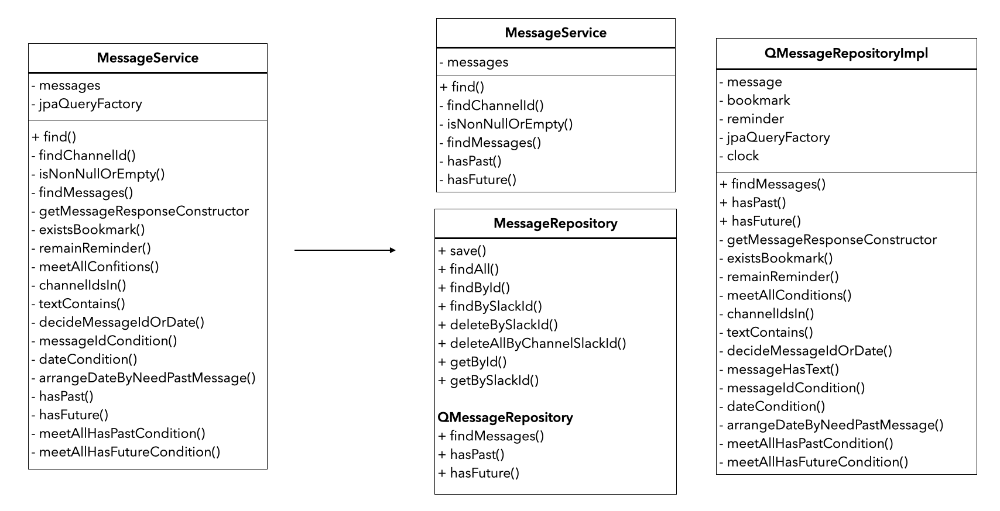
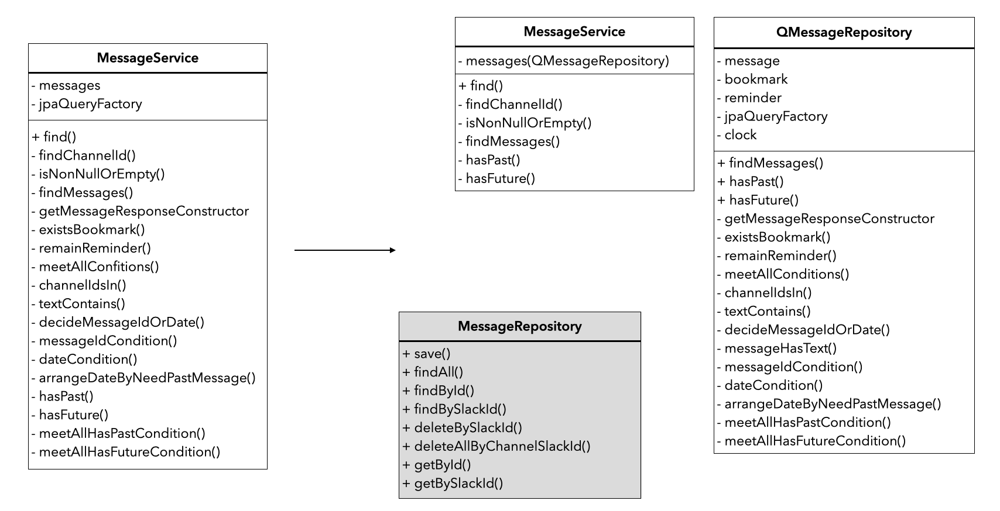

## 🧶 문제상황  

### 🪐 비대해진 서비스 코드  

[줍줍](https://github.com/woowacourse-teams/2022-pickpick)은 요청에 따라 동적으로 변화해야 하는 복잡한 조회 조건을 걸기 위해 `Querydsl`을 도입했다. 
예전에 공부하며 가볍게 사용해 본 적은 있지만, 줍줍 요구사항만큼 복잡한 코드를 짜 본 적은 없었다. 
`XXXService`에 `Querydsl` 코드를 넣는 식으로 우선 구현했고, 무사히 배포되었다.  

```java
public class MessageService {

    private final MemberRepository members;
    private final MessageRepository messages;
    private final ChannelSubscriptionRepository channelSubscriptions;
    private final JPAQueryFactory jpaQueryFactory;

    public MessageResponses find(final Long memberId, final MessageRequest messageRequest) {
        List<Long> channelIds = findChannelId(memberId, messageRequest);

        List<MessageResponse> messageResponses = findMessages(memberId, channelIds, messageRequest);
        boolean hasPast = hasPast(channelIds, messageRequest, messageResponses);
        boolean hasFuture = hasFuture(channelIds, messageRequest, messageResponses);

        return new MessageResponses(messageResponses, hasPast, hasFuture, messageRequest.isNeedPastMessage());
    }

    private List<Long> findChannelId(final Long memberId, final MessageRequest messageRequest) {
        List<Long> channelIds = messageRequest.getChannelIds();

        if (isNonNullNorEmpty(channelIds)) {
            return channelIds;
        }

        ChannelSubscription firstSubscription = channelSubscriptions.getFirstByMemberIdOrderByViewOrderAsc(memberId);

        return List.of(firstSubscription.getChannelId());
    }

    private List<MessageResponse> findMessages(final Long memberId, final List<Long> channelIds,
                                               final MessageRequest messageRequest) {
        boolean needPastMessage = messageRequest.isNeedPastMessage();
        int messageCount = messageRequest.getMessageCount();

        List<MessageResponse> messageResponses = jpaQueryFactory
                .select(getMessageResponseConstructor())
                .from(QMessage.message)
                .leftJoin(QMessage.message.member)
                .leftJoin(QBookmark.bookmark)
                .on(existsBookmark(memberId))
                .leftJoin(QReminder.reminder)
                .on(remainReminder(memberId))
                .where(meetAllConditions(channelIds, messageRequest))
                .orderBy(arrangeDateByNeedPastMessage(needPastMessage))
                .limit(messageCount)
                .fetch();

        replaceMentionMembers(memberId, messageResponses);
        ...
    }
    ...
}
```

그러다 `Querydsl`을 쓰지 않는 다른 서비스 클래스 코드를 보니 '어... 여기는 너무 깔끔한데?'하는 위화감이 들었다. 
그리고 다시 `Querydsl`을 쓰는 코드를 보니, `Repository`가 할 일이 `Service`에서 이뤄지고 있다는 생각이 들었다.  

위에 있는 기존 `MessageService`의 짧은 예시 코드 내에서도 `Querydsl` 사용으로 인한 서비스 역할 비대화가 보인다. 
`findChannelId()`의 경우 DB에서 데이터를 가져오는 역할을 완벽히 `channelSubscriptions`에 맡기고 있다. 
반면, `findMessages()`는 DB에서 어떤 데이터를 가져올지 서비스 코드 상에 완전히 노출되어 있음을 볼 수 있다.  

그래서 각 레이어 별 역할이 원칙대로 분리되도록 `Querydsl` 코드를 별도의 `Repository` 객체로 빼내는 리팩토링을 시작했다.  

<br>

### ✂️ 일단 레포지토리 코드 분리  

`Querydsl` 사용 예시를 보면 `Querydsl`을 사용하는 레포지토리의 인터페이스를 만들고, 이를 `JpaRepository`와 함께 상속받아 결과적으로 하나의 구현체를 사용하게 하는 방법이 많이 나온다. 
글로 하니 어려운데, 그림과 코드로 보면 이렇다.  

  

<br>

```java
public class MessageService {
    private final MessageRepository messages;
    ...
}

public interface MessageRepository extends Repository<Message, Long>, QMessageRepository { ... }

public interface QMessageRepository { ... }

public class QMessageRepositoryImpl implements QMessageRepository { ... }
```

이렇게 한다면 `MessageService`의 `messages`를 통해, `QMessageRepositoryImpl`에 구현된 메서드도 모두 사용할 수 있다. 
`XXXService` 입장에서 단 하나의 `Repository`를 사용하면 되니 깔끔하다.  

이 방식으로 코드를 분리하면 클래스 다이어그램에서 서비스가 한껏 가벼워진 것을 볼 수 있다.  

  

그런데 첫번째 리팩터링 후에 보니, `MessageService`에서 일반 `MessageRepository`의 메서드를 전혀 사용하지 않고 있었다. 
동시에 반대로 `MessageService`를 제외하고 `MessageRepository`를 사용하는 다른 모든 곳에서 `Querydsl` 로직을 전혀 사용하지 않고 있었다. 
다중 상속으로 `Message` 도메인과 관련된 DB 접근 로직을 한 곳에 다 모을 수 있었지만, 
정작 사용하지 않는 메서드가 모두 노출되면서, 관리할 인터페이스만 하나 더 생겼다는 생각이 들었다.  

그래서 다중 상속 없이 `MessageRepository`와 `QMessageRepository`를 필요에 따라 각각 사용하도록 다시 리팩터링을 진행했다.  

  

두 형태 중에 고민했는데 설계상으로는 1안이 확연히 좋았다. 
`MessageRepository`의 DB 접근 명세를 한 번에 볼 수 있다는 점이 특히 그랬다. 
메서드 구현을 위해 내부에서 `JPA`가 자동 생성하는 코드를 사용하건, `Querydsl`을 사용하건, 외부의 관심사가 아니기 때문이다.  

반면, 이 설계의 장점이 현재 우리 프로젝트에 맞을까? 하는 고민이 들었다. 
실질적으로 `JPA` 자동 생성 코드를 쓰는 클라이언트 클래스와 `Querydsl` 코드를 쓰는 클라이언트가 완벽히 나누어져 있고, 
이 둘을 한 번에 쓸 새로운 객체가 생길 가능성이 낮다. 
그렇다면 객체를 분리해 자신이 쓸 메서드만 제공받는 것이 낫지 않을까?  

이 부분은 혼자 고민해서 답을 내리기 보다 팀원들의 의견을 듣고 별도 진행하는 게 나을 것 같아, 두 가지 방안을 모두 열어두고 나머지 리팩터링을 진행했다.  

<br>

### 📛 메서드 이름을 명확하게  

다음으로 `QMessageRepository`의 메서드 이름 개선 작업에 들어갔다. 
기존 코드는 빌더 안 메서드 명이 추상적이라, 코드만 보고 실제로 어떤 조건인지 파악하기 쉽지 않았다.  

```java
public List<MessageResponse> findMessages(final Long memberId, final List<Long> channelIds,
                                            final MessageRequest messageRequest) {
    boolean needPastMessage = messageRequest.isNeedPastMessage();
    int messageCount = messageRequest.getMessageCount();

    return jpaQueryFactory
        .select(getMessageResponseConstructor())
        .from(message)
        .leftJoin(message.member)
        .leftJoin(bookmark)
        .on(existsBookmark(memberId))
        .leftJoin(reminder)
        .on(remainReminder(memberId))
        .where(meetAllConditions(channelIds, messageRequest))
        .orderBy(arrangeDateByNeedPastMessage(needPastMessage))
        .limit(messageCount)
        .fetch();
    }
```

이를 `JPA` 메서드 컨벤션에 맞춰 아래와 같이 명확하게 개선했다.  

#### 1. on 조건문  
on절 안의 메서드는 둘 다 해당 멤버가 갖고 있는 북마크와 리마인더만 조회하는 조건이다. 
여기에 리마인더는 추가로 알람 시각이 현재 시간보다 미래일 경우만 조회한다. 
따라서 조건에 맞춰 구체적인 이름을 지었다.  

```java
return jpaQueryFactory
    .select(getMessageResponseConstructor())
    .from(message)
    .leftJoin(bookmark)
    .on(bookmarksFindByMemberId(memberId))
    .leftJoin(reminder)
    .on(remindersFindByMemberIdWhereRemindDateAfterNow(memberId))
```

#### 2. where 조건문  

where 절 내의 메서드는 `where(meetAllConditions(channelIds, messageRequest)`로 `모든 조건을 만족하는 경우`라는 추상화된 내용만 들어가있다. 
사실 이 안에 너무 많은 조건이 감싸져 있긴 하다. 
정리하자면 다음과 같다.  

- 특정 채널들에 속한 메시지만 조회한다  
- 검색 키워드가 있다면, 해당 키워드가 본문에 존재하는 메시지만 조회한다  
- 본문이 빈 메시지는 조회 대상에서 제외한다  
- 기준삼는 메시지가 있다면, 해당 메시지의 작성시간 기준으로 조회한다
  - 이 때, 조건에 따라 작성시간이 기준 메시지의 작성시간 이전/이후의 메시지로 추가 분기처리된다  
- 기준삼는 메시지가 없다면, 특정 시간 기준으로 조회한다 
  - 이 때, 조건에 따라 작성시간이 특정 시간 이전/이후인 메시지로 추가 분기처리된다  
- 기준삼는 메시지와 특정 시간이 둘 다 없다면, 작성시간 상관없이 조회한다  

처음에는 이 조건들을 메서드 명에 다 넣으려니 도저히 불가능했다. 
그래서 본문과 관련된 두 항목을 `본문에 따라 필터링`, 
그리고 아래 세 항목을 `작성 시간에 따라 필터링`이라는 항목으로 간추렸다.  

```java
return jpaQueryFactory
    .select(getMessageResponseConstructor())
    .from(message)
    .leftJoin(bookmark)
    .on(bookmarksFindByMemberId(memberId))
    .leftJoin(reminder)
    .on(remindersFindByMemberIdWhereRemindDateAfterNow(memberId))
    .where(inChannelsFilterByTextAndPostedDate(channelIds, messageRequest))
```

특정 채널들에 속해있으며, 본문과 작성 시간에 따라 필터링 된다고 요약된 이름이다.  

#### 3. orderBy 조건문  

기존 메서드 이름은 `arrangeDateByNeedPastMessage`였는데, 내부 로직은 결국 `posted_date`의 정렬 기준, 
즉 `decs/asc`를 결정하는 내용이었다. 
그래서 `오름차순/내림차순` 여부가 바뀐다는 내용을 이름에 넣었다.  

```java
return jpaQueryFactory
    .select(getMessageResponseConstructor())
    .from(message)
    ...
    .orderBy(postedDateDescOrAsc(needPastMessage))
```

최종적으로 바뀐 빌더 코드이다.  

```java
// before
return jpaQueryFactory
    .select(getMessageResponseConstructor())
    .from(message)
    .leftJoin(message.member)
    .leftJoin(bookmark)
    .on(existsBookmark(memberId))
    .leftJoin(reminder)
    .on(remainReminder(memberId))
    .where(meetAllConditions(channelIds, messageRequest))
    .orderBy(arrangeDateByNeedPastMessage(needPastMessage))
    .limit(messageCount)
    .fetch();
}

// after 
return jpaQueryFactory
    .select(getMessageResponseConstructor())
    .from(message)
    .leftJoin(message.member)
    .leftJoin(bookmark)
    .on(bookmarksFindByMemberId(memberId))
    .leftJoin(reminder)
    .on(remindersFindByMemberIdWhereRemindDateAfterNow(memberId))
    .where(inChannelsFilterByTextAndPostedDate(channelIds, messageRequest))
    .orderBy(postedDateDescOrAsc(needPastMessage))
    .limit(messageCount)
    .fetch();
```

메서드 이름이 많이 길긴 하지만, 실제로 어떤 조건으로 조회하는지 더 잘 보인다. 
추가로 해당 메서드 내부의 메서드들도 이름을 바꿨다.  

```java
// before
private BooleanExpression inChannelsFilterByTextAndPostedDate(final List<Long> channelIds, final MessageRequest request) {
    return channelIdsIn(channelIds)
        .and(textContains(request.getKeyword()))
        .and(messageHasText())
        .and(decideMessageIdOrDate(request.getMessageId(), request.getDate(), request.isNeedPastMessage()));
}

// after
private BooleanExpression inChannelsFilterByTextAndPostedDate(final List<Long> channelIds, final MessageRequest request) {
    return inChannels(channelIds)
        .and(textContains(request.getKeyword()))
        .and(textIsNotNullNorEmpty())
        .and(afterOrBeforeMessagePostedDateOrRequestDate(request.getMessageId(), request.getDate(), request.isNeedPastMessage()));
    }
```

<br>

### 🕊 서비스 로직은 서비스로 

나머지 `public` 메서드인 `hasPast(), hasFuture()`은 메시지 조회 결과에 대해 각각 과거와 미래의 메시지 조회 결과가 더 있는지 확인하는 메서드다. 
피드에서 자유로운 날짜 이동과 양방향 무한스크롤을 구현하기 위해 페이지네이션을 없애고, 앞/뒤의 메시지를 추가로 불러오는 식으로 구현해 생겼다.    

```java
public boolean hasPast(final List<Long> channelIds, final MessageRequest messageRequest,
                        final List<MessageResponse> messages) {
    Integer result = jpaQueryFactory
        .selectOne()
        .from(message)
        .where(meetAllHasPastCondition(channelIds, messageRequest, messages))
        .fetchFirst();

    return result != null;
}

private BooleanExpression meetAllHasPastCondition(final List<Long> channelIds, final MessageRequest request,
                                                    final List<MessageResponse> messages) {
    MessageResponse targetMessage = messages.get(messages.size() - 1);

    return inChannels(channelIds)
            .and(textContains(request.getKeyword()))
            .and(message.postedDate.before(targetMessage.getPostedDate()));
}
```

결국 이 메서드는 같은 조회 조건일 때 위의 `findMessages()`로 찾은 결과 목록에서, 
첫번째 결과 기준으로 과거/미래의 메시지가 더 존재하는지 조회한다. 
앞과 동일한 방식으로 이름을 개선했다.  

또, `messages.get(messages.size() - 1)`와 `messages.get(0)`로, 
조회 기준이 되는 메시지를 선정하는 건 서비스 레이어의 책임이라 생각해 파라미터를 변경했다.    

```java
public boolean existsByChannelsBeforePostedDate(final List<Long> channelIds, final MessageRequest messageRequest,
                                                    final MessageResponse messageResponse) {
    Integer result = jpaQueryFactory
        .selectOne()
        .from(message)
        .where(inChannelsFilterByTextBeforePostedDate(channelIds, messageRequest, messageResponse))
        .fetchFirst();

    return result != null;
}

private BooleanExpression inChannelsFilterByTextBeforePostedDate(final List<Long> channelIds, final MessageRequest request,
                                                                final MessageResponse messageResponse) {
    return inChannels(channelIds)
        .and(textContains(request.getKeyword()))
        .and(message.postedDate.before(messageResponse.getPostedDate()));
}
```

서비스 코드를 보면 맥락이 훨씬 뚜렷해졌다.  

```java
// before
private boolean hasPast(final List<Long> channelIds, final MessageRequest messageRequest,
                        final List<MessageResponse> messages) {
    if (messages.isEmpty()) {
        return false;
    }

    return this.messages.hasPast(channelIds, messageRequest, messages);
}

// after
private boolean hasPast(final List<Long> channelIds, final MessageRequest messageRequest,
                        final List<MessageResponse> messages) {
    if (messages.isEmpty()) {
        return false;
    }

    MessageResponse message = messages.get(messages.size() - 1);
    return this.messages.existsByChannelsBeforePostedDate(channelIds, messageRequest, message);
}
```

<br>

### 🤫 레포지토리에게 DTO 숨기기  

현재 `QMessageRepository`는 `MessageService`에서 `MessageRequest` 객체를 받아와 값을 꺼내 사용한다. 
이 요청값 DTO가 컨트롤러부터 넘어왔다는 사실을 고려한다면, 레포지토리가 클라이언트에서 어떤 값을 받아오는지 알고 있는 상황이다. 
그래서 파라미터가 늘어남을 감수하고, 값을 꺼내서 받도록 했다.    

```java
public class MessageService {
    ...
    private List<MessageResponse> findMessages(final Long memberId, final List<Long> channelIds,
                                               final MessageRequest messageRequest) {
        boolean needPastMessage = messageRequest.isNeedPastMessage();

        List<MessageResponse> messageResponses = messages.findMessages(
                memberId,
                channelIds,
                messageRequest.getKeyword(),
                messageRequest.getMessageId(),
                messageRequest.getDate(),
                messageRequest.isNeedPastMessage(),
                messageRequest.getMessageCount());
        ...
    }
}

public class QMessageRepository {
    public List<MessageResponse> findMessages(final Long memberId,
                                              final List<Long> channelIds,
                                              final String keyword,
                                              final Long messageId,
                                              final LocalDateTime date,
                                              final boolean needPastMessage,
                                              final int messageCount) {
    ...
    }
}
```

이제 레포지토리는 DTO를 알지 못한다!  

<br>

## 🧹 마치며  

구현이 급하고 `Querydsl`을 잘 몰랐을 때는 기존 구현 방식의 단점을 잘 몰랐다. 
그런데 여유가 생기고 프로젝트 구조에 익숙해지자, 보이지 않던 문제가 보이기 시작한다.  

솔직히 사용자 요구사항에 따른 기능 추가가 더 급해 리팩토링이 내키지 않을 때도 있다. 
하지만 깨끗한 코드 위에 새로운 코드를 올리는 것이, 결과적으로 복잡한 코드 사이를 헤매며 올리는 것 보다 대부분 더 빠르고 효율적이다. 
그래서 지속적인 리팩터링이 신규 개발 만큼 중요한 것이다.  

여담으로 요즘은 프로그래밍이 치워도 치워도 필연적으로 다시 더러워진다는 점에서 참 집안일 같다는 생각이 든다...  

<br>

```toc
```
