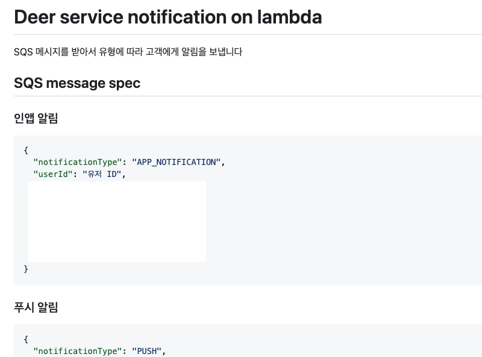

최근 디어에 알림함이 생겼다. 
근데 최근이라고 쓰고 확인해보니 최초 오픈한지 이미 몇달이 지났다... 요즘 시간 지나가는 속도가 정말 충격적이다...   

어쨌든 그 전에 디어엔 '알림' 개념이 없었다. 몇 기능에 푸시 알림이 붙어 있었을 뿐이다.  
공유 모빌리티 서비스를 사용한 적이 있다면 앱 체류 시간을 떠올려 보자. 굉장히 짧지 않았나? 
나도 길에서 킥보드가 보이면 대여할 때 한 번, 반납할 때 한 번 앱을 키는 게 전부다. 
그래서 알림의 필요성이 부족해 없었다.  
그러다 게이미피케이션 같이 고객과 상호작용이 강한 기능이 도입되면서, 고객에게 전달한 정보가 어디에도 남지 않고 휘발된다는 문제점을 팀 디자이너 분이 발견했다. 알림함은 그 분의 오랜 숙원 사업이었는데, 오픈하고 보니 '필요없다'고 생각해서 고객에게 전하지 않던 정보 중 필요한 것도 있었고, 원래 도입하려던 기능에 알림이 큰 도움이 되는 것도 있었다.  

<br>

## 🔔 알림 도입과 아키텍쳐 개편  

인앱 알림 도입 이전엔 푸시 알림만 여러곳에서 보냈다. 예로 문의를 남겼을 때 A서버에서 '문의를 보냈다'는 푸시를, CX 관리 어드민에서 답변을 작성했을 때 '문의 답변이 달렸다'는 푸시를 보냈다.    

  

<br>

앱에 알림함을 만들고 게이미피케이션 푸시 및 인앱 알림을 보내면서 구조가 추가되었다.  

  

사실 여기까지만 해도 나쁘지 않아 보이는데, 고객들의 편의와 정보 전달을 위한 알림을 적극적으로 추가하려니 문제가 생겼다.  

<br>

  

그림으로 그리니 복잡함이 과장되게 보이는 느낌이 없잖지만... 
외부 푸시 서비스를 다른 서비스로 교체한다고 생각해보자. 그럼 저 곳을 모두 돌아다니면서 교체해야 한다. 
인앱 알림은 DB에 데이터를 저장하는 식인데, 여기도 변경점이 생긴다면 동일한 문제가 있다.  

여기에 만약 다른 서비스에서도 알림을 보내고 싶다면? 
똑같은 코드를 또 써야 한다. 
그리고 한 데이터를 여러 곳에서 변경하는 것도 바람직해 보이진 않는다.  

원래는 이미 이곳 저곳에 퍼져있는 푸시를 재쳐두고, 인앱 알림 저장을 서비스 B나 C에 몰아주고, 차라리 다른 곳에서 호출해 사용하도록 API를 열어줘야 하나? 아니면 알림 서비스를 별도로 분리해야 하나? 싶었다.  


  


고려하면서 달갑지 않았다! 이미 별도로 돌아가고 관리에 어려움이 있는 특수 목적의 레거시 서비스들이 있다. 
결제 관련 php 서버 하나를 완전 페이드 아웃 시키는데만 몇 달이 걸렸는데, 하나를 치우고 다른 하나를 놓는 게 영 별로였다.  

그러다 팀장님이 SQS와 서버리스 프레임워크를 사용한 람다로 분리하면 어떻겠냐 제안해주셨고, 이런 구조로 개선하기로 했다.  

  

언듯 보면 SQS가 추가로 끼어서 더 복잡할 것 같지만, ec2 인스턴스로 띄우는 서버와 달리 여러 면에서 장점이 있다. 트래픽을 고려해 스펙을 정하지 않아도 되고, 실행 시간이 짧은 만큼 요금도 저렴하다. 또 클라우드 워치에서 로그도 쉽게 볼 수 있고, 서버리스는 배포도 쉽다. 사실 스타트업에서는 다른 거 다 빼도 비용 저렴한 것 만으로 가치가 있다!  

<br>

## 🧨 개편 중 사소한 트러블 슈팅  
 
분명 주말 내내 삽질을 했었는데, 한달 정도 지났더니 세 개만 기억난다.😭  

첫번째로 다른 서비스에서 SQS에 메시지를 보낼 때 접근 권한 관리다. 원인은 모르겠으나 스프링 애플리케이션 서버에서 SQS에 접근이 안 돼 메시지를 보낼 수 없었다. 그래서 별도의 iam 사용자를 만들어 권한을 주고, 키를 발급해 프로퍼티 값으로 넣어 사용했다.  

그런데 보안상 키를 사용하지 않는 게 낫고, 내가 yml 설정을 잘못해서 안 됐던 거였다. 대신 iam 역할에서 각 서비스 별 권한 정책에 `AmazonSQSFullAccess`를 추가하는 걸로 대체했다.  

  

<br>

더 엄격하게 관리한다면 메시지 전송 작업만 가능한 별도 권한을 줬을 것이다. 그 정도로 관리할 필요성은 없어서 하지 않았다.  

람다에도 SQS 메시지 읽기와 삭제 권한을 줘야 한다. 삭제는 함수 실행 후 처리한 메시지를 삭제하기 위해 필요하다. 여기는 처음 설정해보는 거라 학습을 위해 전체가 아닌 개별 권한을 줬다. yml로 설정 가능하다.  

```yml
iam:
  role:
    statements:
      - Effect: Allow
        Action:
          - sqs:ReceiveMessage
          - sqs:DeleteMessage
        Resource: 'arn:aws:sqs:ap-northeast-2:*:*'
```

<br>

두번째는 람다에서 AWS RDS를 연결할 때, 직접 연결 대신 프록시를 사용해야 했다. 팀장님과 개편 논의하면서 처음부터 들어서 알고는 있었는데 처음 작업해봐서 헤맸다. 사유와 방법은 감사하게도 잘 정리된 [Meduim 해리의 유목코딩 - \[AWS\] 서버리스를 위한 RDS Proxy서비스](https://medium.com/harrythegreat/aws-%EC%84%9C%EB%B2%84%EB%A6%AC%EC%8A%A4%EB%A5%BC-%EC%9C%84%ED%95%9C-rds-proxy%EC%84%9C%EB%B9%84%EC%8A%A4-fb5815b83cce) 포스팅을 참고했다. 

<br>

마지막으로 vpc 설정이다. 배포가 쉽고 빠르기에 실행 즉시 hello world 문자열을 응답하는 람다를 먼저 배포해보고 점점 붙이는 식으로 학습 및 개발했는데... yml로 vpc 적용이 되지 않았다.  

```yml
functions:
  함수 이름:
    vpc:
      securityGroupIds:
        - ${self:provider.SECURITY_GROUP_ID}
      subnetIds:
        - ${self:provider.SUBNET_ID}
```

알고보니 이 설정은 람다 생성 후 소급 적용이 불가능했다. 그래서 함수를 삭제했다가 배포로 다시 생성하니 적용됐다.  

<br>

## ⚡️ 써보니 좋긴 좋더라  

서버리스로 개발하고 람다에 배포하니 훨씬 쉽고 빨랐다. 
(물론 평소에 자주 쓰는 스프링은 엔터프라이즈급 애플리케이션에 적합하다 나와있어 각자 의도한 쓸모가 다르니 비교에 딱 맞진 않다.)  

아래에 있는 게 함수 코드 전체다. 메시지의 타입을 보고 푸시면 외부 서비스에 요청을 보내고, 인앱이면 DB에 저장한다.  

```javascript
'use strict';
const mysql = require('mysql');

const TYPE = {
    APP_NOTIFICATION: 'APP_NOTIFICATION',
    PUSH: 'PUSH'
}

async function sendAppNotification(body) {
    await new Promise(() => {
        const connection = mysql.createConnection({
            host: process.env.DB_PROXY_ENDPOINT,
            user: process.env.DB_USERNAME,
            password: process.env.DB_PASSWORD,
            database: process.env.DB_SCHEMA,
        });
        connection.connect();
        connection.query(`
                    INSERT INTO ...`,[...], function (error, results, fields) {
                if (error) throw error;
            });
        connection.end();
    });
}

async function sendPushNotification(body) {
    await new Promise(() => {
        fetch('https://external-service', {
            method: 'POST',
            body: JSON.stringify({...}),
            headers: {
                'Content-Type': 'application/json',
                'Authorization': '...'
            }
        });
    });
}

module.exports.handler = async (event) => {
    const body = JSON.parse(event.Records[0].body);
    if (body.notificationType === TYPE.APP_NOTIFICATION) {
        await sendAppNotification(body);
    }
    if (body.notificationType === TYPE.PUSH) {
        await sendPushNotification(body);
    }
};

```  

<br> 

람다에 올렸으니 트래픽이 겹쳐 몰릴까 신경쓰지 않고 알림을 보낼 수 있다. 
어디서든 리드미에 정의한 대로 SQS에 메시지만 보내면 된다.  

  

<br>

더 이상 복붙 중복 개발은 없다! 
람다로 교체하고 배치랑 다른 람다를 포함해 여기저기서 유용한 알람을 잘 추가하고 있다.  

  

이용권 만료 알림 처럼 고객에게 꼭 필요했던 기능이 알림함 개발 및 개편 후 빠르고 쉽게 추가되어서 정말 뿌듯했다.  

다음 목표는 현재 곳곳에 퍼져있는 푸시 알림 레거시를 모두 걷어내고 메시지 발행으로 교체하기다. 
더 중요한 일들이 산더미라 아마 빠른 시일 내로 하기는 어렵곘지만 상반기 내로는 할 수 있지 않을까?  
그리고 한 번 람다에 올리고 나니 아 이거 똑 떼내면 기가 막히겠다 싶은 것들이 이것저것 보인다. 무분별하게 떼내는 건 자제해야겠지만, 새로운 걸 배우니 선택권이 넓어져서 너무 좋다. 사실 이렇게 개편할 때 일정이 진짜 너!무! 촉박해서 이거 하다가 틀어질까 걱정이 많았는데... 하다보니 어떻게든 되어서 요즘 그래도 경험치 있는 개발자가 된 것 같아 기쁘다. 올해는 경험치를 더 많이 쌓을 수 있었으면 좋겠다. 

<br>

```toc
```
