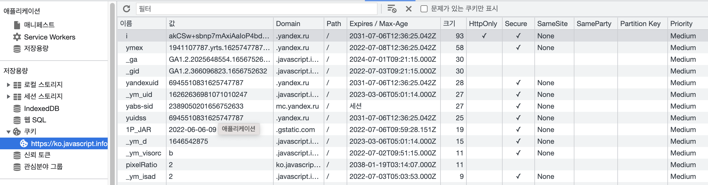
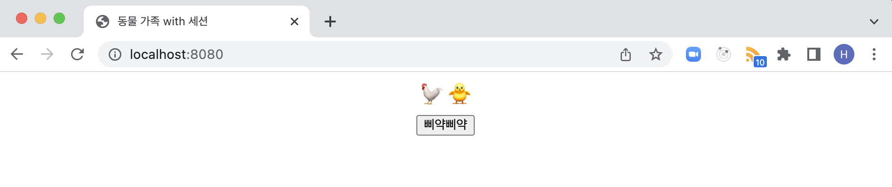
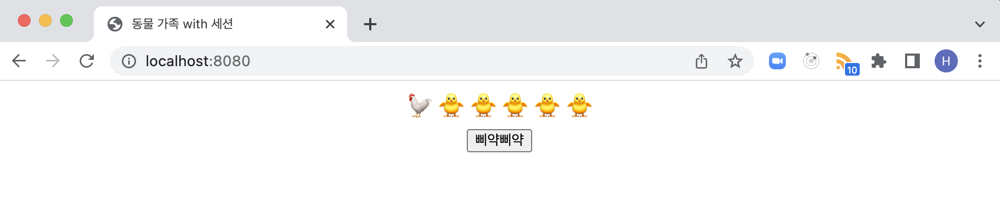
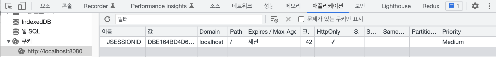
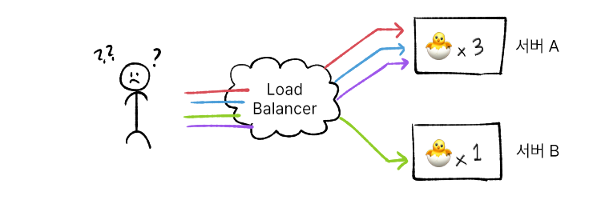
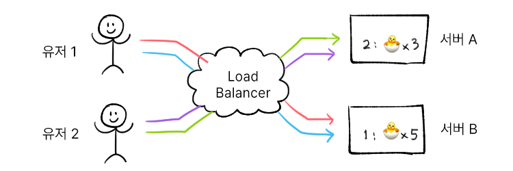
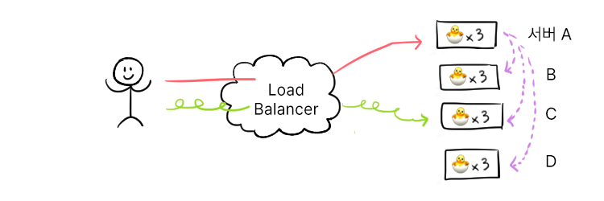
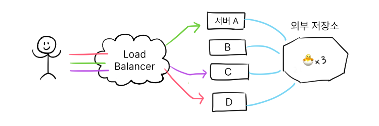

## 🔍 세션의 정체를 찾아서   

### 세션의 정의  

영어에서 `session`이란 특정 활동이 수행된 기간을 의미한다. 일상 속에서 보자면 나는 꾸준히 PT를 받고 있는데, PT 수업 한 회를 세션이라고 불렀다.  
그럼 CS의 세션은 무엇일까? **`둘 또는 그 이상의 컴퓨팅 디바이스간에서 일어나는 일시적이고 상호적인 정보 교환`**을 의미한다. 통신을 하는 동안 세션이 유지된다면 세션의 정보를 이용할 수 있을 것이다. 이런 상태를 `stateful`이라 부른다. 반대는 `stateless`라고 부르는데, HTTP 프로토콜이 이에 속한다. (막간 홍보 : HTTP에 관심이 있다면 [HTTP 테코톡](https://youtu.be/IjxkKQvn8Bc))  

HTTP 프로토콜이 `stateless`이기에, 여러 불편한 상황이 일어난다. 쇼핑몰에서 상품을 장바구니에 담을 때 마다 로그인을 새로 요구한다고 생각해보자. 짜증나서 사려던 것도 안 사고 나가지 않을까? 이런 무상태를 보충하기 위해 상태 유지를 돕는 기술을 함께 사용한다. 그 중 하나가 `세션`이다.  

<br/>

### javax servelet HttpSession  

자바 서블릿의 `HttpSession`은 **인터페이스**다. 이 포스팅에서 다룰 내용을 java docs에서 간추려보았다.  

<!--more-->

> 유저 정보를 저장함으로써 웹페이지 요청이나 사이트 방문 간에 유저를 식별할 수 있는 방법을 제공한다. 서블릿 컨테이너는 이 인터페이스를 HTTP 클라이언트와 HTTP 서버 간의 세션을 만드는데 사용한다. 세션은 여러 커넥션이나 유저의 페이지 요청을 걸쳐 특정 시간동안 유지된다. 한 세션은 보통 사이트를 여러번 방문할 한 유저에 대응된다. 쿠키나 URLs 복제 등을 이용해 서버에서 한 세션을 유지시킬 수 있다.  
> ... 서블릿은 클라이언트가 쿠키 비허용 같이 의도적으로 세션 유지를 거부할 때에 대한 대비를 해둬야 한다. 클라이언트가 세션에 참여하면 `isNew`는 `true`를 반환한다. 클라이언트가 세션 유지를 거부하면, `getSession`은 매 요청마다 다른 세션을 반환하기에 `isNew`도 항상 `true`를 반환할 것이다.  
> 세션 정보 범위는 현재의 웹 어플리케이션(ServletContext)로 한정되기에, 한 곳에 저장된 정보는 다른 웹 어플리케이션(ServletContext)에서 접근할 수 없다.  

<br/>

### 톰캣 StandardSession & ManagerBase  

스프링부트로 웹개발을 하고 있기에, **톰캣의 구현체**를 살펴보겠다. `StandardSession`은 `HttpSession`과 함께 `Session`, `Serializable`을 구현하고 있다. 이중 `Session` 인터페이스는 `HttpSession`의 [퍼사드 패턴](https://ko.wikipedia.org/wiki/%ED%8D%BC%EC%82%AC%EB%93%9C_%ED%8C%A8%ED%84%B4)적용 객체이다.  

```java
/**
* The collection of user data attributes associated with this Session.
* 역 - 해당 세션과 관련된 유저 정보의 집합  
*/
protected ConcurrentMap<String, Object> attributes = new ConcurrentHashMap<>();

public void setAttribute(String name, Object value, boolean notify) {
    ...
```  

`StandardSession`은 `ConcurrentMap`의 형태로 정보를 담는다. `setAttribute`로 세션에 객체를 담을 수 있는데, 특이사항이 두 가지 있다.  

1. 키값이 이미 존재한다면 값이 교체된다  
2. 추가한 객체가 `HttpSessionBindingListener`의 구현체라면, `valueBound()`가 호출된다  

1번은 `Map` 자료구조를 생각하면 당연한 사실이겠지만, 2번은 추후 공부가 더 필요한 영역이다.  

그리고 `ManagerBase` 클래스에 `session id`를 키값으로 세션이 들어가있다.  

```java
public abstract class ManagerBase extends LifecycleMBeanBase implements Manager {
    ...
    protected Map<String, Session> sessions = new ConcurrentHashMap<>();

    @Override
    public void add(Session session) {
        sessions.put(session.getIdInternal(), session);
        ...
    }

    ...
    public HashMap<String, String> getSession(String sessionId) {
        Session s = sessions.get(sessionId);
        ...
}
```  

<br/> 

## 🍪 그렇담 쿠키는 무엇인가  

### 쿠키 정의  

쿠키는 인터넷 웹 브라우저를 통해 컴퓨팅 기기에 설치되는 **작은 기록 정보 파일**이다. 쿠키는 `key-value`쌍과 속성으로 이루어져 있는데, 속성에는 만료 기간, 도메인, 플래그(ex. Secure, HttpOnly)등의 정보를 저장한다. 브라우저의 개발자 도구에서 값을 직접 확인할 수 있다.  

  

쿠키는 세션 관리, 개인화, 트래킹 등의 목적으로 사용된다. 하지만 이미지에서 보이듯 값을 자유롭게 확인 가능함으로 **비밀번호, 개인정보 등의 중요정보는 절대 담아선 안된다.** 

<br/>

### 쿠키 종류  

종류에 따라 특정한 유형으로 따로 저장되는 건 아니고, 설정에 따라 분류할 수 있다.  

- Session Cookie
    - expires(유효 일자)나 max-age(만료 기간) 옵션이 지정되지 않은 쿠키. 브라우저가 닫힐 때 함께 삭제된다.  
    expires를 과거로 지정하거나 max-age를 0으로 설정하는 경우 바로 삭제되므로 여기에 속한다.   
- Persistent Cookie  
    - 장기간 저장되는 쿠키. max-age로 설정할 수 있다. 접속한 기기에 저장된다.  
    포스팅 자료를 찾다 2038년 문제와 관련된 재밌는 글을 발견했는데 심심하면 읽어보시길. [절대 만료되지 않을 쿠키 만들기 - stackoverflow](https://stackoverflow.com/questions/3290424/set-a-cookie-to-never-expire)  
- Secure Cookie  
    - `secure` 옵션을 설정해 HTTPS로 통신하는 경우에만 전송되는 쿠키.  
    `secure`가 설정되어 있지 않은 기본값은 `HTTPS <-🍪-> HTTP`간의 이용이 자유롭다. 반면 설정 시, `HTTPS -🍪/-> HTTP` 이 되어 HTTPS에서 생성한 쿠키를 HTTP가 읽을 수 없다.  
    민감 내용이 저장되어 있어 비암호화인 HTTP 연결 전달을 원치 않는다면 사용하면 된다.  
- Third-Party Cookie  
    - 사용자가 방문 중인 도메인이 아닌 다른 도메인에서 설장한 쿠키. [부록: 서드 파티 쿠키 - JAVASCRIPT.INFO](https://ko.javascript.info/cookie#ref-696)에 잘 설명되어 있다. 반대 개념으로 같은 도메인에서 설정한 쿠키는 First-Party Cookie다.  

<br/>

## HttpSession을 이용한 상태 유지 (with 🍪)  

### 세션에 상태값 유지하기  

HttpSession으로 간단한 상태 유지를 한 사례를 [깃헙](https://github.com/hyewoncc/spring-sandbox/tree/session-cookie)에서 볼 수 있다. 해당 브랜치의 애플리케이션을 실행하면 간단한 페이지가 뜬다. `삐약삐약`을 누르면 병아리가 추가된다.  

  
  

해당 애플리케이션은 브라우저를 완전히 종료하고 다시 켜는 것만 아니면, 새로고침을 하거나, 페이지를 닫았다 열어도 증가한 만큼 병아리의 수가 유지된다. `HttpSession`에 `chicks`라는 이름으로 정수값을 저장하기 때문이다.  

```java
@Controller
public class SessionController {

    private static final String SESSION_KEY = "chicks";

    @GetMapping
    public ModelAndView main(HttpSession session) {
        Object attribute = session.getAttribute(SESSION_KEY);
        ModelAndView modelAndView = new ModelAndView("session.html");
        Map<String, Object> map = new HashMap<>();

        if (attribute != null) {
            map.put(SESSION_KEY, (int) attribute);
            session.setAttribute(SESSION_KEY, (int) attribute);
            return modelAndView.addAllObjects(map);
        }

        map.put(SESSION_KEY, 0);
        session.setAttribute(SESSION_KEY, 0);
        return modelAndView.addAllObjects(map);
    }

    @PostMapping
    public String add(HttpSession session) {
        Object attribute = session.getAttribute(SESSION_KEY);

        if (attribute != null) {
            session.setAttribute(SESSION_KEY, (int) attribute + 1);
        }

        return "redirect:/";
    }
}
```

그런데 애플리케이션은 `ManagerBase`에서 해당 세션을 어떻게 찾아오는 것일까? 개발자 도구에서 `쿠키`를 보면 답을 알 수 있다.  

  

`HttpSession`을 생성할 때, 톰캣에서 자동으로 랜덤한 문자열인 `JSESSIONID`를 생성한다. 그리고 이 값을 쿠키에 담아 클라이언트에 전송하고, 쿠키가 유지되는 동안 이 쿠키의 `JSESSIONID` 값으로 저장된 세션을 찾아온다. 해당 쿠키를 삭제하면 새로운 세션에 연결되고 병아리의 수가 초기화된다.  

## 세션의 한계와 극복법  

세션은 JVM에 저장된다. 따라서 서버가 분산되어 있다면 위의 방식으로 동작하지 않는다. A서버 메모리의 세션 맵과 B서버 메모리의 세션 맵이 다르기 때문이다.  

  

이를 극복할 수 있는 몇 방안을 간략하게 소개하겠다.  

### Sticky session  

  

한 사용자가 처음 세션에 참여한 서버로 접속을 고정시킨다. `유저1`이 `서버B`에 요청을 보냈다면, 세션이 유지되는 동안 `서버B`와 통신을 주고받게 된다.  

### Session clustering   

  

서버 간에 세션을 복사해 공유한다. 한 서버에서 생성된 세션이 모든 서버에 복사되기에, 어떤 서버에 접속하더라도 같은 세션값을 받을 수 있다. 하지만 `sticky session`과 같이 유지 비용이 많이 든다.    

### Session storage DB  

  

외부에 세션 저장소를 따로 둔다. 앞선 두 방법 보다 비용 측면에서 나아 보이지만, 분산 서버의 많은 요청이 외부 저장소로 들어갔을 때 부하가 생길 수 있다.    

또는...  

## 🪙 토큰   

### 토큰이란?  

`토큰`이란 단어는 아주 광범위하게 쓰인다. 예를 들어 java `StringTokenizer`의 토큰은 문자열을 자르는 데 이용되는 특정한 문자열이다. `jwt`의 토큰은 생성 정보와 키, 값 쌍을 인코딩한 문자열이다. 여러 사례를 보고 내가 일반화한 CS의 토큰은 `특정 값을 식별하는데 사용되는 키`이다.  

토큰 기반 인증은 `사용자가 서버에서 발급받은 토큰을 요청마다 함께 주는 방식`이다. 얼핏 보면 세션ID를 쿠키로 전달하는 것과 비슷해보이지만, 전달받은 값을 서버에서 처리하는 방식이 다르다. 토큰은 저장소에 접근하지 않고, 서버에서 유효성을 검증한다. 따라서 분산 서버 환경이어도 문제가 없다.  

다만 `Access Token`과 `Refresh Token`을 함께 사용하는 경우에는 `Refresh Token`을 DB에 저장하게 된다. 이번 포스팅에서 마저 다루기엔 내용이 길기에, 대신 잘 정리되어 있는 다른 블로그 포스팅 링크를 남기겠다. 토큰에 대해 알아보며 토큰을 사용한 대표적인 인증 방식인 `OAuth`도 함께 공부할 필요성을 느껴서 함께 올린다.  

- [쉽게 알아보는 서버 인증 2편(Access Token + Refresh Token)](https://tansfil.tistory.com/59)  
- [OAuth 2.0 이해](https://www.icatpark.com/entry/OAuth-20-%EC%9D%B4%ED%95%B4)  

<br/>

### 번외 - session id는 토큰인가?  

우테코 레벨2 인터뷰에서 `session id는 토큰일까요 아닐까요?`라는 포비의 질문에 제대로 대답하지 못했다. 내가 생각하던 `토큰`은 `HTTP 헤더 Authorization`에 들어가는 문자열이었기 때문이다. 하지만 인증 방식과 CS의 토큰의 사례에 대해 알아보면서, `session id == session token`임을 알게 되었다.  

<br/>

## 참고자료    

- [CS의 Sessions](https://medium.com/@llamacorn/computer-science-sessions-7517ec8af766)  
- [HTTP쿠키 mdn](https://developer.mozilla.org/ko/docs/Web/HTTP/Cookies)  
- [쿠키와 document.cookie](https://ko.javascript.info/cookie)  

```toc
```
