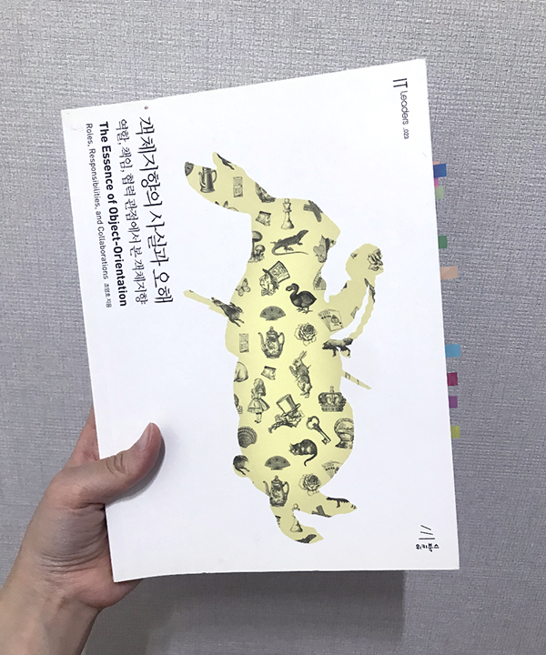
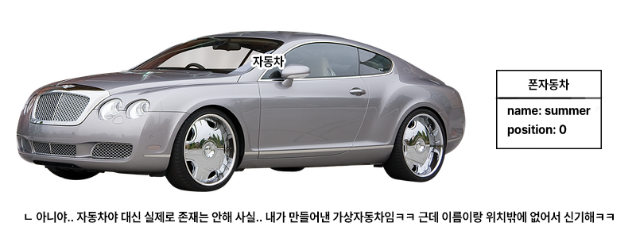

객체지향의 사실과 오해는 널리 알려진 개발자 필독서 중 하나로, 김영한님의 인프런 강의를 듣다 알게 되었다.   

그 후로 책을 긴 텀을 두고 네다섯번 정독했다. 읽기 쉽고 가벼운 책이기도 하고, 경험치가 누적됨에 따라 새로 발견하는 것이 있었기 때문이다. 이 책은 우아한테크코스의 레벨1 필독서에 포함되어 있다. 블랙잭 미션을 마치고 충격과 실의에 빠져 `나는 여전히 객체지향을 모른다`는 생각에 책을 다시 펼쳤다. 그래서 이 글은 책의 전체 내용 보다 특정한 주제와 그에 따른 의견을 중심으로 쓰여졌음을 양해바란다.    

**내 블랙잭 미션은 왜 망했을까?** 네오의 강의에서 `상태 패턴`을 배우고, 이 책을 다시 읽기 전까진 미션의 패인을 `디자인 패턴을 몰라서`라 생각했었다. 만약 나와 비슷한 생각을 가진 사람이 있다면 흥미롭게 읽을 수 있을 것이다.  

## 이 책을 읽기 전에...  

  

무언가를 설명함에 있어 비유는 때때로 혼란을 일으킨다. 객체지향을 설명코자 나온 많은 비유가 오히려 입문자들에게 잘못된 관념을 심고 있다. 조부모-부모-자식과 자산의 흐름 또는 동물계의 분류와 하위 특정 종으로 나타내는 상속에 대한 부적절한 설명이 그 중 하나다. <!--more--> 이 책은 `이상한 나라의 엘리스`에 대한 비유로 내용을 이끌어나간다. 지은이는 비유를 쓰면서도 우리 입문자들이 자칫 틀린 관념에 빠질까 시시때때로 비유의 바다에서 건져내는 환기 작업을 해준다. 비유에만 몰입하다 길을 잃지 말고, 자신만의 통찰을 얻길 바란다.  

 

## 새로운 객체지향 실천 지침

### 실세계를 떠나기  

> 객체지향의 목표는 실세계를 모방하는 것이 아니다. 오히려 새로운 세계를 창조하는 것이다.  
> p.21  

객체지향 프로그래밍을 하다 나오는 많은 실수는 `실세계를 프로그램에 완벽히 대응`시키려는 시도에서 나온다. 실세계의 현상과 우리가 개발하려는 로직은 결고 일대일로 대응할 수 없으며, 그렇게 해야 할 이유도 없다. 우리는 이미 무의식중에 존재하지 않는 새로운 세계를 훌륭히 창조하면서도, 때때로 능력을 잊고 실세계를 대입하다 망치곤 한다.  

  

[자동차 경주 미션](https://github.com/woowacourse/java-racingcar)에서 크루들이 구현한 `Car`객체는 실세계의 자동차와 결코 일대일로 대응하지 않는다. 이 자동차는 실세계의 자동차가 아니다. 상상 속 자동차 경주 세계에 존재하는 `자동차 역할을 해 줄 새로운 창조물`이다. 이 폰자동차에 모델, 가격, 연비, 출력, 엔진 따위는 필요없다. 폰자동차가 전진(후진도 좌회전도 유턴도 불가능하다)할 때 필요한 건 숫자 하나 뿐이다. 낮은 차원에서 훌륭히 작동하는 창조력은 복잡한 문제로 넘어가면 고장나기 시작한다.  

폰자동차가 전진할 때 랜덤 숫자가 필요하다. 여기에 `실세계의 랜덤`을 가져오는 시도는 테스트가 불가능한 구조로 이어진다. 실세계의 로또 추첨이 완전한 우연으로 이루어 지기에, 폰로또에 우연을 넣는 시도도 같은 실패로 끝난다.  

> 그러나 인간의 인지 능력은 물리적인 한계를 넘어 개념적으로 경계 지을 수 있는 추상적인 사물까지도 객체로 인식할 수 있게 한다.  
> p.41 

앞선 실패에서 과연 `전략 패턴`과 `의존객체 주입`을 몰랐던 것 만이 문제였을까? `숫자 하나를 제공하는 것`, `여섯자리 숫자를 만드는 것` 같은 추상화된 `역할`을 인식함이, 전략 패턴과 의존객체 주입 공부에 앞섰어야 했다는 것을, 이 책을 다시 읽으며 깨달았다. 폰자동차에 불필요한 실세계 자동차의 모든 요소를 깨끗히 잊은 것 처럼, 이도 실세계를 떠나야 가능한 인식의 전환이다.   

 

### 행동을 앞서 생각하기      

> 객체를 결정하는 것은 행동이다. 데이터는 단지 행동을 따를 뿐이다.  
> p.95  

객체지향의 특성을 검색하면 `캡슐화, 상속, 다형성, 추상화`와 함께 이를 구현하는 법이 나온다. 나는 프로그래밍을 파이썬으로 시작했다. 그 때 객체지향을 처음 알게 되면서, 앞선 특성들과 구현법에 대해 배웠다. 하지만 근본에 대한 이해가 없으니 기계적으로 따라할 뿐, 객체지향의 장점에 대해 체감할 수 없었다. 책에서 설명하는 객체지향의 본질을 이해하고 나니, 애초에 저 네가지 특성이 동등한 무게를 가진 것 처럼 병렬해 적는 것이 틀린 일로 여겨진다.  

> 동일한 요청에 대해 서로 다른 방식으로 응답할 수 있는 능력을 **다형성(polymorphism)**이라고 한다.  
> p.28  

> 서로 다른 객체들이 다형성을 만족시킨다는 것은 객체들이 동일한 책임을 공유한다는 것을 의미한다.  
> p.151  

다형성을 구현 중점으로 공부했기에 위와 같은 생각을 하기 어려웠다. 인터페이스를 작성해 오버라이딩 했기에 여러 객체의 구현을 사용할 수 있는 것이 아니다. 특정한 `행동`을 수행하는 `타입`을 인터페이스로 정의했기에, 타입에 속하는 여러 객체가 누구든 그 자리에 들어가 일할 수 있는 것이다. 두 문장이 차이가 없어 보일 수도 있다. 하지만 `숫자 하나를 제공하기`, `여섯자리 숫자를 만들기` 같은 `행동`을 먼저 추출하지 못했기에 인터페이스를 활용할 수 없었던 것이, 자동차 경주와 로또 미션이 지나고 든 아쉬움이다. 

> 객제지향에서 일반화/특수화 관계를 결정하는 것은 객체의 상태를 표현하는 데이터가 아니라 행동이라는 것이다. ... 결국 객체의 일반화/특수화 관계에 있어서도 중요한 것은 객체가 내부에 보관한 데이터가 아니라 객체가 외부에 제공하는 행동이다.  
> p.98  

> 객체가 역할을 대체하기 위해서는 행동이 호환돼야 한다는 점에 주목하라. ... 결국 객체는 협력 안에서 역할이 수행할 수 있는 행동을 그대로 수행할 수 있어야 한다. ... 요약하면 역할의 대체 가능성은 행위 호환성을 의미하고, 행위 호환성은 동일한 책임의 수행을 의미한다.  
> p.127  

상속을 가계도나 동물 분류도에 비유하는 것을 틀렸다고 한 이유가 여기에 있다. 또, 객체지향의 네 가지 특성을 병렬해 적는 것이 껄끄럽게 느껴지는 이유기도 하다. 실세계를 떠나기와 합쳐, `행동`, `책임`을 추출하는 `추상화`를 먼저 탐구하면, 나머지는 훨씬 쉽고 자연스럽게 이해할 수 있다.  

 

### 그래서 내 블랙잭은 왜 망했을까?  

> 객체지향에 갓 입문한 사람들이 가장 쉽게 빠지는 함정은 상태를 중심으로 객체를 바라보는 것이다.  
> p.64  

실세계의 카드패를 떠올려보자. 내 손 안의 카드패는 게임 진행이라는 시간축에 따라 상태가 바뀐다. 처음에 ♠K, ◆4를 받았다. 합이 14이니 힛이다. 카드를 한 장 더 뽑으니 안타깝게도 ♥8이 나왔다. 카드패는 버스트가 되었다. 실세계의 카드패와 상태에 생각이 메어있기 때문에, 시간 흐름에 따라 상태가 변하는 단일한 객체를 떠올리기 쉽다.    

  

내 손의 실재하는 카드패는 갑자기 다른 카드패로 교체되지 않으며, 카드를 `받는`주체는 게임 참가자인 나 이다. `상태 패턴`을 몰랐던 것 만이 문제가 아니다. 이런 생각이 블랙잭에서 행동과 메시지를 분리하지 못하게 했다.   

폰카드패-힛은 카드를 주면 자신의 상태를 판별한다. 21이 넘으면 폰카드패-힛은 자신의 데이터를 넘겨주고 폰카드패-버스트를 만들어낸다. 폰카드패-버스트는 카드를 주면 예외를 던진다. 상상 속 블랙잭 세계의 `행동`은 `카드를 받는 것`, `메시지`가 `상태`가 된다. 행동이 상태를 결정하는 것이다. 각 객체는 진행 흐름과 무관하게 존재하며, 다만 게임에서 요청하는 행동에 대해 메시지를 던질 뿐이다.  

 

### 번외. 구현 기능 목록, 왜 적어야 할까 

프리코스를 포함한 우테코 미션에서는 `기능을 구현하기 전에 구현할 기능 목록을 정리할 것`이 필수 요구사항이다. 처음에는 아래와 같이 클래스 별로 넣으려는 기능을 적었다.

- Car
- [ ] 숫자가 5 이상이면 전진한다  
- Game
- [ ] 우승자를 찾는다  

그랬더니 클래스 별로 구현 기능을 적지 말라는 피드백이 메일에 있었다. 그래서 그 때 부터 레벨1을 진행하며 쭉 합쳐서 적긴 했지만, 여기에 의문을 가진 적은 없었다. 하지만 책에서 객체지향 시스템 설계 절차를 읽고 나니, 구현 기능 목록을 작성하는 이유를 알 수 있었다. `시스템 책임`에 해당하는 구현 기능 목록을 먼저 파악하고 적으면서 자연스레 이 절차를 따르게 된 것이 신기하다. 우테코는 다 계획이 있군요.  

> 협조적이고 성실한 객체 시민들로 구성된 객체지향 시스템을 설계하는 절차의 요약  
> 1. `시스템이 사용자에게 제공해야 하는 기능인 시스템 책임을 파악한다.` 
> 2. 시스템 책임을 더 작은 책임으로 분할한다.  
> 3. 분할된 책임을 수행할 수 있는 적절한 객체 또는 역할을 찾아 책임을 할당한다.  
> 4. 객체가 책임을 수행하는 중에 다른 객체의 도움이 필요한 경우 이를 책임질 적절한 객체 또는 역할을 찾는다.  
> 5. 해당 객체 또는 역할에게 책임을 할당함으로써 두 객체가 협력하게 한다.  
>
> p.133  

 

## 나는 여전히 객체지향을 모른다  

처음 이 책을 읽을 때는 동화책을 읽듯 했던 것 같다. 객체지향 자체를 공부한 게 처음이라 쉬운 비유로 쓰인 설명이 잘 읽혔다. 그 다음에는 캡슐화, 추상화를 주의깊게 보았다. 아마 자바 인터페이스를 처음 작성해 본 후였던 듯 싶다. 그리고 프리코스를 진행하며 다시 읽고, `객체 간 메시지를 주고 받는다`는 개념과 그 중요성을 배웠다. 이번 독서에서는 `새로운 세계를 창조하기`가 큰 주제였다. 이 책을 굳이 여러번 읽는 걸 이상하게 생각하는 사람도 있었다. 하지만 나는 손을 한 번 데어 봐야 불이 뜨겁다는 걸 조심하는 사람이어서, 객체지향의 벽에 부딪혔을 때 마다 책에서 새로운 교훈을 얻을 수 있었다. 나처럼 레벨1을 진행하며 객체지향의 벽에 부딪혀 막막해져 본 모두에게 새삼 이 책을 추천한다.  
이 책을 다시 꺼낼 날이 언제가 될 지는 모르겠지만, 그 때도 분명 새로 와닿는 게 있을 것이다. 그래서 이 말로 글을 마치려 한다. 나는 여전히 객체지향을 모르겠다.  
