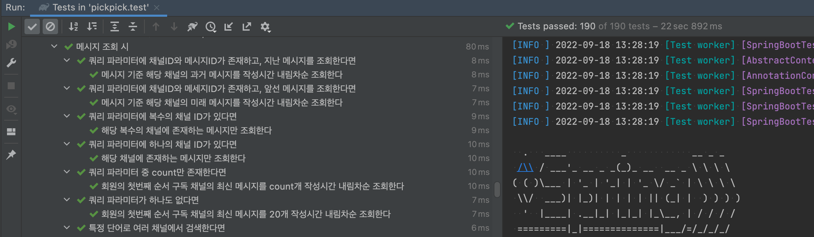
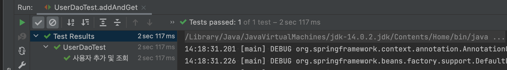
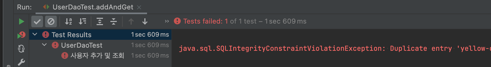

해당 포스팅은 [토비의 스프링 3.1](https://search.shopping.naver.com/book/catalog/32463364883?cat_id=50010881&frm=PBOKPRO&query=%ED%86%A0%EB%B9%84%EC%9D%98+%EC%8A%A4%ED%94%84%EB%A7%81&NaPm=ct%3Dl7xcl9rk%7Cci%3D2beb40c880925062f67b8f4c293f36caed990219%7Ctr%3Dboknx%7Csn%3D95694%7Chk%3De46d0a257b549c8d320d7074983959664f253dd5)을 읽고 책 내용과 실습 코드 정리 및 스터디에서 나온 의견을 정리한 포스팅이다.  

## 2장 테스트  

스프링을 국비학원에서 처음 배운 나는 `테스트`가 존재하는 줄도 몰랐다. 
자잘한 코드 하나 고치는 데도 대소동이 일어났다. 
회원가입 기능을 만드는데 비밀번호 제한이 잘 안되는 것 같다면  

- 애플리케이션을 종료한다  
- 코드를 수정하고 break point를 걸거나 출력문을 써둔다     
- 다시 애플리케이션을 킨다  
- 크롬 시크릿 + 강력 새로고침으로 페이지에 들어간다  
- 회원가입을 시도하고 다시 확인한다  

이런 과정을 거쳐야 했다.  

테스트가 일상이 된 지금은 테스트가 없으면 불안하다. (레벨4 미션을 하면서 소홀해지긴 했지만...) 
테스트를 배운 처음엔 신기했고, 그 다음엔 조금 귀찮았는데, 지금은 테스트가 없으면 줄 없이 번지점프하는 기분이 든다. 
테스트는 나에게 자유롭고 재밌게 코드를 갖고 놀게 해주는 안전장치인 셈이다.  


<div style="text-align:center; font-style:italic; color:grey;">
  현재 개발중인 줍줍의 전체 테스트 실행 콘솔 화면. 편-안하다.  
</div>

<br>

## 초난감 UserDaoTest 개선기  

1장에서 만들었던 `UserDaoTest`는 내가 예전에 했던 휴먼-테스트보단 낫지만 여전히 초난감한 테스트다.  

```java
public class UserDaoTest {

    public static void main(String[] args) throws SQLException {

        UserDao userDao = new DaoFactory().userDao();

        User user = new User("hyewoncc4", "최혜원", "password");
        userDao.add(user);

        System.out.println("등록 성공");

        User foundUser = userDao.get(user.getId());
        System.out.println(foundUser.getName());
        System.out.println(foundUser.getPassword());
        System.out.println(foundUser.getId() + " 조회 성공");
    }
}
```  

<br>

1. 수동으로 결과를 확인해야 한다  
이 코드는 자동화가 덜 되었다. 
콘솔 창에 찍힌 `getName(), getPassword()`가 정말 저장 된 값과 일치하는지는 결국 사람이 보고 판단해야 한다.  

2. 실행 작업이 번거롭다  
현재는 테스트 클래스가 하나뿐이지만, 이런 식으로 내부에 `main()`을 통해 테스트하는 클래스가 늘어난다면 일일히 실행하는 것도 보통 일이 아니게 될 것이다.  

첫번째 문제는 코드를 개선해 해결할 수 있다.  

```java
public static void main(String[] args) throws SQLException {
    
    UserDao userDao = new DaoFactory().userDao();

    userDao.add(user);
    User user = new User("hyewoncc4", "최혜원", "password");    
    User foundUser = userDao.get(user.getId());
    
    if (!user.getName().equals(foundUser.getName())) {
        System.out.println("테스트 실패 : name");  
    }
    else if (!user.getPassword().equals(foundUser.getPassword())) {
        System.out.println("테스트 실패 : password");  
    } else {
        System.out.println("조회 테스트 성공");
    }
}
```

이제 콘솔창에서 값을 확인하지 않아도 된다. 
하지만 여전히 문제가 남아있다.  

<br>

### Junit 적용하기  

이 테스트를 `Junit` 프레임워크를 이용해 바꿔보자. 
책에서는 `Junit4`를 사용하고 있지만, `Junit5`로 예제를 따라했다.  

```
testImplementation("org.junit.jupiter:junit-jupiter-api")
```

1장의 `xml`부분은 코드로 따라하지 않았고, `@Configuration`을 통해 빈을 생성해서 책과 다른 부분이 있다.  

```java
class UserDaoTest {

    @DisplayName("사용자 추가 및 조회")
    @Test
    void addAndGet() throws SQLException {
        ApplicationContext applicationContext = new AnnotationConfigApplicationContext(DaoFactory.class);
        UserDao userDao = applicationContext.getBean("userDao", UserDao.class);

        User user = new User("yellow-cat", "노란 고양이", "password");
        userDao.add(user);

        User foundUser = userDao.get(user.getId());
        assertEquals(user.getName(), foundUser.getName());
        assertEquals(user.getPassword(), foundUser.getPassword());
    }
}
```  

테스트를 돌리면 **한번만** 정상적으로 돌아간다. 
다시 실행하면 유니크 값 중복으로 `insert`에 실패하기 때문이다.  

  
  

테스트를 성공시키려면 DB의 데이터를 비워줘야 한다. 
이를 `UserDao`에 `deleteAll(), getCount()` 메서드를 만듦으로써 보충했다. 
그리고 책 예제의 테스트 스타일이 맞지 않아, 결국 스프링 부트 스타터 테스트로 의존성을 변경하고 평소 스타일대로 작성했다... 

```
testImplementation("org.springframework.boot:spring-boot-starter-test")
```

```java
class UserDaoTest {

    @DisplayName("사용자 추가 및 조회")
    @Test
    void addAndGet() throws SQLException {
        ApplicationContext applicationContext = new AnnotationConfigApplicationContext(DaoFactory.class);
        UserDao userDao = applicationContext.getBean("userDao", UserDao.class);

        userDao.deleteAll();
        assertThat(userDao.getCount()).isEqualTo(0);

        User user = new User("yellow-cat", "노란 고양이", "password");
        userDao.add(user);
        assertThat(userDao.getCount()).isEqualTo(1);

        User foundUser = userDao.get(user.getId());
        assertThat(foundUser.getName()).isEqualTo(user.getName());
        assertThat(foundUser.getPassword()).isEqualTo(user.getPassword());
    }
}
```

책에는 `User`를 두 번 추가하고 `getCount()`의 값 증가를 확인하고, 두 `User`의 값을 각각 상세 검증하는 코드가 추가되어 있다.   

<br>

### TDD로 개발하는 예외처리  

예외처리를 `TDD`로 소개한 부분이 인상깊었다. 
현재 코드에서 `userDao.get(존재하지 않는 id)`를 하면 `EmptyResultDataAccessException`을 발생시키는 기능을 추가하고 싶다고 하자. 
그럼 정상적으로 동작되어야 할 테스트를 먼저 작성한다.  

```java
@DisplayName("존재하지 않는 id 조회 시 예외")
@Test
void get_idDoesNotExists_throwException() throws SQLException {
    ApplicationContext applicationContext = new AnnotationConfigApplicationContext(DaoFactory.class);
    UserDao userDao = applicationContext.getBean("userDao", UserDao.class);

    userDao.deleteAll();

    assertThatThrownBy(() -> userDao.get("unknown_id"))
        .isInstanceOf(EmptyResultDataAccessException.class);
}
```

이 테스트는 다른 예외가 발생하면서 실패한다.  

```
java.lang.AssertionError: 
Expecting:
  <java.sql.SQLException: Illegal operation on empty result set.>
to be an instance of:
  <org.springframework.dao.EmptyResultDataAccessException>
but was:
  <"java.sql.SQLException: Illegal operation on empty result set.
```

이제 **테스트를 통과시킬 코드**를 개발하면 된다. 
`id`로 `User`를 조회했을 때 결과가 없다면 예외를 발생시키는 코드를 추가하자.  

```java
public User get(final String id) throws SQLException {
    Connection connection = dataSource.getConnection();

    PreparedStatement statement = connection.prepareStatement(
        "select id, name, password from users where id = ?"
    );
    statement.setString(1, id);

    ResultSet resultSet = statement.executeQuery();
    User user = null;

    if (resultSet.next()) {
        user = new User();
        user.setId(resultSet.getString("id"));
        user.setName(resultSet.getString("name"));
        user.setPassword(resultSet.getString("password"));
    }

        resultSet.close();
        statement.close();
        connection.close();

    if (user == null) {
        throw new EmptyResultDataAccessException(1);
    }

    return user;
}
```

테스트가 통과하는 것을 볼 수 있다.  

<br>

### @Before과 Junit 생명주기  

현재 테스트는 `userDao` 빈을 컨테이너에서 가져오는 과정이 중복되어있다. 
이 중복을 Junit의 `@Before, @BeforeEach`를 이용해 제거할 수 있다.  

```java
class UserDaoTest {

    private UserDao userDao;

    @BeforeEach
    void setUp() {
        ApplicationContext applicationContext = new AnnotationConfigApplicationContext(DaoFactory.class);
        userDao = applicationContext.getBean("userDao", UserDao.class);
    }
    
    @Test
    void addAndGet() {...}

    @Test
    void get_idDoesNotExists_throwException() {...}
}
```

원래 `@Before`도 사용해보려고 했는데, `setUp()`이 호출되지 않는 문제가 있었다. 
`Junit4`에서는 모두 `public`이어야 했던 것 같아서 클래스와 메서드 접근제어자를 바꾸기 등등 시도해보았는데 잘 안됐다... 
어쨌든 `addAndGet(), get_idDoesNotExists_throwException()`이 각각 실행될 때 새로운 `UserDaoTest` 인스턴스가 생기고 `setUp()`이 호출된다. 
이는 테스트 간 격리를 위한 `Junit` 기본 스펙이다. 
만약 테스트가 하나의 인스턴스에서 이뤄져야 한다면 어노테이션으로 생명주기를 변경할 수 있다.  

```java
@TestInstance(Lifecycle.PER_CLASS)
class UserDaoTest {
    ...
```

책에서는 생성되는 `User` 픽스쳐도 `setUp()`을 통해 설정하게 바꿔두었는데... 깃헙에 올리진 않았다. 
많은 경우에 픽스쳐와 이를 테스트하는 코드는 거리가 가까운 게 좋다는 생각 때문이다. 
아마 `@Before`로 중복 코드를 제거하는 방식을 보여주려고 여기에도 적용하신 것 같다.  

<br>

### 테스트 간 애플리케이션 컨텍스트 공유  

솔직히 이 부분은 괜히 익숙한 대로 하겠다고 하다가... 책의 설명을 잘 이해하지 못했다. 
`@RunWith(SpringJunit4ClassRunner.class)`와 `@SpringBootTest`가 비슷한 역할을 해주는 것 같다는 것만 추론했다.  

```java
// 그리고 이쯤에서 DaoFactory 라는 이름이 몹시 잘못되었다는게 보여서 AppConfig로 바꿨다  
@SpringBootTest
@ContextConfiguration(classes = DaoFactory.class)
class UserDaoTest {
    
    @Autowired
    private ApplicationContext applicationContext;
    
    private UserDao userDao;
    
    @BeforeEach
    void setUp() {
        userDao = applicationContext.getBean("userDao", UserDao.class);
    }
    ...
```

콘솔로 각 테스트 메서드에서 `this(UserDaoTest의 인스턴스)`와 `applicationContext`를 찍어보면, 
`UserDaoTest`는 매번 새 인스턴스가 만들어짐에도 불구하고 `applicationContext`은 같은 인스턴스가 재활용됨을 볼 수 있다. 
`ApplicationContext`도 스프링 빈으로 등록되기 때문이다. 
만약 동일하게 `@ContextConfiguration(classes = DaoFactory.class)`만 사용하는 (그러니까 애플리케이션 컨텍스트 설정이 같은) 다른 테스트 클래스가 있다면, 
그 클래스의 인스턴스들과도 동일한 `applicationContext`를 공유한다. 
인수테스트를 배우며 알게된 `@DirtiesContext`로 새로운 애플리케이션 컨텍스트를 생성하도록 강제할 수 있다.  

아예 `UserDao`를 주입받도록 변경할 수도 있다.  

```java
@SpringBootTest
@ContextConfiguration(classes = AppConfig.class)
class UserDaoTest {

    @Autowired
    private UserDao userDao;
    ...
```

`DataSource`를 주입받아 테스트에서 다른 DB를 사용하도록 할 수도 있다.  

```java
@SpringBootTest
@ContextConfiguration(classes = TestAppConfig.class)
class UserDaoTest {

    @Autowired
    private DataSource dataSource;
    ...

@Configuration
public class TestAppConfig {

    @Bean
    public DataSource dataSource() {
        SimpleDriverDataSource dataSource = new SimpleDriverDataSource();

        dataSource.set...;

        return dataSource;
    }
}
```

책과 같은 방식은 아니지만 예전에 [테스트에서만 빈 갈아 끼우기](https://hyewoncc.github.io/spring-study-1/)를 고민한 적 있어서 반가웠다.  

<br>

### 아니면, 컨테이너를 없애버리기  

순수하게 `UserDao`만 테스트 할 것이라면 이런 식으로 `DI`를 할 수 있다.  

```java
class UserDaoTest {

    private UserDao userDao;

    @BeforeEach
    void setUp() {
        userDao = new UserDao();
        userDao.setDataSource(dataSource());
    }
    
    private DataSource dataSource() {
        SimpleDriverDataSource dataSource = new SimpleDriverDataSource();

        dataSource.setDriverClass(com.mysql.cj.jdbc.Driver.class);
        dataSource.setUrl("jdbc:mysql://localhost:3306/springbook?serverTimezone=Asia/Seoul");
        dataSource.setUsername("spring");
        dataSource.setPassword("book");

        return dataSource;
    }
    ...
```

우테코 레벨1에서 [콘솔 체스 게임 만들기 미션](https://github.com/woowacourse/java-chess)을 할 때, 
체스판을 뜻하는 `Board` 객체를 테스트에서 `DI`를 이용해 초기화해줬다.  

```java
public Board(final PiecesSetup piecesSetup) {
    pieces = new Pieces(piecesSetup);
}

public interface PiecesSetup {
    Map<Position, Piece> initialize();
}

@Test
@DisplayName("폰은 상대기물이 목적지에 존재하면 대각선으로 움직일 수 있다")
void pawnCanMoveDiagonal_targetExist() {
    Piece whitePawn = new Piece(Color.WHITE, new Pawn());
    Board board = new Board(() -> {
        Map<Position, Piece> pieces = new HashMap<>();
        pieces.put(Position.of("a2"), whitePawn);
        pieces.put(Position.of("b3"), new Piece(Color.BLACK, new Pawn()));
        return pieces;
    });

    board.move("a2", "b3");
    assertThat(board.findPiece(Position.of("b3")).get()).isEqualTo(whitePawn);
}
```

이렇게 테스트 상황에 맞는 데이터를 주입해 생성할 수 있었다. 
`DI`가 스프링에 종속적인 기술이 아니라는 걸, 순수(?) 자바 애플리케이션 테스트를 통해 체득할 수 있었다.  

전체 실습 코드는 [깃헙 topring 레포](https://github.com/hyewoncc/topring/tree/chapter2)에서 볼 수 있다.

<br>

## 학습테스트를 만들자!  

토프링 내용 요약은 위에서 거의 끝났고, 여기는 번외 느낌이다. 
학습테스트로 학습을 한번이라도 해 본 사람들은 학습테스트의 ✨멋짐✨을 알 것이다. 
나는 평소에 `XXX-sandbox`라는 이름으로 프로젝트를 만들어 공부한 코드를 정리하고, 블로그에 올릴 예제 코드를 깃헙에 올린다. 
솔직히 공부가 잘되는 건 둘째치고... 정말 훌륭한 커닝페이퍼가 되어준다. 
코틀린으로 given/when/then 테스트 어떻게 작성했더라? 하면 구글에서 검색하고 블로그의 코드블럭 긁어오고 할 필요 없이 그냥 프로젝트 켜서 보면 된다.  

```kotlin
internal class BehaviorTest: BehaviorSpec({

    given("when으로 동물 소리룰 찾으면") {
        val grammar = Grammar()

        `when`("고양이는") {
            val name = "cat"
            val sound = grammar.whenAnimalSound(name)
            then("야옹이 나온다") {
                sound shouldBe "meow"
            }
        }

        `when`("개는") {
            val name = "dog"
            val sound = grammar.whenAnimalSound(name)
            then("멍멍이 나온다") {
                sound shouldBe "woff"
            }
        }

        `when`("이름 모를 동물은") {
            val name = "x"
            val sound = grammar.whenAnimalSound(name)
            then("unknown이 나온다") {
                sound shouldBe "unknown"
            }
        }
    }
})
```

막상 올리려니 부끄럽긴한데 어쨌든 이런식으로 정리해두고 유용하게 베끼고 있다.  

<br>

이번 장은 지난번 보다 가볍게 읽었다. 
테스트를 모르던 때 읽었다면 어땠을까? 
감동받아서 테스트 신봉자가 되었을까, 아니면 이런게 있구나 하고 넘어갔을까. 
어쨌든 지금은 테스트없는 개발이 부실공사로 보인다. 
그런 코드는 빨리 진행되는 것 같아도 한번 무너지면 겉잡을 수 없게 된다. 
테스트의 멋짐을 알게 되고 나서는 기능을 추가하거나 리팩터링 한 뒤에 전체 테스트를 돌리고 초록불이 일사분란하게 켜지는 걸 보는 재미로 코드를 짠다. 
다음장은 훑어보니 만만치 않은 것 같은데 다음주가 기대된다. 

그리고 포스팅 제목을 위트있게 짓고 싶었는데 아무 생각도 나지 않아서 이모지나 붙였다. 
테스트의 멋짐이 전해지면 좋겠다...

<br>

```toc
```
