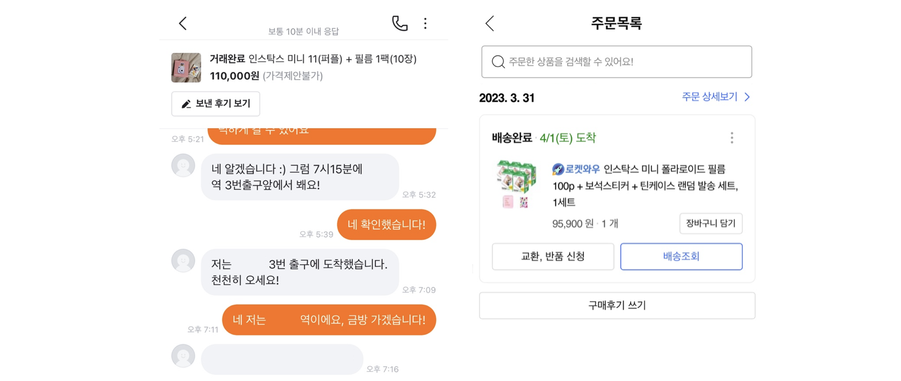
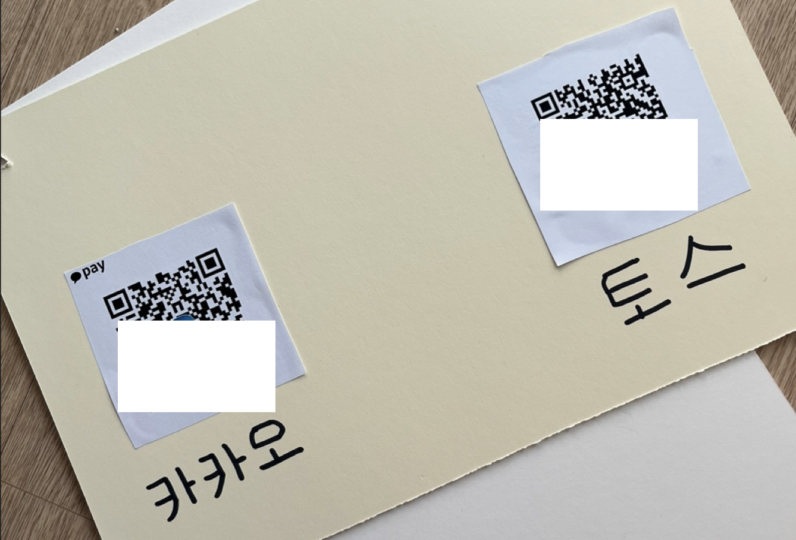
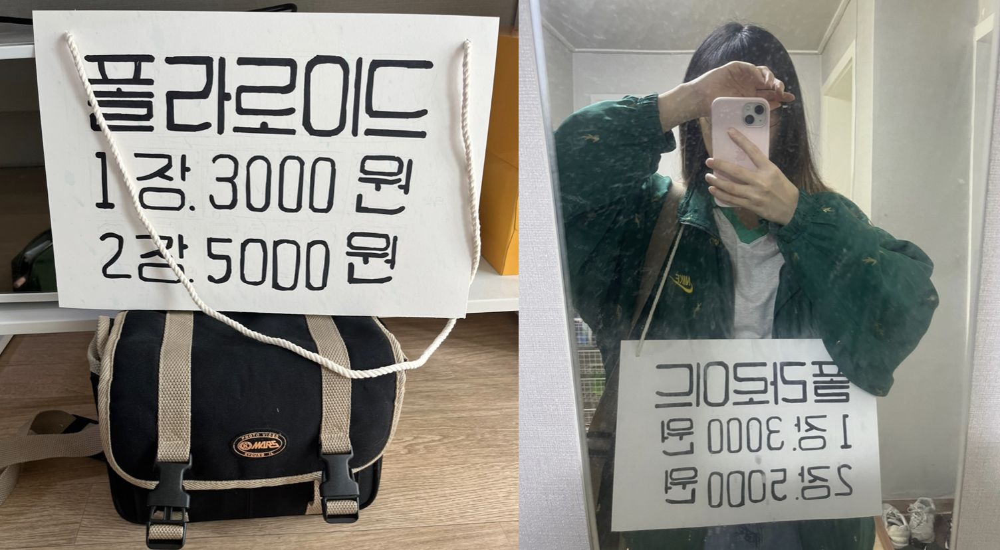
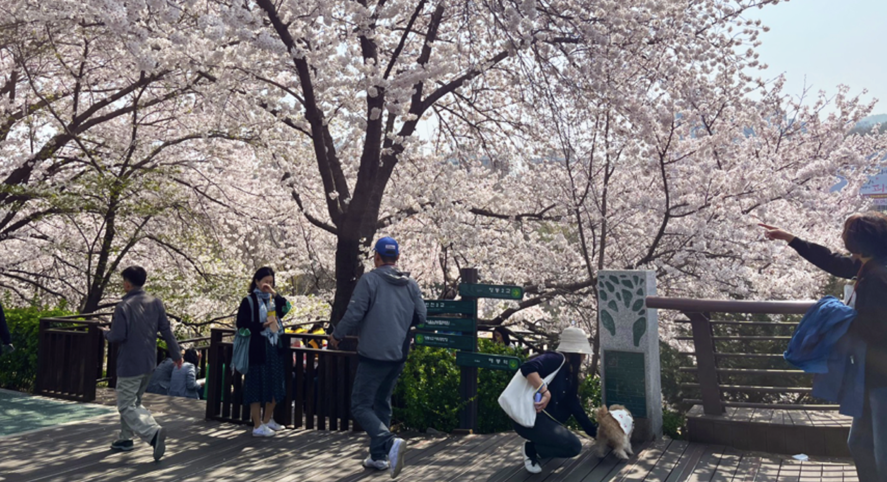
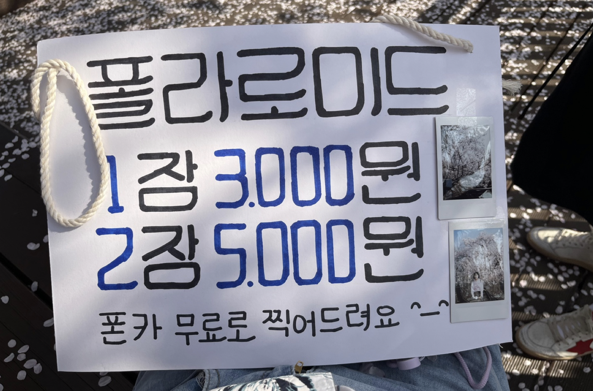
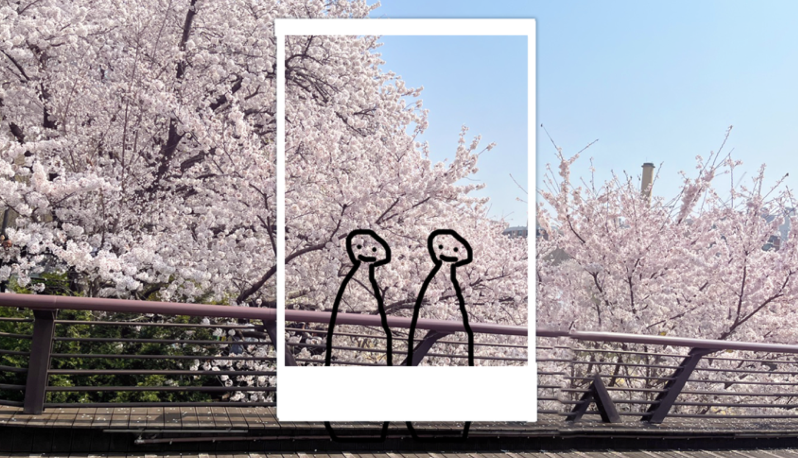

어느날 문득 천재적인 생각이 떠올랐다. 
'벚꽃철에 석촌호수에서 폴라로이드 사진을 돈 받고 찍으면 부자가 될 수 있지 않을까?'  

  

우리 회사엔 `가설과 팩트를 구분하자`는 그라운드 룰이 있다. 
예시로 '비오는 날에 킥보드 이용이 줄어든다'는 팩트, '킥보드에 우산을 달면 이용률이 올라갈 것이다'는 가설이다. 
이 룰에 따라 내 발상을 표현하자면 다음과 같다.  

- 팩트
  - 인생네컷과 같은 사진 촬영, 즉석 출력 서비스가 인기가 많다.  
  - 인생네컷에는 지역, 계절별로 특별한 프레임, 예를 들어 벚꽃 프레임 같은 것이 한정판으로 존재한다.   
- 가설
  - 요즘 사람들은 디지털 사진을 찍는 것이 대부분이다. 그래서 실물 사진을 갖고 싶어 한다.  
  - 사실 인생네컷 같은 실물 사진을 벚꽃과 함께 찍고싶지만, 그러기 힘들어서 벚꽃 프레임 같은 걸로 대리만족 하고있다.  


이 아이디어를 회사 사람들에게 얘기했을 때, 소수의 몇명은 돈이 되겠다 동의하고 몇명은 반대했다. 
제일 긍정적인 의견이 한 10만원 벌 것 같다 였고, 제일 비관적인 의견은 만원이나 벌면 다행이라 했다. 
이 쯤 되니 진짜 얼마가 벌리나 너무너무 궁금해졌다.  

그래서 해봤다. 
폴라로이드 사진기조차 없엇지만, 내 예상 만큼 수익이 나면 당연히 카메라 가격은 번다고 생각해서 당근으로 구매했다. 
폴라로이드 필름도 100장 시켰다.  

  

<br>

그리고 이 '폴라로이드 사진 찍기'로 실험할 수 있는 여러 가설이 떠올랐다. 
그 중 하나가 이 부업의 최대 병목은 '돈을 송금하는 시간'일 것이라는 가설이다.  

그래서 가격을 적은 피켓 뒤에 카카오페이와 토스 QR도 출력해 붙였다. 
몇 년 전에 마지막으로 썼던 사진 잘 찍을 것만 같은 카메라 가방도 발굴해서 좀 더 전문가스러워 보이기 위해 멨다.  

  

  

<br>

## 🎯 가설 정리  

폴라로이드 사진 찍기로 증명하고 싶었던 가설 목록이다.  

- 사업 감각  
  - ⬜️ 벚꽃 철에 폴라로이드를 찍으면 돈을 벌 수 있다  
  - ⬜️ 일요일에 최소 50만원은 벌 수 있을 것이다    
  - ⬜️ 가격은 적절하게 책정되었다  
- 고객 유형
  - ⬜️ 커플이 많을 것이다  
  - ⬜️ 아기나 어린이를 동반한 가족이 많을 것이다  
  - ⬜️ 20대 여성 그룹(내 생각에 인생네컷을 많이 찍는...)이 많을 것이다 
  - ⬜️ 반려동물을 동반한 사람이 많을 것이다  
- 고객 행동
  - ⬜️ 대부분의 사람들은 현금을 들고 다니지 않을 것이다  
  - ⬜️ 이 작업의 최대 병목은 돈을 주고받거나 송금하는 시간이 될 것이다

과연 이 중에 얼마나 사실로 밝혀졌을까?  

<br>

## 🧑‍✈️ 4/1 토요일 - 파일럿  

폴라로이드 필름은 한 장에 천원으로 꽤 비싸다. 
얼마나 팔릴지 모르는데 덮어두고 시키기엔 부담되는 금액이었다. 
거기다 `벚꽃 사진`이라는 특성 상, 그 주 주말이 마지막 장사 기회였다.  

그래서 토요일에 나름 `파일럿 프로젝트`를 했다. 
그리고 장소로 석촌호수가 아닌 양재천을 택했다. 
집에서 가깝기도 하고, 이미 좋은 포토스팟을 알고 있었기 떄문이다. 
오후에 약속이 있어서 오전 11시 20분부터 12시 10분까지 50분 간 서있었다. 
이 날의 판매량을 토대로 일요일에 필요한 총 필름을 더 주문하려고 했다.  

  

이 날 50분 동안 총 19장의 자신을, 매출은 48,000원을 기록했다. 
진짜 되는 장사였던 것이다. 
일요일은 9시부터 해가 질 때 까지, 약 9~10시간 정도 있을 예정이었기에 100장의 필름을 추가 주문했다.  

예상 외로 실물 현금으로 지불한 사람이 절반이었다. 
`요즘 사람들은 현금을 들고 다니지 않는다`는 가설이 깨지는 순간이었다. 
일요일에 잔돈을 거슬러주지 못할까 걱정되었지만, 주말이라 은행을 갈 수 없어 그냥 잔돈이 없을 수 있다는 사실만 염두에 두기로 했다.  

돈이 된다는 제일 중요한 가설이 증명되었으니, 일요일에 시도해 볼 가치가 충분했다. 아래는 가설 중간 점검이다.  

- 사업 감각  
  - ✅ 벚꽃 철에 폴라로이드를 찍으면 돈을 벌 수 있다  
  - ⬜️ 일요일에 최소 50만원은 벌 수 있을 것이다  
  - ⬜️ 가격은 적절하게 책정되었다  
- 고객 유형
  - ⬜️ 커플이 많을 것이다  
  - ⬜️ 아기나 어린이를 동반한 가족이 많을 것이다  
  - ⬜️ 20대 여성 그룹(내 생각에 인생네컷을 많이 찍는...)이 많을 것이다 
  - ⬜️ 반려동물을 동반한 사람이 많을 것이다  
- 고객 행동
  - ❌ 대부분의 사람들은 현금을 들고 다니지 않을 것이다  
  - ⬜️ 이 작업의 최대 병목은 돈을 주고받거나 송금하는 시간이 될 것이다

<br>

## 🌸 4/2 일요일 - 진짜 한 탕 하자  

토요일 파일럿 때 사람들이 `사진이 예쁘게 나올 지 모르겠어서` 망설이다 안 찍는 걸 보고, 아침에 친구를 찍은 샘플을 허락받고 샘플로 붙였다.  

  

그리고 개인적인 아쉬움으로, 폴라로이드 사진을 파는 것과 별개로 커플이나 가족이 사진을 함께 찍기 어려워하는 모습이 많이 보였다. 
소심한 편인 나도 그럴 때 지나가는 사람한테 부탁을 잘 못해서, 폰카를 무료로 찍어준다는 말을 덧붙였다. 
하지만 이 무료 서비스를 많이 이용할 거라는 기대는 아래 가설에 따라 안했는데....  

- ⬜️ 지나가는 사람들에게 사진 찍어달라고 얘기 못 하는 사람은, 당연히 나한테 무료로 찍어달라 얘기 못 할 것이다  
- ⬜️ 무료로 찍어주는 서비스를 받으면 사진을 팔아줘야 한다는 부담감을 느낄 것이다  

이 가설도 증명해보고 싶었다.  

<br>

양재천에서 제일 예쁜 포토스팟 앞에 오전 10시부터 서있었다. 
사진은 주로 이런 느낌으로 찍었다.  

  

원래 계획은 해질 때 까지 있기였으나, 날이 더운데 밥도 물도 먹지 않고 있으니 너무 힘들어서 오후 5시에 철수했다.  

<br>

## 🔍 가설 검증  

그러면 이 이상한 부업의 결과를 공개하겠다.  

먼저 사업 감각 부분이다.  

- ✅ 벚꽃 철에 폴라로이드를 찍으면 돈을 벌 수 있다  
- ❌ 일요일에 최소 50만원은 벌 수 있을 것이다  

돈은 확실히 벌었으나, 매출이 50만원까지 나오진 않았다. 
오전에는 토요일보다 훨씬 많은 사람들이 찍어서 필름이 모자라진 않을까 걱정할 정도였는데, 오후 1시 ~ 3시 쯤 사진을 찍는 사람이 급격하게 줄었다. 
그 날 날씨가 꽤 더웠는데, 사람들이 대부분 긴팔과 겉옷을 입고 있었다. 
안그래도 더운데 사진 찍을 자리가 나기를 기다릴 마음이 없던 것 같다.  

- ❓ 가격은 적절하게 책정되었다  

적절했다고 생각하는 건 여러번 찍은 사람들이 있어서다. 
나도 갈 수록 스킬이 늘어서 나중에는 내가봐도 사진을 기막히게 예쁘게 찍었는데... 
제일 많이 찍은 고객은 세 번, 여섯 장, 총 15,000원을 지불하셨다.  

적절하지 않았다고 생각하는 건 찍을까 말까 얘기하며 비싸다는 말을 한 사람들이 있어서다. (결국 찍지 않았던 것 같다.) 
원래는 1장 5,000원 2장 8,000원에 하려다가 회사 사람들이 너무 비싸다 해서 깎은 가격이었다.  

인생네컷과 비교해 타당한 가격이라 생각했는데 고객 입장에서는 그렇지 않나보다. 
비싸게 하고 총 매출을 올릴 수도 있었으니 완전히 검증하지 못했다.  

<br>

고객 유형 부분이다.  

- ✅ 커플이 많을 것이다  
- ✅ 아기나 어린이를 동반한 가족이 많을 것이다  
- ❌ 20대 여성 그룹(내 생각에 인생네컷을 많이 찍는...)이 많을 것이다 
- ❌ 반려동물을 동반한 사람이 많을 것이다  

대부분이 고객이 커플과 아이가 있는 가족이었다. 
20대 여성 그룹은 두 번 정도 있었고, 반려동물을 동반한 사람은 한 번도 찍지 않았다! 
도무지 이해가 안갔는데, 아마 20대 여성 그룹은 이미 사진을 잘 찍어서 남에게 맡길 이유를 못느껴서고, 
반려동물은 움직여서 사진을 여러 번 찍어야 한 장 건질까 말까라 그렇지 않을까 추측만 했다.  

그리고 또 하나 착각이 있었다.  

- ❌ 어린이들은 폴라로이드가 뭔지 잘 모른다  

폴라로이드가 추억의 사진 느낌이라 그런가? 
사실 뚜렷한 근거 없이 초등학생 정도 까지의 어린이들 부터 한 중학생까지 폴라로이드를 잘 모를 거라 생각했다. 
그런데 다수의 어린이들이 날 보고 사진 찍자고 부모님을 조르다가 혼났다. 
관광지 앞에서 풍선과 장난감으로 아이들을 현혹하는 역할이 된 것 같고, 혼난 어린이들에게 너무 미안했다...  

어쨌든, 그래도 폴라로이드를 찍거나 찍혀본 경험은 적을텐데 왜 좋아하는 것일까? 고민하는데, 친구가 
'요즘 폰카 어플에 폴라로이드 효과가 있어서 그걸 많이 접한 것이 아닐까?'했다. 
증명은 불가능하지만 굉장히 일리 있는 말이었다.  

<br>

마지막으로 고객 행동 부분이 제일 의외였다.   

- ❌ 대부분의 사람들은 현금을 들고 다니지 않을 것이다  
- ❌ 이 작업의 최대 병목은 돈을 주고받거나 송금하는 시간이 될 것이다  

대부분의 고객이 20~30대 였음에도, 실물 현금으로 계산한 사람이 절반이 넘었다. 
나는 지폐를 만져본 지가 까마득해서 당연히 다른 사람들도 그럴 줄 알았다. 
그런데 전혀 아니었다. 
거기다 만원짜리만 잔뜩 받아 거슬러 줄 돈이 없을까 걱정이었는데, 많은 사람들이 천원 지폐를 들고 다녔다.  

그리고 돈계산 하는 시간은 전혀 병목이 아니었으며, 벚꽃 스팟 앞에서 자리가 나길 기다리는 시간이 제일 많았다 ㅎㅎ... 
같이 서서 멀뚱히 기다리려니 엄청 뻘쭘했다.  

거기다 내가 얼마나 편향 속에 살았는지 깨달은 것이 있었는데... 

- ❌ QR 송금은 사람들에게 익숙하며 편한 결제 방식이다  

이게 전혀 아니었다. 
내가 만들어 간 QR 코드는 휴대폰 기본 카메라를 대면, 카카오페이와 토스의 송금 페이지로 연결되는 코드였다. 
그런데 이 플로우를 알고 있는 사람이 한명도 없었다. 
모두 카카오페이나 토스 앱을 일단 키거나, 계좌 번호를 물어보았다.  

그래서 '기본 카메라로 찍으면 카카오페이나 토스 송금 화면에 자동으로 연결된다'라고 꼬박꼬박 설명을 했는데도, 
따라하다가 뭔가 잘 안돼서 포기하거나, 그냥 은행 송금을 하면 안되냐고 물어봤다.  

나부터가 직업이 개발자고, 주위 사람도 IT 업종에 종사하거나, 그렇지 않아도 기술이나 신제품에 관심이 많은 사람이 대부분이다. 
그래서 `QR을 기본 카메라로 찍을 수 있다`가 보편적인 지식이라 생각했다. 
내 사고가 굉장히 편향적인 환경에서 돌아가고 있구나 깨달았다.    

<br>

그래도 폰카 무료 서비스 부분은 모두 적중했다.  

- ✅ 지나가는 사람들에게 사진 찍어달라고 얘기 못 하는 사람은, 당연히 나한테 무료로 찍어달라 얘기 못 할 것이다  
- ✅ 무료로 찍어주는 서비스를 받으면 사진을 팔아줘야 한다는 부담감을 느낄 것이다  

사진을 찍어달라 하는 사람이 거의 없었다. 
단체로 온 중장년 분들 정도... 
한 번은 단체 사진 찍는 걸 어려워해서 말 걸었더니 괜찮다고 거절당한 적이 있고, 
또 한 번은 일행 중 한 명이 나한테 말을 걸었는데, 다른 사람이 황급하게 말린 적이 있었다.  

그러다 중간에 한 커플이 셀카봉이 고장났는지 끙끙대고 있어서 폰카 찍어주겠다고 가서 찍었는데... 
폴라로이드 얘기는 한마디도 하지 않았음에도 강매로 느꼈는지 찍고 나서 굉장히 당황+불쾌해해서 ㅠㅠ 나도 민망해서 그 뒤로 먼저 폰카 찍어주겠다는 말은 하지 못했다. 근데 충분히 이해한다... 

<br>

## 💸 부업 총 정리와 회고    

- 사업 감각  
  - ✅ 벚꽃 철에 폴라로이드를 찍으면 돈을 벌 수 있다  
  - ❌ 일요일에 최소 50만원은 벌 수 있을 것이다  
  - ❓ 가격은 적절하게 책정되었다  
- 고객 유형
  - ✅ 커플이 많을 것이다  
  - ✅ 아기나 어린이를 동반한 가족이 많을 것이다  
  - ❌ 20대 여성 그룹(내 생각에 인생네컷을 많이 찍는...)이 많을 것이다 
  - ❌ 반려동물을 동반한 사람이 많을 것이다  
- 고객 행동
  - ❌ 대부분의 사람들은 현금을 들고 다니지 않을 것이다  
  - ❌ 이 작업의 최대 병목은 돈을 주고받거나 송금하는 시간이 될 것이다
- 기타
  - ❌ 어린이들은 폴라로이드가 뭔지 잘 모른다  
  - ❌ QR 송금은 사람들에게 익숙하며 편한 결제 방식이다   
  - ✅ 지나가는 사람들에게 사진 찍어달라고 얘기 못 하는 사람은, 당연히 나한테 무료로 찍어달라 얘기 못 할 것이다  
  - ✅ 무료로 찍어주는 서비스를 받으면 사진을 팔아줘야 한다는 부담감을 느낄 것이다  

<br>

처음에는 요즘 삶에 서스팬스가 부족해... 하고 시작한 장난이었는데, 의외로 유용한 인사이트를 얻었다. 
무엇보다 그 이후로 '우리 서비스를 사용하는 고객은 이러이러 할 것이다' 생각할 때, 
이게 정말 맞나? 근거는? 관찰한 사실이 있나? 어디까지가 나의 편향인가? 를 돌아보게 되었다.  

그리고 꽃 구경 사람 구경 실컷 해서 재밌었다. 
나도 중간부터는 뻔치가 늘어서 폴라로이드 찍고 서비스로 이어서 폰카를 엄청나게 찍어줬는데, 
커플들한테 포즈 추천도 하고 너무 보기 좋다고 하고 재밌어서 주접을 떨었다.  

사람들이 사진이 너무 잘나왔다며 기뻐할 때 나도 기뻤고, 
아이가 눈을 감아서 한 장을 그냥 추가로 찍어드리자 고맙다며 아이를 통해 간식을 건네준 분도 계셨다. 
이렇게 돈 벌 생각을 하다니 천재적이라는 말을 여러번 들었고, 심지어 그 분 중에 한 분은 나랑 셀카를 찍어가셨다. 대체 왜...?!  

반면 불쾌한 경험도 있었는데, 내가 NPC로 보였던 건지 도촬을 엄청 당했다... 찍지 말라 하기도 이상해서 그냥 있었는데 그건 좀 스트레스였다.  

그리고 이 자리를 빌어 고백할 일이 있는데... 덜 부끄럽고 덜 창피하려고 '누가 물어보면 대학생이고 과제라고 해야지' 하는 생각을 했는데... 
물어본 사람이 두 명 있어서 준비했던 거짓말을 하고 말았다. 
그러니 아~ 그렇구나 하는 반응이어서 덜 쪽팔리긴 했는데, 별 거 아닌데도 거짓말 하고 나서 계속 신경쓰였다. 
정직하게 살자.  

  

철수할 때 친구에게 부업 기념 사진을 찍어달라 부탁했다.   

마지막으로 가장 중요한 깨달음은... 
한 탕 벚꽃 사진 장사로는 부자가 될 수 없다! 개발 공부 열심히 하자!! 회사를 열심히 다니자!!! 였다. 🥹 
그래도 이런 영감을 주는 호작질을 기회가 되면 또 해보고 싶다. 
이상한 부업 일기 2를 언젠가 쓸 수 있기를...  

<br>

```toc
```
